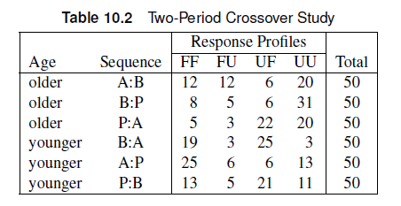

# Conditional Logistic Regression

## Outline

- Paired Observations and Crossover Design Studies
- General Conditional Logistic Regression
  - 1:1 Conditional Logistic Regression
  - 1:m Conditional Logistic Regression
- Exact Conditional Logistic Regression

## Conditional Logistic Regression

- When data is highly stratified and each strata contain small numbers of subjects, logistic regression may not be appropriate
  - Maximum likelihood estimates need a large sample size relative to the parameter number.
- Highly stratified data come from a cluster sampling design
  - Example: paired observations, matched case control studies in epidemiology.
- Conditional Logistic Regression accounts for stratification by basing the maximum likelihood estimation on a conditional likelihood.

## Conditional Logistic Regression

- Consider a highly stratified cohort study where there are $q$ centers randomly selected. At each center, one randomly selected patient is placed on treatment and another randomly selected patient is assigned to a placebo. 
  - Response: y_{hi}=1 if there is improvement, 0 otherwise.
  - Two patients per center: leads to biased estimate
  
## Likelihood

The likelihood for $y_{hi}$ can be written as:

$$
P(y_{hi} = \pi_{hi} = \frac{\exp[\alpha_h + \beta x_{hi} + \sum_g \gamma'_g z_{hig}]}{1+ \exp[\alpha_h + \beta x_{hi} + \sum_g \gamma'_g z_{hig}]})
$$

::: callout-note
$\alpha_h$ is an intercept for the $h^{th}$ center (strata), $\beta$ is the treatment parameter, and $\gamma'$ is the parameter of covariates $z$. Note that there are a lot of parameters, which may lead to biased estimates with only two patients per center.
:::

::: callout-note
## Nuisance parameters

We can fit a model based on probabilities conditioned on the center effects. After conditioning, the center dependent intercept $\alpha_h$ would not be important. This is why $\alpha_h$ is referred to as a _nuisance parameter_.
:::

## Why conditional?

We condition the result to a specific "sufficient statistic" or event.

::: callout-note
In the example, the events considered could be concordant (both showed no effect or both improved) or discordant (only one improved per clinic) outcomes.
:::

In the case of the cohort study, we can condition on the case that exactly one of the participants in each clinic will show improvement.

::: callout-note
The improvement could be observed in the test participants ($y_{h1}=1$, $y_{h2}=0$) or the placebo participants ($y_{h1}=0$, $y_{h2}=1$). Either way, $y_{h1}+y_{h2}=1$.
:::


## Condiitonal Probability

The conditional probability that the test participant improved conditioning on the discordant outcome that exactly one of the participants in each clinic will show improvement is:

$$
P((y_{h1},y_{h2}) = (1,0) | y_{h1}+y_{h2}=1) = \frac{P(y_{h1}=1)P(y_{h2}=0)}{P(y_{h1}=1)P(y_{h2}=0) + P(y_{h1}=0)P(y_{h2}=1)}
$$

::: callout-note
Performing the mathematical calculations, we will end up with a likelihood independent of $\alpha_h$, which means we effectively removed center-only terms in our model.
:::

## Conditional vs. Unconditional Logistic Regression

- The conditional likelihood has the same form as that of the unconditional likelihood, but the intercept term is now $\beta$, which is related to the treatment effect.
  - The nuisance parameters $\alpha_h$ do not affect the likelihood.

::: callout-note
The conditional likelihood applies to paired data can be written as a simple case of the Cox proportional hazards model, which is used in the analysis of survival times.
:::

## Conditional Logistic Regression: SAS

- The `STRATA` statement allows us to add the stratification variables when there is a small sample size per strata. 


::: callout-note
You should establish which variables are stratification variables and which ones are covariates.
:::

## Example

The data listed below includes data from a study about the effect of a new treatment on a skin condition. The data were collected from 79 clinics. In each clinic, one patient received the treatment, and another received a placebo. Demographic variables such as age, sex, and initial grade for the skin condition (1-4, mild to severe) was collected. The response variable was whether the skin condition improved.

::: {.panel-tabset}
### SAS Data Set

```{.r}
data trial;
input center treatment $ sex $ age improve initial @@;
datalines;
1 t f 27 0 1 1 p f 32 0 2 41 t f 13 1 2 41 p m 22 0 3
2 t f 41 1 3 2 p f 47 0 1 42 t m 31 1 1 42 p f 21 1 3
3 t m 19 1 4 3 p m 31 0 4 43 t f 19 1 3 43 p m 35 1 3
4 t m 55 1 1 4 p m 24 1 3 44 t m 31 1 3 44 p f 37 0 2
5 t f 51 1 4 5 p f 44 0 2 45 t f 44 0 1 45 p f 41 1 1
6 t m 23 0 1 6 p f 44 1 3 46 t m 41 1 2 46 p m 41 0 1
7 t m 31 1 2 7 p f 39 0 2 47 t m 41 1 2 47 p f 21 0 4
8 t m 22 0 1 8 p m 54 1 4 48 t f 51 1 2 48 p m 22 1 1
9 t m 37 1 3 9 p m 63 0 2 49 t f 62 1 3 49 p f 32 0 3
10 t m 33 0 3 10 p f 43 0 3 50 t m 21 0 1 50 p m 34 0 1
11 t f 32 1 1 11 p m 33 0 3 51 t m 55 1 3 51 p f 35 1 2
12 t m 47 1 4 12 p m 24 0 4 52 t f 61 0 1 52 p m 19 0 1
13 t m 55 1 3 13 p f 38 1 1 53 t m 43 1 2 53 p m 31 0 2
14 t f 33 0 1 14 p f 28 1 2 54 t f 44 1 1 54 p f 41 1 1
15 t f 48 1 1 15 p f 42 0 1 55 t m 67 1 2 55 p m 41 0 1
16 t m 55 1 3 16 p m 52 0 1 56 t m 41 0 2 56 p m 21 1 4
17 t m 30 0 4 17 p m 48 1 4 57 t f 51 1 3 57 p m 51 0 2
18 t f 31 1 2 18 p m 27 1 3 58 t m 62 1 3 58 p m 54 1 3
19 t m 66 1 3 19 p f 54 0 1 59 t m 22 0 1 59 p f 22 0 1
20 t f 45 0 2 20 p f 66 1 2 60 t m 42 1 2 60 p f 29 1 2
21 t m 19 1 4 21 p f 20 1 4 61 t f 51 1 1 61 p f 31 0 1
22 t m 34 1 4 22 p f 31 0 1 62 t m 27 0 2 62 p m 32 1 2
23 t f 46 0 1 23 p m 30 1 2 63 t m 31 1 1 63 p f 21 0 1
24 t m 48 1 3 24 p f 62 0 4 64 t m 35 0 3 64 p m 33 1 3
25 t m 50 1 4 25 p m 45 1 4 65 t m 67 1 2 65 p m 19 0 1
26 t m 57 1 3 26 p f 43 0 3 66 t m 41 0 2 66 p m 62 1 4
27 t f 13 0 2 27 p m 22 1 3 67 t f 31 1 2 67 p m 45 1 3
28 t m 31 1 1 28 p f 21 0 1 68 t m 34 1 1 68 p f 54 0 1
29 t m 35 1 3 29 p m 35 1 3 69 t f 21 0 1 69 p m 34 1 4
30 t f 36 1 3 30 p f 37 0 3 70 t m 64 1 3 70 p m 51 0 1
31 t f 45 0 1 31 p f 41 1 1 71 t f 61 1 3 71 p m 34 1 3
32 t m 13 1 2 32 p m 42 0 1 72 t m 33 0 1 72 p f 43 0 1
33 t m 14 0 4 33 p f 22 1 2 73 t f 36 0 2 73 p m 37 0 3
34 t f 15 1 2 34 p m 24 0 1 74 t m 21 1 1 74 p m 55 0 1
35 t f 19 1 3 35 p f 31 0 1 75 t f 47 0 2 75 p f 42 1 3
36 t m 20 0 2 36 p m 32 1 3 76 t f 51 1 4 76 p m 44 0 2
37 t m 23 1 3 37 p f 35 0 1 77 t f 23 1 1 77 p m 41 1 3
38 t f 23 0 1 38 p m 21 1 1 78 t m 31 0 2 78 p f 23 1 4
39 t m 24 1 4 39 p m 30 1 3 79 t m 22 0 1 79 p m 19 1 4
40 t m 57 1 3 40 p f 43 1 3
;
```

### SAS Code

#### Without Covariates
```{.r}
proc logistic data=trial;
class treatment(ref="p") /param=ref;
strata center; # <1>
model improve(event="1")= treatment;
run;
```

1. The strata argument lets SAS know that conditional logistic regression should be performed.

#### With Covariates
```{.r}
proc logistic data=trial;
class sex (ref="f") treatment(ref="p") initial(ref="1") /param=ref;
strata center;
model improve(event="1") = treatment initial sex age/
selection=forward include=1 details;
run;
```

### Answer

After adding the covariates, only the initial skin condition rating was added to the model. There is a significant effect of initial skin condition ($\chi^2$ = 10.57, p=0.0143), and a marginal effect of treatment ($\chi^2 $= 2.93, p=0.09). The odds of improvement in the treatment group is 1.87 (0.914, 3.82) times that of the placebo group. The odds of improvement for severe initial skin condition is 26.5 (2.4, 292) times that of mild initial skin condition.

Note that the answers will be different if you treated the initial skin condition as a continuous variable.
:::

## Exercise

The dataset CORRECT includes data from a study that asked pairs of individuals to interpret a visual infographic regarding health disparities arising from the COVID-19 pandemic. Each participant was asked about their occupations. The response variable was whether they correctly interpreted the infographic (1) or not (0). Implement a conditional logistic regression analysis to determine whether occupation affects the accuracy of interpretation of visual infographics.

### SAS Data Set

```{.r}
data correct;
format occupation $10.;
input pair Occupation $ Correct;
datalines;
1 STEM 0
1 Other 0
2 Other 0
2 Healthcare 1
3 Healthcare 0
3 Other 0
4 Other 0
4 STEM 0
5 Healthcare 0
5 Healthcare 0
6 Healthcare 0
6 STEM 0
7 STEM 0
7 Healthcare 1
8 STEM 0
8 Healthcare 1
9 Healthcare 0
9 Healthcare 1
10 Other 0
10 STEM 0
11 Healthcare 1
11 STEM 1
12 Other 0
12 Healthcare 0
13 Healthcare 0
13 Healthcare 1
14 STEM 0
14 STEM 0
15 Healthcare 0
15 Healthcare 1
16 Other 0
16 STEM 0
17 Other 0
17 STEM 0
18 STEM 0
18 Healthcare 0
19 Healthcare 1
19 Other 1
20 Other 0
20 Healthcare 0
21 Other 0
21 Other 0
22 Other 1
22 Healthcare 1
23 Healthcare 0
23 Healthcare 1
24 Other 0
24 Healthcare 0
25 Healthcare 1
25 STEM 0
26 STEM 0
26 Healthcare 1
27 Other 1
27 Healthcare 1
28 Other 1
28 Healthcare 0
29 Healthcare 0
29 STEM 0
30 Other 0
30 Other 0
31 Other 1
31 Healthcare 0
32 Healthcare 0
32 Other 1
33 STEM 0
33 Other 0
34 Other 0
34 STEM 1
35 Healthcare 0
35 Healthcare 0
36 Healthcare 0
36 Healthcare 1
37 Other 0
37 Healthcare 0
38 Healthcare 0
38 Other 1
39 Healthcare 0
39 Other 0
40 Other 0
40 Other 1
41 Healthcare 1
41 Healthcare 0
42 Other 0
42 Other 0
43 Other 1
43 STEM 0
44 Other 1
44 Healthcare 0
45 STEM 0
45 STEM 0
46 Healthcare 0
46 Healthcare 0
47 Healthcare 0
47 Other 1
48 Healthcare 0
48 Healthcare 0
49 Other 0
49 STEM 1
50 Healthcare 0
50 Healthcare 0
;

```

## Exercise

The dataset CORRECT includes data from a study that asked pairs of individuals to interpret a visual infographic regarding health disparities arising from the COVID-19 pandemic. Each participant was asked about their occupations. The response variable was whether they correctly interpreted the infographic (1) or not (0). Implement a conditional logistic regression analysis to determine whether occupation affects the accuracy of interpretation of visual infographics.

::: {.panel-tabset}
### SAS Code

```{.r}
proc logistic data=correct;
strata pair;
class occupation(ref="Other")/param=ref;
model correct(event="1")=occupation/details;
run;
```

### Answer

There was no significant effect of occupation on the accuracy of interpretation of visual infographics.
:::

## Crossover Designs

- When an individual or group of individuals undergo different treatments at each pre-determined period.
  - Patients act as their own controls.
- Common types of crossover design studies:
  - Two-period design (AB/BA)
  - Three-period design	(ABC/CBA/ACB…)

- Important effects to account for in crossover designs are the carryover effect and the period effect.
  - An extra variable can be introduced to indicate which effect is carried over at any given period.
  - If the preceding treatment is a placebo, it is safe to assume the absence of a carryover effect.

## Example

Patients were stratified according to two age groups and then assigned to one of three treatment sequences. Responses were measured as favorable (F) or unfavorable (U); thus, FF indicates a favorable response in both Period 1 and Period 2. The data is included in the SAS file as CROSS2.

::: {.panel-tabset}
### Contingency Table



### Data Set

```{.r}
data cross1 (drop=count);
input age $ sequence $ time1 $ time2 $ count;
do i=1 to count;
output;
end;
datalines;
older AB F F 12
older AB F U 12
older AB U F 6
older AB U U 20
older BP F F 8
older BP F U 5
older BP U F 6
older BP U U 31
older PA F F 5
older PA F U 3
older PA U F 22
older PA U U 20
younger BA F F 19
younger BA F U 3
younger BA U F 25
younger BA U U 3
younger AP F F 25
younger AP F U 6
younger AP U F 6
younger AP U U 13
younger PB F F 13
younger PB F U 5
younger PB U F 21
younger PB U U 11
;

data cross2; set cross1;
subject=_n_;
period=1;
drug = substr(sequence, 1, 1);
carry='none';
response =time1;
output;
period=2;
drug = substr(sequence, 2, 1);
carry = substr(sequence, 1, 1);
if carry='P' then carry='none';
response =time2;
output;
run;
```

### SAS Code

```{.r}
proc logistic data=cross2;
class drug period age carry / param=ref;
strata subject;
model response = period drug period*age carry; # <1>
A_B: test drugA=drugB;
oddsratio drug;
run;

```

1. Carryover effect is accounted for with `carry`.

Since there is no significant carryover effect, we can remove it from the model.

```{.r}
proc logistic data=cross2;
class drug period age carry / param=ref;
strata subject;
model response = period drug period*age;
A_B: test drugA=drugB;
oddsratio drug;
run;

```
### Answer

There is no significant carryover effect. At a significance level of 0.05, there is no significant interaction effect. There is a significant drug effect ($\chi^2$ = 18.7, p=0.001). The odds of a favorable response with drug A is 3.84 (2.02, 7.32) times that for the placebo and 2.95 (1.55, 5.59) times that for drug B.
:::

## Three-Period Crossover Studies

- The approach is similar to the two-period crossover studies
  - Period effect
  - Crossover effect – Need to restrict which levels you assume a carryover effect for.
- The response profiles would be different:   
  - The total values of {$y_{hi}$={0,1,2,3}} can be {0,1,2,3}. Only {1,2} is informative, but adds complexity to the likelihood.
- PROC LOGISTIC can handle three-period crossover studies with the same syntax.

## Matching in Case-Control Studies

- Case-control studies pair a person known to have the event of interest (case) with a person who doesn’t have the event (control)
  - Research question: Is the exposure/risk factor associated with the event?

## Conditional Logistic Regression: Matching
- The conditional likelihood for the matched pairs data is the unconditional likelihood for a logistic regression model where the response is always equal to 1, the covariate values are equal to the differences between the values for the case and the control, and there is no intercept.
  - The pairs/groups are used as the strata in the analysis.

## Example

- The data set ENDO is subset of the data from the Los Angeles Study of the Endometrial Cancer Data in Breslow and Day (1980). Outcome=1 corresponds to cases of endometrial cancer. Two prognostic factors are included
  - Gall: gallbladder disease
  - Hyper: hypertension
- Use conditional logistic regression to determine the association between gallbladder disease and endometrial cancer after controlling for hypertension.

::: {.panel-tabset}
### SAS Code

```{.r}
data endo;
   do ID=1 to 63;
      do Outcome = 1 to 0 by -1;
         input Gall Hyper @@;
         output;
      end;
   end;
   datalines;
0 0  0 0    0 0  0 0    0 1  0 1    0 0  1 0    1 0  0 1
0 1  0 0    1 0  0 0    1 1  0 1    0 0  0 0    0 0  0 0
1 0  0 0    0 0  0 1    1 0  0 1    1 0  1 0    1 0  0 1
0 1  0 0    0 0  1 1    0 0  1 1    0 0  0 1    0 1  0 0
0 0  1 1    0 1  0 1    0 1  0 0    0 0  0 0    0 0  0 0
0 0  0 1    1 0  0 1    0 0  0 1    1 0  0 0    0 1  0 0
0 1  0 0    0 1  0 0    0 1  0 0    0 0  0 0    1 1  1 1
0 0  0 1    0 1  0 0    0 1  0 1    0 1  0 1    0 1  0 0
0 0  0 0    0 1  1 0    0 0  0 1    0 0  0 0    1 0  0 0
0 0  0 0    1 1  0 0    0 1  0 0    0 0  0 0    0 1  0 1
0 0  0 0    0 1  0 1    0 1  0 0    0 1  0 0    1 0  0 0
0 0  0 0    1 1  1 0    0 0  0 0    0 0  0 0    1 1  0 0
1 0  1 0    0 1  0 0    1 0  0 0
;

```

### SAS Code

```{.r}
proc logistic data=endo;
   strata ID;
   model outcome(event='1')=Gall hyper Gall*hyper/selection=forward include=2 details;
run;
```

### Answer

There is marginal association between history of gallbladder disease ($\chi^2$ = 3.34, p=0.07) and endometrial cancer, but there is no evidence of an association between hypertension and endometrial cancer ($\chi^2$ = 0.85, p=0.36). The odds of developing endometrial cancer is 164% higher for those with gallbladder disease (OR: 2.64, 95% CI: 0.93, 7.5) 
:::

  
## Exact Conditional Logistic Regression

- Exact tests can be used if there is not enough data, or the data are too sparse.
  - EXACT statement in SAS can estimate effects and perform joint tests for repeated measures.
  - If exact methods are used, selection options cannot be used concurrently.


## Example: Exact Conditional Logistic Regression

The data set CARDIO includes data from a cardiovascular study of eight animals who received various drug treatments. Researchers then arrested coronary flow, which led to the development of regional ischemia, and they recorded whether an adverse cardiovascular event occurred during an eight-minute interval. The heart was re-perfused for 50 minutes to allow the heart to return to normal, and then another treatment was tested. Thus, there are up to five repeated measurements on eight animals. The treatments are: (1) Control (C), (2) Test Drug with counteracting agent (DA), (3) Low dose test drug (D1), (4) High dose test drug (D2).

The treatment S indicates the placement of intracoronary artery catheter, which is dropped in the final data set.

:::{.panel-tabset}
### SAS Data Set
```{.r}
data cardio;
input animal treatment $ response $ @@;
if treatment='S' then delete;
else if treatment='C' then ordtreat=1;
else if treatment='DA' then ordtreat=2;
else if treatment='D1' then ordtreat=3;
else if treatment='D2' then ordtreat=4;
datalines;
1 S no 1 C no 1 C no 1 D2 yes 1 D1 yes
2 S no 2 D2 yes 2 C no 2 D1 yes
3 S no 3 C yes 3 D1 yes 3 DA no 3 C no
4 S no 4 C no 4 D1 yes 4 DA no 4 C no
5 S yes 5 C no 5 DA no 5 D1 no 5 C no
6 S no 6 C no 6 D1 yes 6 DA no 6 C no
7 S no 7 C no 7 D1 yes 7 DA no 7 C no
8 S yes 8 C yes 8 D1 yes
;

data cardio;
set cardio;
drop treatment;
run;
```

### SAS Code

```{.r}
proc logistic data=cardio descending exactonly;
strata animal;
model response = ordtreat;
exact ordtreat / estimate=both;
run;
```

### Answer

We treat the treatments as an ordinal variable with equal separation. Based on the exact analysis, there is a significant effect of treatment (p=0.0017). The odds of an adverse event becomes seven times higher with each unit change in treatment level.
:::