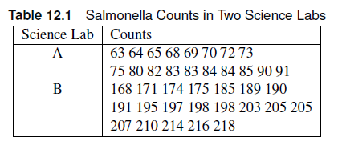
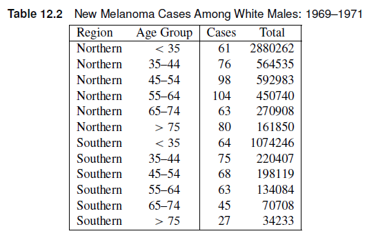
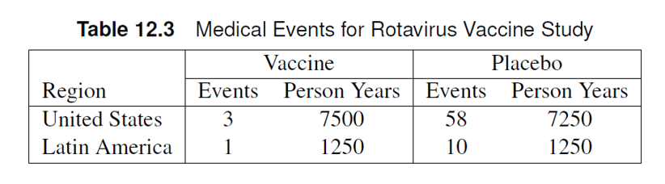

# Poisson Regression

## Outline

- Poisson Regression
  - When is it used for?
  - Offset in Incidence Densities
  - Overdispersion
  - Exact Methods
- Generalized Linear Models

## Poisson Regression

- Recall: We have discussed how to model different categorical responses
  - Mantel-Haenszel: associations between ordinal and nominal variables
  - Logistic Regression: dichotomous and polytomous responses
- Counts are also a discrete variable
  - Typically assumed to be a normal distribution, but its discreteness means it’s not a perfect fit to a continuous distribution like the normal distribution
- Often, we use the Poisson distribution. Sometimes, we use the negative binomial distribution. 

## Poisson Regression: Applications

- Examples of counts include:
  - Colony counts in bacteria
  - Accidents
  - Equipment failures
  - Rare Disease Incidence

## Generalized Linear Models

- Generalized linear models (GLM) allows us to have non-Gaussian error distributions for a response variable.
  - Typically used when the response variable is **NOT** Gaussian.
- GLMs utilize a link function ($\eta$) to transform the response variable based on its assumed distribution.
  - Proportions: Logit link functions (Logistic regression)
  - Poisson: Logarithmic function
  
## Poisson Regression: GLM

Suppose a response variable Y is distributed as Poisson and has expected value 𝜇 for a unit of time/space. We can write a Poisson regression model as a loglinear model such that:

$$
\eta = \log \mu = \alpha + \sum_i{\beta_ix_i}
$$


::: callout-note
The link function $\eta$ is logarithmic in nature, which means a 1-unit increase in $x_i$ leads to an increase of $e^{\beta_i}$ in the response variable.
:::

## Offset

Sometimes, counts are measured for an interval of time (seconds, hours, weeks) or space (inches, kilometers, miles), which we designate as $N$.

::: callout-note
## Poisson Rates

The ratio $Y/N$ can be interpreted as the rate of counts per unit time. Examples include:

- Monthly mortality rate
- Yearly failure rate
- Daily hospitalization rate
:::

## Offset: GLM

The expected values of $Y/N$ is $\mu/N$. The loglinear model can now be written as:

::: callout-note
$$
\log \mu/N = \alpha + \sum_i\beta_ix_i \to log \mu = \log N + \alpha + \sum_i\beta_ix_i
$$


$\log N$ is called the offset term. 

:::
::: callout-note
The offset can be a function of the explanatory variables, such that $N = N(x_i)$.
:::

::: callout-note
## Incidence Rate

We define an incidence rate $\lambda (x_i)$ is defined as:

$$
\lambda(x_i) = \frac{\mu(x_i)}{N(x_i)}
$$

We can rewrite the model as:

$$
\eta_i = \log \lambda(x_i) = \alpha + \sum_i\beta_ix_i
$$
:::

## Poisson Model

We can specify the model using the following syntax:

$$
Y_i \sim Poisson(\lambda_i)
$$

$$
\eta_i =\log \lambda(x_i) = \alpha + \sum_i\beta_ix_i
$$

## Comparing Incidence Rates

Note that the linear predictor is in a logarithmic scale with respect to the incidence rates. Suppose we want to compare $ \lambda_1 = \lambda(x_1)$ and $ \lambda_2 = \lambda(x_2)$ in terms of the linear predictors $\eta_1$ and $\eta_2$

$$
\eta_1 - \eta_2 = \log \lambda_1 - \log \lambda_2 = \log (\lambda_1 / \lambda_2)
$$

::: callout-note
The estimated differences in the linear predictor estimates the logarithm of the ratio of the two incidence rates. These differences can be tested using `CONTRAST` statements OR estimated using the `ESTIMATE` statement.
:::


$$
\exp (\eta_1 - \eta_2) = \lambda_1/\lambda_2
$$

::: callout-note
Exponentiating the differences in the linear predictors will provide an estimate of the incidence rate ratio, similar to the incidence density ratio discussed in Chapter 2.
:::


## Poisson Regression: SAS

The `GENMOD`, `GLM`, and `GLIMMIX` procedures can perform Poisson regression in SAS.

::: callout-tip
## GENMOD procedure

The `GENMOD` procedure has very similar syntax to the `LOGISTIC` procedure. 

- Since `GENMOD` can handle other distributions, we need to specify the `DIST` option in the `MODEL` statement
as `DIST=POISSON`.
- Joint tests can also be displayed by adding the `TYPE3` option to the `MODEL` statement.
- Interaction plots can be created using the `EFFECTPLOT` statement.
- The estimated means can be calculated using the `LSMEANS` statement.
:::

## Is the Poisson Regression appropriate?

::: callout-warning
The criteria for assessing goodness of fit in Poisson regression is the Pearson $\chi^2$/DF, where DF is the degrees of freedom. This value is included in the goodness of fit table in the “Scaled Pearson X2” row. The Value/DF should be close to 1.

:::

## Example

The table shows salmonella counts for samples taken from two science labs. The researchers want to determine whether the counts are different between the labs. Estimate the incidence rate ratio of salmonella between the two labs.

::: {.panel-tabset}

### Table


### SAS Data Set

```{.r}
data salmonella;
input lab $ counts @@;
datalines;
A 63 A 64 A 65 A 68 A 69 A 70 A 72 A 73
A 75 A 80 A 82 A 83 A 83 A 84 A 84 A 85 A 90 A 91
B 168 B 171 B 174 B 175 B 185 B 189 B 190
B 191 B 195 B 197 B 198 B 198 B 203 B 205 B 205
B 207 B 210 B 214 B 216 B 218
;
```

### SAS Code

```{.r}
proc genmod data=salmonella;
class lab; 
model counts = lab / dist=poisson link=log type3  ;
lsmeans lab/diff=all ilink cl;
estimate "incidence ratio lab A/lab B" lab 1 -1/ exp alpha=0.05  ;
run;
```

### Answer

The scaled Pearson chi-square Value/DF = 1.11, which is close to 1. This supports the use of the Poisson distribution to modle the salmonella counts.

There is strong evidence of a difference in counts between the two labs ($\chi^2$ = 1007, p < 0.0001). The incidence rate ratio is 0.39 (95% CI: 0.37, 0.42), which means there is 61% less counts in Lab A compared to Lab B.

:::

## Exercise

The file urgentcare_queue.csv includes simulated queueing data from urgent care clinics located at two cities (A and B). The number of people in queue at the time when the urgent care clinics open is recorded in the variable “queue”. The “Medicaid” variable indicates whether the clinic accepts Medicaid or not. 

- Use an interaction model to test whether the location and Medicaid acceptance affect the length of the queue of urgent care clinics at the start of the workday. Is the Poisson distribution a good fit for the data? Is the interaction significant at the 0.10 level?

- If the interaction is non-significant, remove the interaction term and re-run the analysis to estimate the incidence rate ratios between the queues in urgent care clinics in City A and B.


## Exercise

The file urgentcare_queue.csv includes simulated queueing data from urgent care clinics located at two cities (A and B). The number of people in queue at the time when the urgent care clinics open is recorded in the variable “queue”. The “Medicaid” variable indicates whether the clinic accepts Medicaid or not. 

- Use an interaction model to test whether the location and Medicaid acceptance affect the length of the queue of urgent care clinics at the start of the workday. Is the Poisson distribution a good fit for the data? Is the interaction significant at the 0.10 level?

- If the interaction is non-significant, remove the interaction term and re-run the analysis to estimate the incidence rate ratios between the queues in urgent care clinics in City A and B.

:::{.panel-tabset}
### SAS Code

```{.r}
proc genmod data=work.urgent ;
class city medicaid; 
model queue = city|medicaid / dist=poisson link=log type3  ;
lsmeans city*medicaid/ilink cl ;
effectplot interaction (sliceby=city);
run;

proc genmod data=work.urgent;
class city medicaid; 
model queue = city medicaid / dist=poisson link=log type3  ;
lsmeans city / diff=all ilink cl;
lsmeans medicaid/ diff=all exp cl;
estimate "IRR between City A and B" city 1 -1;
run;
```

### Answer

The Value/DF of the Scaled Pearson $\chi^2$ (Interaction Model: 0.9105 ) is close to 1, which means the Poisson distribution assumption is appropriate. There is no evidence of an interaction between city and medicaid ($\chi^2$ = 0.61, p=0.43) at the 0.10 level.

The Value/DF of the Scaled Pearson $\chi^2$ for the main effects model is also close to 1 (0.9108). The estimated incidence rate of queues in City A is 60% less than that in City B (IRR = 0.40 (95% CI: 0.34, 0.47))

:::


## Example: Offset

The table below includes counts of melanoma cases reported in 1969-1971 for white males in two areas. The totals are the sizes of the estimated populations at risk. The researchers were interested in whether the incidence densities varied across age groups and region.

- Use a main effect model to test for the effect of region and age on the mean number of Melanoma cases among White males reported in 1969-1971.
- Use contrasts to compare the incidence rates for <35 and 75+ age groups. 

:::{.panel-tabset}
### Table



### SAS Data Set

```{.r}
data melanoma;
input age $ region $ cases total;
ltotal=log(total); *calculates the logarithm of the total; # <1>
datalines;
35-44 south 75 220407
45-54 south 68 198119
55-64 south 63 134084
65-74 south 45 70708
75+ south 27 34233
<35 south 64 1074246
35-44 north 76 564535
45-54 north 98 592983
55-64 north 104 450740
65-74 north 63 270908
75+ north 80 161850
<35 north 61 2880262
;
```

1. The `ltotal` variable performs the logarithmic transformation of the offset variable, which is the total number of tests.

### SAS Code
```{.r}
proc genmod data=melanoma;
class region (ref='north') age (ref='<35');
model cases = age region 
/ dist=poisson link=log offset=ltotal type3 cl ; *the offset should be in the LOGARITHMIC SCALE;
estimate "75+ vs <35" age 0 0 0 0 1 -1/exp;
lsmeans age/ ilink cl diff = all  adjust=tukey;
lsmeans region /ilink cl diff = all ;
run;
```

### Answer

Note that the Scaled Pearson Chi-Square is 1.24, which is slightly further away from 1 and should be examined more closely using methods we will discuss later in the chapter.

There is strong evidence of an age effect ($\chi^2$ = 797, p <0.0001) and region ($\chi^2$ = 124.22, p < 0.001).

The incidence rate of Melanoma in the 75+ age group is 19 times (95% CI: 14.67, 24.62) that in the <35 age group.

:::


## Exercise

The file resident_hours.csv contains the annual count of patients assisted by medical residents at a hospital in Asia. Researchers wanted to test whether the patient assistance rate (#patients per hour) has decreased throughout the years. The number of hours spent on duty is listed as the “time” variable--- with “ltime” being the logarithm of the time variable.

- Is there an overall effect of year?
- Use the `estimate` statement to calculate the change in assistance rate from 2021 to 2022, and from 2022 to 2023.


## Exercise

The file resident_hours.csv contains the annual count of patients assisted by medical residents at a hospital in Asia. Researchers wanted to test whether the patient assistance rate (#patients per hour) has decreased throughout the years. The number of hours spent on duty is listed as the “time” variable--- with “ltime” being the logarithm of the time variable.

:::{.panel-tabset}
### SAS Code

```{.r}
proc genmod data=resident;
class year;
model counts = year
/ dist=poisson link=log offset=ltime type3 cl; *the offset should be in the LOGARITHMIC SCALE;
lsmeans year/ ilink cl diff=all adjust=tukey;
estimate "2021 vs 2022" year 1 -1 0; 
estimate "2022 vs 2023" year 0 1 -1 ;
run;
```

### Answer

The Scaled Pearson $\chi^2$ is 0.8, which is slightly lower than 1. At this point, we are only concerned if the Scaled Pearson X2 is above 1, so we can say that the Poisson distribution is appropriate to use.

There is an overall effect of year ($\chi^2 = 15890, p < 0.0001). 

When looking at multiple pairwise differences, it is important to adjust for multiplicity, hence we added `adjust=tukey`. After applying the Tukey-Kramer adjustment, we estimate that the patient assistance rate is 45% times higher than that in 2021 compared to 2022 (95% CI: 1.42, 1.48). Additionally, the patient assistance rate is 141% higher in 2022 compared to 2023.

:::

## Overdispersion

- Recall: We use the Scaled chi-square /df value to determine whether the Poisson distribution is a good fit to the data.
  - What if the Scaled chi-square/df >> 1? Overdispersion
- Overdispersion occurs when the observed variance is larger than the variance accounted for in the model.	
  - Recall: Poisson distribution mean = Poisson distribution variance = $\mu$.
- Underdispersion also occurs: Scaled chi-square/df <<1
  - Will not be discussed in this course.

## Overdispersion: What to do?

- We use alternative distributions like the negative binomial distribution.
- If we want to continue using the Poisson distribution, we can introduce a scaling factor $\phi$ such that the variance is assumed to be $\phi \mu$.
  - Difference between negative binomial and Poisson reparametrization: the scaling factor is a function of the mean for the negative binomial distribution. Specifically, $\phi (1+k\mu)$ where $k$ is the negative binomial dispersion parameter.
  
  
::: callout-note
## Negative Binomial Model

Biological processes tend to agree with negative binomial models more than Poisson regression. Rule of thumb is to use Poisson unless the data is overdispersed, in which you use the negative binomial model.
:::
  

## Overdispersion: SAS

- PROC GENMOD can handle both Poisson and Negative Binomial analyses
  - DIST=NB specifies a negative binomial distribution.
  - Dispersion now replaces Scale in the output
  - We can also adjust the scale using the option `scale=pearson` in the `MODEL` statement (Quasi-Poisson approach).


## Example

The data set OVERDISPERSION shows count data from different locations and treatments. Suppose we want to test for a treatment effect.

:::{.panel-tabset}
### SAS Data Set

```{.r}
data overdispersion;
 input location trt count;
datalines;
1 1 2
1 2 3
1 3 0
1 4 2
2 1 26
2 2 14
2 5 51
2 6 16
3 1 76
3 3 44
3 5 77
3 7 3
4 1 0
4 4 3
4 6 5
4 7 12
5 2 12
5 3 13
5 6 22
5 7 1
6 2 49
6 4 54
6 5 205
6 7 23
7 3 3
7 4 4
7 5 15
7 6 3
;

```

### SAS Codes

```{.r}

/*Example of overdispersion*/
proc genmod data=overdispersion;
class location trt;
model count=trt location/type3 dist=poisson;
lsmeans trt/ilink cl;
lsmeans location/ilink cl;
estimate "trt 2 vs trt 4" trt 0 1 0 0 0 -1 0;
run;

/*Pearson adjustment*/
proc genmod data=overdispersion;
class location trt;
model count=trt location/type3 dist=poisson scale=pearson;
lsmeans trt/ilink cl;
lsmeans location/ilink cl;
estimate "trt 2 vs trt 6" trt 0 1 0 0 0 -1 0;
run;


/*Negative Binomial*/
proc genmod data=overdispersion;
class location trt;
model count=trt location/type3 dist=nb ;
lsmeans trt/ilink cl;
lsmeans location/ilink cl;
estimate "trt 2 vs trt 6" trt 0 1 0 0 0 -1 0;
run;


```

### Answer

In the Naive Poisson approach, the Scaled Pearson X2 Value/DF was 7.25, which is significantly higher than 1. We can choose to add `scale=Pearson` to include a scale factor, making the distribution a quasi-Poisson distribution. The Poisson and quasi-Poisson have the same Least Squares Means (LSMeans) estimates, but have different standard errors. Note that the scale introduces a scaling factor to the variance estimate, which affects the standard errors. For both models, there is a significant treatment effect ( Likelihood Ratio Chi-square test: p < 0.0001)

The negative binomial model also includes the dispersion parameter in the results, and has different LSMeans estimates as the Poisson. (LR $\chi^2$ = 15.33, p=0.0178).
:::

## Exercise

The file adverse.csv includes the counts of adverse events recorded for subjects in each of the four experimental treatment regimes for ovarian cancer. The subjects were recruited from three clinics. The researchers want to know if the four treatments differ in incidence density rate of adverse events. (Hint: Is there overdispersion? Did the resulting model converge?)

## Exercise

The file adverse.csv includes the counts of adverse events recorded for subjects in each of the four experimental treatment regimes for ovarian cancer. The subjects were recruited from three clinics. The researchers want to know if the four treatments differ in incidence density rate of adverse events. (Hint: Is there overdispersion? Did the resulting model converge?)


:::{.panel-tabset}
### SAS Code

```{.r}
proc genmod data=adverse;
class clinic treatment;
model count = clinic treatment/ type3 dist=poisson;
lsmeans treatment/ilink cl;
run;

proc genmod data=adverse;
class clinic treatment;
model count = clinic treatment/ type3 dist=poisson scale=pearson;
lsmeans treatment/ilink cl;
run;

proc genmod data=adverse;
class clinic treatment;
model count = clinic treatment/ type3 dist=nb;
lsmeans treatment/ilink cl;
run;
```

### Answer

After implementing the Naive Poisson model, the scaled Pearson X2 Value/DF is 1.65, which is a sign of overdispersion. Implementing the negative binomial led to convergence issues. The most viable option is setting the `scale=Pearson` to fix the scaled Pearson X2 Value/DF to 1.

There is no significant effect of clinic ($\chi^2$ = 0.92, p = 0.63).


:::

## Exact Poisson Regression

::: callout-tip
For rare events with small number of observed counts, exact methods may be more appropriate. The `GENMOD` procedure can also implement exact Poisson regression analysis using the `exact` statement.
:::

## Example

The table shows the rotavirus vaccine data for both United States and Latin America. We want to investigate if there is a difference between the incidence densities of the vaccine and placebo groups.

::: {.panel-tabset}

### Table


### SAS Data Set

```{.r}
data rotavirus;
input region $ treatment $ counts years_risk @@ ;
log_risk=log(years_risk);
datalines;
US Vaccine 3 7500 US Placebo 58 7250
LA Vaccine 1 1250 LA Placebo 10 1250
;
run;
```

### SAS Code

```{.r}
/*Not Exact*/
proc genmod data=rotavirus;
class region treatment;
model counts = treatment region / dist=poisson offset= log_risk type3;
lsmeans treatment/ilink cl;

estimate 'Placebo vs Vaccine' treatment 1 -1 /exp;


/*Exact*/
proc genmod data=rotavirus;
class region treatment /param=ref;
model counts = treatment region / dist=poisson offset= log_risk type3;
lsmeans treatment/ilink cl;
estimate 'Placebo vs Vaccine' treatment 1 /exp;
exact treatment / estimate=odds cltype=exact;
run;

```

### Answer

It would be advisable to use the exact incidence rate ratio confidence limits and p-values because of the low count of events in the vaccine group. The incidence rate in the placebo group was 17.5 **Exact 95% CI: (6.53, 66.05)** times that of the vaccine group.

:::

## Extreme Overdispersion: Zero inflation

Oftentimes, you can encounter data sets with an abundance of zeroes especially when the event of interest is rare.

- Behavioral events in students
- Positive cases in vaccine groups
- Insect count in a pesticide-treated plot of land.

::: callout-warning
Using a negative binomial distribution or the quasi-Poisson likelihood will not be enough to account for the abundance of zeros. 
:::

## Zero-Inflated Poisson/Negative Binomial models

Zero-inflated models account for excess zeroes that are not accounted for by the Poisson or Negative Binomial distributions.

There are two types of zero inflated models:

::: {.callout-note title="Zero-Inflated Models"}

In zero-inflated models, zero or nonzero counts may occur in the “on” part of the
process, with the probability of 0, 1, 2, etc., determined by the counting distribution
in the “on” part of the process.

Example: Cars at a traffic intersection, animal sightings.

:::
::: {.callout-note title="Hurdle Models"}

In hurdle models, only nonzero counts may be observed in the “on” part of the
process.

Example: Doctor visits, Insurance claims
:::

## Zero-inflated Models

The zero-inflated models must be described in two processes: the on-off process and the counting process.

::: {.callout-note title="Process 1"}
The on-off part is a binary process. The count process is "off" or 0 with probability $\pi$ and "on" with probability $1-\pi$. We call $\pi$ the inflation probability.
:::

::: {.callout-note title="Process 2"}
When the system is "on", counts may take on values 0,1,2,... according to a discrete probability distribution such as Poisson or Negative Binomial. This gives rise to Zero-Inflated Poisson (ZIP) models and Zero-Inflated Negative Binomial (ZINB) models. 
:::

The resulting probability $P(Y=y)$ where $Y$ is the random variable corresponding to the observations from a zero-inflated model is:

$$
P(Y=y) = \begin{cases} 
      \pi + (1-\pi)f(0) & y= 0 \\
      (1-\pi)f(y) & y = 1, 2,...
   \end{cases}
$$
where $f(y)$ is the discrete probability distribution corresponding to Poisson/Negative Binomial.

## Hurdle Model

Like the zero-inflated models, hurdle models also have two processes: the on-off process and the counting process.

::: {.callout-note title="Process 1"}
The on-off part is a binary process. The count process is "off" or 0 with probability $\pi$ and "on" with probability $1-\pi$. We call $\pi$ the inflation probability. This is the same as the on-off process for zero-inflated models.
:::


::: {.callout-note title="Process 2"}
The "on" process is slightly different. Note that the hurdle model is used when zero counts is NOT possible during the "on" process. Hence, we have to use a zero-truncated model of the distribution function $\frac{f(y)}{1-f(0)}, y=1,2,...$
:::

The resulting probability distribution for the hurdle model is thus:

$$
P(Y=y) = \begin{cases} 
      \pi & y= 0 \\
      (1-\pi)\frac{f(y)}{1-f(0)} & y =1,2,...
   \end{cases}
$$


## Zero Inflated Modeling in SAS

The `GENMOD` procedure has ZIP and ZINB capabilities, though limited.

::: callout-note
Specifying `dist=zip` and `dist=zinb` in the `model` statement will implement zero-inflated Poisson and Negative Binomial analyses, respectively.
:::

::: callout-tip
The `zeromodel` statement includes variables that can introduce group-specific zero inflation.
:::

## Example

The data set `counts` contain simulated data from an experiment investigating the association between exposure level and toxin counts. There were $n_i$ samples taken at the $i^{th}$ sites, ranging from 2 to 14 samples, at 18 sites. Determine if there is evidence of zero-inflation. Test for an association between exposure level and toxin counts.

::: panel-tabset
### Data Set

```{.r}
data counts;
   input ni @@; 
   site = _n_;
   do sample_id=1 to ni;
     input exposure_level toxin_count @@; output;
   end;
   datalines;
  6  2 0 82 5 33 0 15 2 35 0 79 1 
  9 18 0 64 0 80 2  0 0 58 0  7 0 81 0 22 3 50 0 
  2 34 0 95 0 
 13 28 1 31 0 63 2 14 0 74 0 44 0 75 3 65 0 74 1 84 5 57 0 29 0 41 0 
  9 42 0  8 0 91 0 20 0 23 0 22 0 96 4 83 3 56 0 
  3 64 0 64 1 15 0 
  4  5 0 73 2 50 2 13 1 
  2  0 0 41 0 
  5 83 7 98 1 11 1 28 0 18 0 
  7 91 0 25 1 51 4 20 0 61 1 34 0 33 2 
 14 60 0 87 0 94 0 29 0 41 0 78 0 50 0 37 0 15 0 39 0 22 0 82 0 93 0 3 0 
 12 68 0 26 1 19 0 60 1 93 3 65 0 16 0 79 0 14 0  3 1 90 0 28 3
  8 34 1 44 0 62 3 21 0  7 0 17 1  0 2 49 0 
 13 11 0 27 2 16 1 12 3 52 1 55 0  2 6 89 5 31 5 28 3 51 5 54 13 64 0 
  9  3 0 36 0 57 0 77 0 41 0 39 0 55 0 57 0 88 1 
  7  2 0 80 0 41 1 20 0  2 0 27 0 40 0 
 13 59 0 96 2 47 1 64 0 18 0 30 0 37 0 36 1 69 0 78 1 47 1 86 0 88 0 
 12 84 6 60 1 33 1 92 0 38 4  6 0 43 3 13 2 18 0 51 0 50 4 68 0
 ;
 
```

### SAS Code

```{.r}
proc genmod data=counts;
 model toxin_count =  exposure_level / dist=zip;
 zeromodel /link=logit;
 estimate ' ' @zero int 1;
run;
```

The analysis of the zero-inflated shows that there is weak evidence of zero-inflation in the data. There is evidence of association between toxin count and exposure level (log IRR = 0.008,p=0.0195).


:::