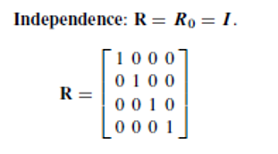
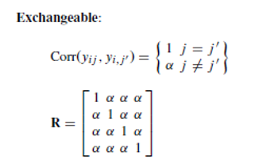
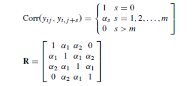
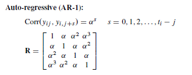
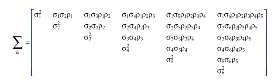
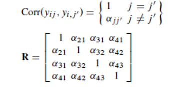

# Generalized Estimating Equations

## Outline

- Generalized Estimating Equations Methodology	
  - Vs. Generalized Linear model and Weighted Least Squares
- Marginal model
- Wald Statistic
- Count Data
- Proportional Odds Data
- Missing Values
- Overdispersion

## Generalized Estimating Equations (GEE)

- Recall: Weighted Least Squares method
  - Can handle categorical outcome variables but cannot handle continuous explanatory variables.
  - No missing values.
  - Also needs a high sample size.
- Generalized Estimating equations can also do what the WLS method can.

::: callout-note
GEEs can handle missing observations, continuous explanatory variables, and time-changing explanatory variables.
:::

::: callout-note
## Applications

Examples of GEE applications include crossover studies, longitudinal data analysis, observational studies, and non-Gaussian responses.
:::

## GEE: Motivation

- We need to account for correlations when the data is correlated
  - Longitudinal study: Within-subject corelations
  - Cross-sectional study with clusters: Between-subject correlations.
- Correlations could lead to an underestimation of standard errors of between-subject effects and the overestimation of the standard errors of within-subject effects.

::: callout-note
What sets GEE apart from other methods is that we can account for the covariance between outcomes by specifying a structure for the covariance matrix. 

- Can account for discrete and continuous response data.
:::

## GEE: Framework

Recall: GLM model such that

$$
\eta(\mu) = X\beta = \alpha + \beta_1 X_1 + \beta_2 X_2...
$$
To estimate the coefficients $\mathbf{\beta}$, we need to assume a form for the working correlation matrix, which we denote as $R$.

::: callout-note
$R$ may depend on a vector of unknown parameters $\alpha$. All components of $R$ should be estimated as part of the analysis.
:::

## Working Correlation Matrix Forms

:::{.panel-tabset}
### Independence

### Exchangeable/Compound Symmetry

### M-dependent

:::

## Working Correlation Matrix Forms

:::{.panel-tabset}
### AR(1) - Auto-Regressive

### ANTE(1) - antedependence model

### Unstructured (Fixed)

:::

