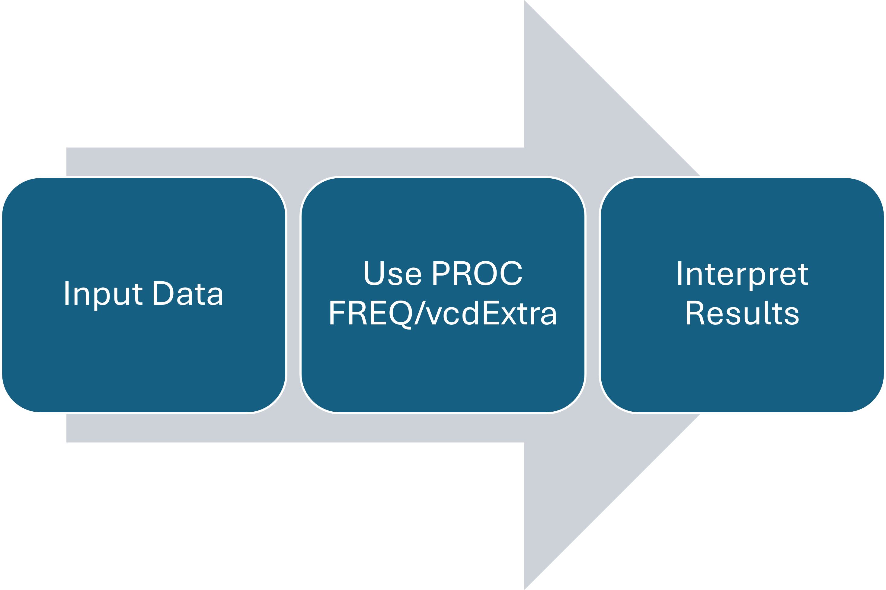

# Chapter 2: $2\times2$ tables

```{r}
#| echo: false
#| output: false

library(vcdExtra)
library(tidyverse)
```

## Outline {.smaller}

- Contingency Tables
- Chi-Square Statistics
- Exact Tests
- Difference in Proportions
- Odds Ratio and Relative Risk
- Sensitivity and Specificity
- McNemar’s Test
- Incidence Densities
- Power Analysis

# Contingency Tables

## 2x2 Contingency Tables

::::: columns
::: {.column style="width:40%; font-size: 75%"}
- Summarizes categorical data
  - Response variable has two levels
  - Exploratory variable has two levels
- Example:
  - Treatment/Placebo in RCT
  - Case/Control in a retrospective study
:::

::: {.column style="width:60%"}

:::
:::::

## Contingency Tables

We wish to determine whether there is an association between the row and column variables using the frequencies observed in each category.

::: callout-note
Is the risk variable associated with the prevalence rate?
:::

Recall: Intro to Statistics

- Chi-square tests of homogeneity $H_0$: The two populations (rows) have the same distribution of the column variable
- Chi-square tests of independence $H_0$: The row and column variables are independent of each other.

## Contingency Tables: Convention

The indices of contingency tables denote the row and column of each number. For a total sample size of $n$,

::::: columns
::: {.column style="width:40%; font-size: 85%"}
- $n_{xy}$ denotes the number at row $x$ and column $y$, also referred to as a joint frequency.
- Seeing a (+) sign indicates that it is a marginal sum, also referred to as marginal frequencies.
  - $n_{x+}$ denotes the sum of all columns in row $x$.
  - $n_{+y}$ denotes the sum of all rows in column $y$.
- The placement of the + sign denotes the margin in which it was summed.
:::

::: {.column style="width:60%"}
{fig-align="center"}
:::
:::::

## `SAS` Example: Contingency Table

::::: columns
::: {.column style="width:50%; font-size: 125%"}
```         
data respire;
length treat $7. outcome $1. ;
input treat $ outcome $ count;
datalines;
placebo f 16
placebo u 48
test f 40
test u 20
;
run;

proc freq data=respire order=data;
weight count;
tables treat*outcome;
run;
```
:::

::: {.column style="width:50%; font-size: 75%"}
- `proc freq` calls the `FREQ` procedure in `SAS`.
  - Not defining `data=respire` means `SAS` will automatically use the most recently run data set.
- `order=data` means we are creating the rows and columns based on how the data was inputted, not alphabetical order.
- `weight` tells `SAS` the number of counts for each count
- `tables` creates the contingency table with row, column, and total percentages.
- `run;` tells `SAS` to run the code. **This is important!**
:::
:::::

## Contingency Tables in `SAS`- Long Format

When the data is not aggregated, the `FREQ` procedure can still be used to create contingency tables. We can use the import data procedure in SAS ODA to create `work.spore` from `Spore.csv` uploaded on Canvas.

```
proc freq order=data data=severe;
weight count;
tables treat*outcome / chisq nocol;
exact or;
run;
```


## Contingency Tables in `R`

To create your own contingency table, you can use the `data.frame()` and `xtabs()` functions.

```{r}
count_data <- data.frame(Row = c("A","A","B","B"),
                         Column = c("X","Y","X","Y"),
                         Count = c(2,4,6,8))
count_data
xtabs(Count~Row+Column,data=count_data)
```

You can also use the `expand.grid()` function to create combinations of variable levels.

```{r}
count_data <- expand.grid(Row = factor(c("A","B"), levels=c("A","B")),
                         Column = factor(c("X","Y"), levels=c("X","Y")))

count_data$Count = c(2,4,6,8)

count_data
xtabs(Count~Row+Column,data=count_data)
```

::: callout-note
`ordered` can also be used to account for ordering in the row and column variables.
:::

## Contingency Tables in `R`- Long Format

When the data is not aggregated, the `xtabs` function can still be used to create contingency tables. First, we import `Spore.csv` from Canvas.

```{r}
spore <- read.csv("Spore.csv",stringsAsFactors = TRUE)
spore

xtabs(~Treatment+Spore,data=spore)
```


## Exercise

Suppose a survey asking sophomores and senior students whether they agree with the statement “I enjoyed my in-person classes this semester.” yielded the following results.

Enter the data in `SAS` using the data step and generate the contingency tables. Name the data set `enjoy`.

|           | Strongly Agree | Agree | Neutral | Disagree | Strongly Disagree |
|:---------:|:--------------:|:-----:|:-------:|:--------:|:-----------------:|
| Sophomore |       24       |  43   |   12    |    25    |        12         |
|  Seniors  |       19       |  37   |   24    |    32    |        21         |

::: panel-tabset
### `R` Code

OR

```{r}
enjoy <- expand.grid(year=factor(c("Sophomore","Seniors"), levels = c("Sophomore","Seniors")),
                     response = factor(c("SA","A","N","D","SD"),levels = c("SA","A","N","D","SD")))
enjoy$Count <- c(24,19,43,37,12,24,25,32,12,21)
xtabs(Count~year+response,data=enjoy)
```

### `SAS` Code

There are many ways to code the `data` step. Here's one way to do it!

```         
data enjoy;
length year $9. response $2.;
input year $ response $ count @@;
datalines;
sophomore SA 24 sophomore A 43
sophomore N 12
sophomore D 25 sophomore SD 12
senior SA 19 senior A 37
senior N 24
senior D 32 senior SD 21
;

proc freq order=data data=enjoy;
weight count;
tables year*response;
run;
```
:::

## Independence

If the two categorical variables are independent of each other, they are not associated.

::: callout-note
Independence also means that the joint probability $p_{ij}$ can be determined solely on the basis of the marginal probabilities. These can be estimated using sample data.
:::

# Chi-square Statistics

## Chi-square Statistics

The null hypothesis of no association (independence or homogeneity) between row and column variables imply that the totals are fixed. The probabilities of realization of each cell is determined by the hypergeometric distribution.

## Chi-square distribution

::::: columns
::: {.column style="width:60%; font-size: 85%"}
- The chi-square distribution, $\chi_k^2$, is defined by the number of degrees of freedom 𝑘, where 𝑘≥1.
- Properties include:
  - The value of $\chi^2$ can only assume non-negative values.
  - The $\chi^2$ distribution is asymmetric.
  - The sum of two or more independent chi-square variables also follows a chi-square distribution.
  - Mean: $k$, Variance: $2k$
:::

::: {.column style="width:40%"}

:::
:::::

## Pearson Chi-square Statistic

The Pearson Chi-square statistic can be written in terms of the joint frequency `n_ij` and the expected frequency `m_ij`.

$$Q_P = \sum_{i=1}^2\sum_{j=1}^2 \frac{(n_{ij}-m_{ij})^2}{m_{ij}}$$

::: callout-note
$m_{ij}$ is the expected value of the number of observations in row $i$ and column $j$, $n_{ij}$. The expected frequency $m_{ij}$ can be calculated based on the null hypothesis assumption.

- Independence: $p_{ij}=p_{i+}p_{+j} \to m_{ij} = \frac{n_{i+}n_{+j}}{n}$
- Homogeneity: $p_{i+}=n_{i+}/n; p_{+j}=n_{+j}/n\to m_{ij} = \frac{n_{i+}n_{+j}}{n}$
:::

## Mantel-Haenszel Chi-square statistic {.smaller}

Another form of the Chi-square statistic is the Mantel-Haenszel chi-square statistic, $Q$. For $2\times 2$ contingency tables,

$$Q =  \frac{(n_{11}-m_{11})^2}{v_{11}}$$

$$m_{11} = n_{1+}n_{+1}/n; v_{11} = \frac{n_{1+}n_{2+}n_{+1}n_{+2}}{n^2(n-1)}$$

::: callout-note
$Q$, also known as the randomization chi-square, is based on the condition that all marginal totals are fixed and the probability distribution of random allocation of units to groups is given by the hypergeometric distribution. $m_{11}$ and $v_{11}$ are the mean and variance of the hypergeometric distribution based on the $2 \times 2$ table, respectively.
:::

## Pearson Chi-square vs. Mantel-Haenszel Chi-square

The relationship can also be approximated by the following relation:

$$Q_P = \frac{n}{n-1}Q$$

For large $n$, both the MH chi-square and the Pearson chi-square approach a chi-square distribution with $1$ degree of freedom ($\chi^2_1$).

::: callout-warning
Rule of thumb for $Q_P$: The expected value for each cell should be at least 5, i.e. $m_{ij} \geq 5$ for all $i,j$
:::

::: callout-tip
Because the MH chi-square statistic comes from a hypergeometric distribution, the MH chi-square statistic can be used for small samples using exact calculations of p-values from the hypergeometric distribution. This is not possible with the Pearson chi-square.

The MH chi-square statistic can also be extended for use in the presence of covariates/stratifying variables.
:::

## Hypothesis testing

The null hypothesis of no association states that there is no association between row and column variables. - Assuming this is true and assumptions are satisfied, $Q$ and $Q_P$ follow a $\chi^2_1$ distribution for $2\times2$ tables.

::: callout-note
The p-values are given by $P(\chi^2 > Q_P)$ and $P(\chi^2 > Q)$ for Pearson and MH Chi-squares, respectively.
:::

## Hypothesis Testing: SAS



## `SAS`: FREQ procedure

- The `weight` statement tells SAS if there is an aggregated count variable present in the data set.
- The `tables` statement tells SAS to create a contingency table using the stated variables.
  - Under tables, you can include the `cmh` or the `chisq` option to calculate the randomization and Pearson chi-square values.

Shown below is a sample `SAS` code.

```         
proc freq;
weight count;
tables a*b/ cmh chisq;
run;
```

## `R`: `vcdExtra`

In `R`, the `vcdExtra` package is required to perform the Mantel-Haenszel chi-square tests. The function `CMHtest()` provides the value of the Mantel-Haenszel statistic, while `chisq.test()` provides the Pearson chi-square statistic.

## Example

The table shows the information from a randomized clinical trial that compared an experimental treatment to a placebo treatment for a respiratory disorder.

```{r}
library(tidyverse)
dat <- expand.grid(Treatment=factor(c("Placebo","Test"),levels=c("Placebo","Test")),
                  Outcome = factor(c("Favorable","Unfavorable"),levels=c("Favorable","Unfavorable")))

dat$count = c(16,40,48,20)

xtabs(count ~ .,data=dat) 
```

::: panel-tabset
### Questions

- What is the Pearson chi-square value?
- What is the Mantel-Haenszel chi-square value?
- Is there strong evidence of an association between treatment and outcome?

### SAS Code

``` {.r code-line-numbers="3,11,13"}
SAScode <- "
data respire;
input treat $ outcome $ count; 
datalines;
test f 40
test u 20
placebo f 16
placebo u 48
;

proc freq data=respire order=data; 
weight count;
tables treat*outcome/chisq; 
run;
"
```

### R Code

```{r}
#| code-fold: true
dat <- expand.grid(Treatment=c("Placebo","Test"),
                  Outcome = c("Favorable","Unfavorable")) |> 
mutate(count = c(16,40,48,20))

xtabs(count ~ .,data=dat) -> dat_cc
```

Pearson Chi-square (without continuity adjustment)

```{r}
#| code-fold: true
#| echo: true
#install.packages("tidyverse")
library(tidyverse)
dat <- expand.grid(Treatment=c("Placebo","Test"),
                  Outcome = c("Favorable","Unfavorable")) |> 
mutate(count = c(16,40,48,20))

xtabs(count ~ .,data=dat) 
chisq.test(dat_cc,correct=F)
```

Randomization Chi-square

```{r}
#| echo: true
# install.packages("vcdExtra")
library(vcdExtra)
CMH_CC <-CMHtest(dat_cc) 
CMH_CC
```

### Answers

- What is the Pearson chi-square value? **21.7**

- What is the Mantel-Haenszel chi-square value? **21.53**

- Is there strong evidence of an association between treatment and outcome?

  - *p \< 0.0001*; There is strong evidence of an association between the test treatment and the outcome.
:::

## Exercise

Suppose we wish to determine if the frequency of falls is related to wheelchair use for Polio survivors. The data is shown in the table.

```{r}
#| echo: false

dat<- expand.grid(Fall=c("Fallers","Nonfallers"),
                  Wheelchair = c("Yes","No")) |> 
mutate(count = c(62,18,121,32))

xtabs(count ~ .,data=dat) -> dat_cc
dat_cc
```

::: panel-tabset
### Questions

- Write the code to enter the data and analyze using the FREQ procedure.
- What is the Pearson chi-square value?
- What is the Mantel-Haenszel chi-square value?
- Using a significance level of 0.05, do we have sufficient evidence to warrant the conclusion that wheelchair use and falling are associated?

### `SAS` code

``` {.r code-line-numbers="2,10,12"}
data wheelchair;
input fall $ wheelchair $ count;
datalines;
f yes 62
n yes 18
f no 121
n no 32
;

proc freq data=wheelchair order=data;
weight count;
tables fall*wheelchair/chisq;
run;
```

### `R`

Pearson Chi-square (without continuity adjustment)

```{r}
#| echo: true
#install.packages("tidyverse")

chisq.test(dat_cc, correct = F)
```

Randomization Chi-square

```{r}
#| echo: true
# install.packages("vcdExtra")
CMH_CC <-CMHtest(dat_cc) 
CMH_CC$table 
```
:::

# Exact Methods

## Fisher's Exact Test

The chi-square distribution assumption for $Q$ and $Q_P$ includes a large sample assumption.

::: callout-warning
What if $m_{ij} < 5$?
:::

The **Fisher's Exact Test** can be used to analyze these contingency tables.

## Fisher's Exact Test

Fisher's Exact Test is based on the hypergeometric distribution. The test calculates an *exact* p-value, unlike the chi-square test which only uses an approximation.

::: callout-note
The test is easy to calculate for $2 \times 2$ and total sample sizes below 50, but computationally expensive as the number increases.
:::

The p-value can be calculated using the hypergeometric distribution with the following parameters: $Hyper(N=n,m=n_{+1},k=n_{1+})$

## Fisher's Exact Test: Hypotheses

Null hypothesis $H_0$: there is no association between the row and column variables

- One sided $H_a$: There is a positive/negative association between the row and column variables. OR One combination of the row and column variable levels is more favored compared to the others.

- Two-sided $H_a$: there is an association between the row and column variables.

::: callout-note
To solve the exact p-value using the hypergeometric distribution, only add probabilities of outcomes that have lower probabilities than the observed value in the direction of the alternative hypotheses.
:::

## Fisher's Exact Test: SAS

Including the `exact` or the `chisq` option under the `tables` statement will yield the results of the exact test.

```         
proc freq;
weight count;
tables a*b/ exact chisq;
run;
```

## Fisher's Exact Test: R

The `fisher.test()` can perform Fisher's exact test in `R` using a contingency table as input.

```{r}
#| eval: false

fisher.test(contingency_table,alternative="two.sided")
```

## Example

The table shown shows data from a study on treatments for healing severe infections. Calculate the exact p-value of this contingency table using the Fisher’s Exact Test.

- Under the alternative hypothesis: The test treatment is positively associated with the outcome.
- Under the alternative hypothesis: The test treatment is associated with the outcome.
- At a significance level of 0.10, do you have enough evidence to conclude that the treatment is associated with the outcome?

```{r}
#| echo: false
library(tidyverse)
dat <- expand.grid(Treatment=c("Test","Control"),
                  Outcome = c("Favorable","Unfavorable")) |> 
mutate(count = c(5,1,1,3))

xtabs(count ~ .,data=dat) -> dat_cc
dat_cc
```

## Example

:::: panel-tabset
### SAS Code

``` r
data severe;
input treat $ outcome $ count;
datalines;
Test f 5
Test u 1
Control f 1
Control u 3
;
proc freq order=data data=severe;
weight count;
tables treat*outcome / chisq nocol;
run;
```

### R Code

```{r}
dat <- expand.grid(Treatment=factor(c("Test","Control"),levels=c("Test","Control")),
                  Outcome = factor(c("Favorable","Unfavorable"),levels=c("Favorable","Unfavorable"))) 
dat$count <- c(5,1,1,3)

dat_cc <- xtabs(count ~ Treatment+Outcome,data=dat) 
dat_cc
```

```{r}
fisher.test(dat_cc, alternative = "greater") # one-sided
fisher.test(dat_cc,alternative= "two.sided")
```

### Manual p-values: 1-sided

- One-sided hypothesis (+) corresponds to the the probabilities $P(X>=5)$ which are equal to or less than $P(X=5)$.

```{r}
N <- 5+1+1+3
m <- 6
k <- 6

dhyper(x=5,m=m,n=N-m,k=k)
```

For X \> 5, the only possible value of X is 6.

```{r}
dhyper(x=6,m=m,n=N-m,k=k)
```

The p-value is then the sum of these two probabilities:

```{r}
dhyper(x=5,m=m,n=N-m,k=k) + dhyper(x=6,m=m,n=N-m,k=k)
```

### Manual p-values: 2-sided

- Two-sided hypothesis need to include values $P(X<5)$ that have probabilities lower than $P(X=5)$. These probabilities will be added to the one-sided p-value to get the two-sided p-value.

```{r}
#| echo: true
dhyper(x=4,m=m,n=N-m,k=k)
dhyper(x=3,m=m,n=N-m,k=k)
dhyper(x=2,m=m,n=N-m,k=k)
dhyper(x=1,m=m,n=N-m,k=k)
dhyper(x=0,m=m,n=N-m,k=k)
```

$P(X=0)$, $P(X=1)$, and $P(X=2)$ have lower probabilities compared to $P(X=5)$. Hence, we add these probabilities to the one-sided p-value to get the two-sided p-value.

```{r}
dhyper(x=5,m=m,n=N-m,k=k) + dhyper(x=6,m=m,n=N-m,k=k) + dhyper(x=2,m=m,n=N-m,k=k) + dhyper(x=1,m=m,n=N-m,k=k) + dhyper(x=0,m=m,n=N-m,k=k) 
```

### Answers

- Under the alternative hypothesis: The test treatment is positively associated with the outcome. p=`r round(dhyper(x=5,m=m,n=N-m,k=k) + dhyper(x=6,m=m,n=N-m,k=k),4)`
- Under the alternative hypothesis: The test treatment is associated with the outcome. p= `r round(dhyper(x=5,m=m,n=N-m,k=k) + dhyper(x=6,m=m,n=N-m,k=k) + dhyper(x=2,m=m,n=N-m,k=k) + dhyper(x=1,m=m,n=N-m,k=k) + dhyper(x=0,m=m,n=N-m,k=k),4)`
- At a significance level of 0.10, do you have enough evidence to conclude that the treatment is associated with the outcome? **At** $\alpha = 0.10$, **we do not have sufficient evidence to conclude that treatment is associated with the outcomes in healing severe infections.**

::: callout-note
In SAS, be careful when selecting which one-sided alternative hypothesis to interpret from the results!
:::
::::

## Exercise

Fisher’s experiment: A number of individuals gathered together for afternoon tea. A lady in the group said that she could differentiate between whether the milk or the tea was poured first into a cup. Fisher suggested to pour tea first into four cups and to pour milk first into four cups. The lady was blinded to which cups had milk or tea poured first, but she knew there were four of each. The contingency table is shown below. At $\alpha=0.05$, do we have sufficient evidence to conclude that the lady can differentiate tea based on how they were poured?

:::: panel-tabset
### Contingency Table

```{r}
#| echo: false
dat <- expand.grid(Actual=c("Milk","Tea"),
                  Guess = c("Milk","Tea")) |> 
mutate(count = c(3,1,1,3))

xtabs(count ~ .,data=dat) -> dat_cc
dat_cc
```

### SAS Code

``` r
data tea;
input actual$ guess $ count;
datalines;
milk milk 3
milk tea 1
tea milk 1
tea tea 3
;

proc freq data=tea order=data;
weight count;
tables actual*guess/chisq;
run;
```

Direction is specified, hence we need to use the "\>" one-sided p-value.

### R `fisher.exact()`

Direction is specified, hence we need to use the "\>" one-sided p-value.

```{r}
#| echo: true
#| 
dat <- expand.grid(Actual=factor(c("Milk","Tea"),levels=c("Milk","Tea")),
                  Guess = factor(c("Milk","Tea"),levels=c("Milk","Tea")))

dat$count <- c(3,1,1,3)

dat_cc <- xtabs(count ~ .,data=dat)
dat_cc
```

```{r}
fisher.test(dat_cc, alternative="greater")
```

### Hypergeometric: `R`

Direction is specified, hence we need to use the "\>" one-sided p-value.

```{r}
N <- 8
m <- 4
k <- 4

dhyper(x=3,m=m,n=N-m,k=k)
```

The only other possible value of $X$ is $X=4$.

```{r}
dhyper(x=4,m=m,n=N-m,k=k)
```

To get the one-sided p-value, we need to add these two probabilities:

```{r}
dhyper(x=3,m=m,n=N-m,k=k) + dhyper(x=4,m=m,n=N-m,k=k)
```

::: callout-note
Note that we needed to add $P(X=4)$ because its value is less than that of $P(X=3)$.
:::

### Answer

The resulting p-value is 0.2429. At significance level $\alpha=0.05$, we fail to reject the null hypothesis. We have no sufficient evidence to conclude that the lady can differentiate tea based on how they were poured.
::::

# Difference in Proportions

## Difference in Proportions

We are often interested in comparing two independent populations. For binary responses, we can compare proportions of success.

::: callout-note
Recall from Intro to Stats course: we can estimate the confidence intervals and standardized statistics for the difference of two proportions.
:::

## Difference in Proportions: Estimation

Estimating the difference of the two proportions involves calculating the confidence intervals. There are different methods to calculate the confidence interval for the difference in proportion.

{fig-align="center"} 


::: callout-note 

Independence of the two populations (Groups 1 and 2) mean that we have two independent binomial distributions. 

:::

## Confidence Intervals: Wald

The commonly used confidence interval in estimating difference in proportions is the **Wald** confidence interval.

$$p_1-p_2 \pm z_{1-\alpha/2}\sqrt{\frac{p_1(1-p_1)}{n_{1+}} + \frac{p_2(1-p_2)}{n_{2+}}}$$

::: callout-warning
This CI fails when $p_1$ or $p_2$ are close to the extreme values (0 and 1). this CI does not account for the discreteness of the data.
:::

## Confidence Intervals: Corrected Wald

We introduce a correction term to the Wald confidence interval to account for the continuity of the data.

$$p_1-p_2 \pm z_{1-\alpha/2}\sqrt{\frac{p_1(1-p_1)}{n_{1+}} + \frac{p_2(1-p_2)}{n_{2+}}} +1/2 (1/n_{1+} +1/n_{2+} )$$

::: callout-warning
This CI still fails when $p_1$ or $p_2$ are close to the extreme values (0 and 1).
:::

## Confidence Intervals: Agresti-Caffo

We introduce a correction term to the Wald confidence interval to account for the extreme values.

$$p_1-p_2 \pm z_{1-\alpha/2}\sqrt{\frac{\tilde{p}_1(1-\tilde{p}_1)}{n_{1+}+2} + \frac{\tilde{p}_2(1-\tilde{p}_2)}{n_{2+}+2}}  $$
where

$$\tilde{p}_1 = (n_{11}+1)/(n_{1+}+2) ; \tilde{p}_2 = (n_{21}+1)/(n_{2+}+2)$$

::: callout-note
This correction keeps the coverage of the confidence interval at 95% for all possible values of $p_1$ and $p_2$.
:::

## Other Confidence Intervals

| Confidence Intervals | SAS code | R code | Adjustment Type |
|-------------------|-----------|---------|----------------------------------|
| Wald | `wald` | "wald" | Default |
| Corrected Wald | `correct` | "waldcc" | Continuity correction |
| Agresti-Caffo | `ac` | "ac" | Improved Coverage |
| Miettinen-Nurminen | `mn` | "mn" | Uses goodness-of-fit to improve coverage |
| Newcombe | `newcombe` | "scorecc" | hybrid interval that does well for small counts |
| Hauck-Anderson | `ha` | "ha" | Accounts for row totals |

## Confidence Intervals: `SAS`

- The FREQ procedure has all mentioned confidence intervals
  - The options included in the `tables` statement are included in the previous slide.
  - The `riskdiff` option of the `tables` statement allows us to specify which confidence intervals we need for the difference as well as the estimates for the group proportions.
  - The `alpha` option can be used to change the confidence level.

Sample SAS code:

``` {.r code-line-numbers="3"}
proc freq;
weight count;
tables treat*outcome/riskdiff(correct cl=(mn ac)) alpha=0.05;
run;
```

## Confidence Intervals: `R`

The `BinomDiffCI()` function in the `DescTools` package in `R` can calculate these confidence intervals.

```{r}
#| eval: false

# install.packages("DescTools")
library(DescTools)
BinomDiffCI(x1=n11, n1 = row1sum, x2 = n21, n2=row2sum,
            conf.level=0.95, 
            method = c("ac", "wald", "waldcc", "score", "scorecc", "mn",
                       "mee", "blj", "ha", "hal", "jp") 
            )
```


## Example


The contingency table shows the information from a randomized clinical trial that compared an experimental treatment to a placebo treatment for a respiratory disorder. 

```{r}
#| echo: false
dat <- expand.grid(Treatment=c("Placebo","Test"),
                  Outcome = c("Favorable","Unfavorable")) |> 
mutate(count = c(16,40,48,20))

xtabs(count ~ .,data=dat)-> dat_cc
dat_cc
```

::: panel-tabset

### Question

Calculate the 95% confidence interval for the difference in proportion of favorable outcomes for both treatment groups.

- Wald
- Corrected Wald
- Agresti-Caffo
- Miettinen-Nurminen

### SAS Code

``` {.r code-line-numbers="12"}
data respire;
input treat $ outcome $ count; 
datalines;
test f 40
test u 20
placebo f 16
placebo u 48
;

proc freq data=respire order=data; 
weight count; 
tables treat*outcome/riskdiff(cl=(mn ac)) alpha=0.05; 
tables treat*outcome/riskdiff(correct) alpha=0.05; 
run;
```

### R Code

```{r}
dat <- expand.grid(Treatment=c("Placebo","Test"),
                  Outcome = c("Favorable","Unfavorable")) 
dat$count <- c(16,40,48,20)

dat_cc <- xtabs(count ~ .,data=dat)
dat_cc

library(DescTools)
BinomDiffCI(x1=40,
            n1 = 40+20,
            x2=16,
            n2=16+48,
            method=c('wald','waldcc','ac','mn'),
            conf.level = 0.95) 
```

### Answers

The estimated difference in proportion is `r round(40/60 - 16/(16+48),4)` with the following 95% confidence intervals:
- Wald: **0.2570-0.5763**
- Corrected Wald: **0.2409-0.5924**
- Agresti-Caffo: **0.2456-0.5416**
- Miettinen-Nurminen **0.2460-0.5627**
:::


## Exercise


One of the most famous and largest clinical trials ever performed was in 1954. The data obtained from this RCT is shown in the contingency table.


::: panel-tabset

### Problem

Calculate the *90%* confidence interval for the difference in proportion of polio-free children between the vaccine and placebo group.

- Corrected Wald
- Miettinen-Nurminen
- Newcombe

### `SAS` Code

``` {.r code-line-numbers="14"}
data vaxx;
length treat $7.;
input treat $ outcome $ count; 
datalines;
vax n 200688
vax p 57
placebo n 201087
placebo p 142
;

proc freq data=vaxx order=data;
weight count;
tables treat*outcome/riskdiff(correct cl=(mn newcombe)) 
alpha=0.10;
run;
```

### `R` Code

```{r}
library(DescTools)
BinomDiffCI(x1=142,
            n1=201087+142,
            x2=57,
            n2 = 57+200688,
            method=c('waldcc','mn','newcombe'),
            conf.level = 0.9) 
```


### Answer

The estimated difference in proportion is `r options(scipen=9999); round(142/(201087+142)-57/(57+200688),4)`.

- Corrected Wald **(0.0003,0.0005)**
- Miettinen-Nurminen **(0.0003,0.0005)**
- Newcombe **(0.0003,0.0005)**

:::

# Odds Ratio and Relative Risk

## Odds Ratio (OR)

::: callout-note
### Odds of success

The ratio of probability of success and failure of an outcome is referred to as the odds.

$$
Odds = p/(1-p)
$$
:::

::: callout-tip
### Odds Ratio
The ratio of the odds of success for Group 1 and Group 2 is referred to as the odds ratio.
$$
OR = \frac{p_1/(1-p_1)}{p_2/(1-p_2)} = (n_{11}n_{22}/n_{21}n_{12})
$$

The odds ratio is commonly used as an effect size for retrospective studies. This statistic is also used in logistic regression techniques, which will be discussed later.
:::

## Relative Risk (RR)

The ratio of the risk developing a particular condition for individuals with risk factors present and absent is called the *relative risk*.

$$
RR = p_1/p_2 = \frac{(n_{11}/n_{1+})}{(n_{21}/n_{2+})}
$$

The relative risk is commonly used as an effect size in prospective studies.

::: callout-note
For cross-sectional data, the relative risk is known as the prevalence ratio because the disease and risk factor are assessed at the same time.
:::

## Odds Ratio & Relative Risk 

- When OR, RR \> 1, Group 1 is **more likely** than Group 2 to record success.
- When OR, RR\< 1, Group 1 is **less likely** to record success.
- When OR, RR= 1, there is **no association** between group and success because the two groups are equally likely to record success.

::: callout-note
When the condition is rare, the OR is approximately equal to the RR.
:::

## Odds Ratio & Relative Risk: `SAS`

- OR and RR are calculated using the measures option in the TABLES statement in PROC FREQ.
- For small sample sizes, the exact confidence limits can be calculated for the odds ratios.

``` {.r code-line-numbers="3,4"}
proc freq;
weight count;
tables a*b/measures;
exact or rr;
run;
```

## Odds Ratio & Relative Risk: `R`

The odds ratio and relative risk can be calculated using functions from the `epitools` package.

```{r}
#| eval: false

library(epitools)
epitools::oddsratio(contingency_table,
          conf.level = 0.95,
          method=c("fisher","wald"),
          rev=c("rows","columns","both")
)

epitools::riskratio(contingency_table,
          conf.level = 0.95,
          method=c("fisher","wald"),
          rev=c("rows","columns","both")
)
```

::: callout-tip
The `fisher` method provides exact confidence intervals for relative risk and odds ratio. The `fisher.test()` function provides an exact confidence interval for the odds ratio based on the hypergeometric distribution, but it does not include the relative risk.
:::

::: callout-tip
The `rev` argument allows us to re-arrange the contingency table without defining factors to establish row and column `R`. The order of the columns for `oddsratio` and `riskratio` should follow this order:

- Rows (top to bottom): No exposure (risk absent), Exposure (risk present)
- Cols (left to right):  Control (Outcome=0), Case (Outcome=1)
:::


## Example

The data set `severe_long.csv` includes data  from a study on treatments for severe infections.  

::: panel-tabset

### Problem

Calculate the asymptotic and exact confidence limits for the odds ratio of favorable outcomes for test and control groups.

```{r}
dat <- read.csv("severe_long.csv")
head(dat)
```

### `SAS` Code

Import `severe_long` as `work.severe_long` in `SAS`.

``` {.r}
proc freq order=data data=work.severe_long;
tables treat*outcome;
exact or;
run;
```

| Method     | Value and CI         |
|------------|----------------------|
| Asymptotic | 10 (1.0256, 97.5005) |
| Exact      | 10 (0.6896,166.3562) |

**The two methods lead to different conclusions.**

### `R` Code

Create the contingency table.

```{r}
dat_cc <- xtabs(~Treatment+Outcome,data=dat)
dat_cc
```

Calculate the odds ratio and the confidence intervals.

```{r}
library(epitools)

epitools::oddsratio(dat_cc,
          method=c("wald"),
          conf.level=0.95,
          rev="columns" #Reverses the columns
          )

epitools::oddsratio(dat_cc,
          method=c("fisher"),
          conf.level=0.95,
          rev="columns" #Reverses the columns,
          )
```

::: callout-note
We report the **estimate** of the odds ratio from the `"wald"` method, but use the `"fisher"` confidence interval as the exact confidence interval.

We also use `epitools::oddsratio` to tell `R` that we are using the `oddsratio` function in `epitools` and not another package (`vcd` also has a package of the same name).
:::

:::


## Exercise

Two groups having the same symptoms of respiratory illness were sampled. One group was treated with an experimental treatment and the other group was treated with a placebo. The participants were asked whether there was an overall treatment in overall respiration.


::: panel-tabset

### Data

```{r}
#| echo: false
library(tidyverse)
dat <- expand.grid(Treatment=c("Test","Placebo"),
                  Outcome = c("Yes","No"))  
dat$count = c(29,14,16,31)

dat_cc<- xtabs(count ~ .,data=dat) 
dat_cc
```

### SAS Code

``` r
data resp;
input  Treatment $ Outcome  $ count;
datalines;
Test Yes 29
Placebo Yes 14
Test No 16
Placebo No 31
;
proc freq data=resp order=data;
weight count;
tables treatment*outcome/measures;
run;
```

### R Code

```{r}
dat <- expand.grid(Treatment=c("Test","Placebo"),
                  Outcome = c("Yes","No")) 
dat$count = c(29,14,16,31)

dat_cc<- xtabs(count ~ .,data=dat) 
dat_cc
```


Odds ratio

```{r}
#| echo: true
library(epitools)
or <- epitools::oddsratio(dat_cc,
                          method="wald",
                          conf.level=0.95,
                          rev="both")
or
or$measure
```

Relative Risk

```{r}
#| echo: true
rr <- riskratio(dat_cc,
                method="wald",
                rev="both")
rr
rr$measure
```

### Answer

- Calculate the odds ratio of respiratory improvement between test and placebo groups.**4.01 (1.67-9.66)**
- What is the relative risk of having respiratory improvement if we consider the treatment as a risk factor? **2.07 (1.27-3.37)**

:::

# Sensitivity and specificity

## Sensitivity

True proportion of positive results that a test elicits when performed on subjects known to have the disease.

$$
Sens=TP/(TP+FN) = n_{11}/n_{1+}
$$

Sensitivity is the conditional probability of a positive test given that the subject has the disease ($P(PT|HD)$)

## Specificity

True proportion of negative results that a test elicits when performed on subjects known to be disease free.

$$
Sens=TN/(TN+FP) = n_{22}/n_{2+}
$$

Specificity is the conditional probability of a negative test when the subject does not have the disease ($P(NT|ND)$).

## Sensitivity and Specificity: SAS

The `FREQ` procedure can also calculate sensitivity and specificity.

- `riskdiff` approximates these metrics using the risk estimates.
  - Sensitivity: Row 1 risk estimate for Column 1
  - Specificity: Row 2 risk estimate for Column 2

## Sensitivity and Specificity: `R`

The `epiR` package has the `epi.tests()` function that calculates sensitivity and specificity. For the following contingency table:


|           | Outcome + | Outcome - |
|:---------:|:--------------:|:-----:|
| Test +|       $n_{11}$       | $n_{12}$  |
|  Test -  |       $n_{21}$       |  $n_{22}$  |

```{r}
#| eval: false

install.packages("epiR")
library(epiR)

epi.tests(contingency_table,
          method=c("exact","wilson","agresti","clopper-pearson","jeffreys"))
```

::: callout-note
The default method used to calculate confidence intervals for the sensitivity and specificity is the `exact` method.
:::


## Example

The following table shows the results of a study investigating a new screening device for a skin disease. Calculate the sensitivity and specificity of the screening device with the corresponding exact 95% confidence interval.


::: panel-tabset
### Data

```{r}
#| echo: false
library(tidyverse)
dat <- expand.grid(Status=c("Disease Present","Disease Absent"),
                  Test = c("Positive","Negative")) |> 
mutate(count = c(52,20,8,100))

xtabs(count ~ Test+Status,data=dat) -> dat_cc
dat_cc
```

### SAS Code

```{.r}
data screening;
input disease $ test $ count @@;
datalines;
present + 52 present - 8
absent + 20 absent - 100
;
proc freq data=screening order=data;
weight count;
tables disease*test / riskdiff;
run;
```

### R Code

```{r}
dat <- expand.grid(Status=c("Disease Present","Disease Absent"),
                  Test = c("Positive","Negative")) |> 
mutate(count = c(52,20,8,100))

xtabs(count ~ Test+Status,data=dat) -> dat_cc
dat_cc
```

```{r}
library(epiR)
epi.tests(dat_cc)
```

### Answer

- Sensitivity: 0.87 (0.75-0.94)

- Specificity: 0.83 (0.75-0.90)


:::

## Exercise

A pharmaceutical company developed a screening test that can be used to detect infection of the Lassa virus. The newly developed test was said to be cheaper than the tests currently available to the public, but its performance was yet to be evaluated. The screening test was applied to 115 diagnosed cases (w/ Lassa virus) and 120 control participants (w/o Lassa virus) of the Lassa fever. The resulting contingency table is shown in the table.

::: panel-tabset

### Question 
- What is the sensitivity of the test?
- What is the specificity of the test?

```{r}
#| echo: false
library(tidyverse)
dat <- expand.grid(Status=c("Disease Present","Disease Absent"),
                  Test = c("Positive","Negative")) |> 
mutate(count = c(97,45,18,75))

xtabs(count ~ .,data=dat) -> dat_cc
dat_cc
```


### R Code
```{r}
library(tidyverse)
dat <- expand.grid(Status=c("Disease Present","Disease Absent"),
                  Test = c("Positive","Negative")) 
dat$count = c(97,45,18,75)

dat_cc <- xtabs(count ~ Test+Status,data=dat)
dat_cc
```
```{r}
library(epiR)
epi.tests(dat_cc)
```

### SAS Code

``` r
data screening;
input disease $ outcome $ count @@;
datalines;
present + 97 present - 18
absent + 45 absent - 75
;
proc freq data=screening order=data;
weight count;
tables disease*outcome / riskdiff;
run;
```

### Answer

- What is the sensitivity of the test? **0.8435 (0.76, 0.90)**

- What is the specificity of the test? **0.6250 (0.53, 0.71)**

:::

# McNemar's Test

## McNemar's Test

When the 2x2 table provides information from matched pairs, the two responses are related to each other. Hence, independence cannot be assumed.

::: callout-note
### Null Hypothesis

$H_0$: The marginal probabilities of each outcome are the same.
:::

::: callout-note
### Test Statistic

The test statistic for the McNemar’s test is $Q_M$ given by

$$
Q_M = (n_{12}-n_{21})^2/(n_{12}+n_{21})
$$

:::

## McNemar's Test: `SAS`

- The `agree` option in the `tables` statement can be used to perform the McNemar's test.
- Exact p-values can be calculated using the `exact` statement.

### Sample `SAS` Code

``` r
proc freq;
weight count;
tables a*b/agree;
exact mcnem;
run;
```

## McNemar's Test: `R`

The `mcnemar.test()` function can be used to perform the McNemar's test.

```{r}
#| eval: false

mcnemar.test(contingency_table) # no continuity correction
```

::: callout-note
The p-value calculated using this function adds the continuity correction by default.
:::

## Example

The table displays data collected by political science researchers who polled husbands and wives on whether they approved of one of their U.S. senators. The cell counts represent the number of pairs of husbands and wives who fit the configurations indicated by the row and column levels. Use the McNemar’s test to determine whether there is no difference in husband and wife approvals on the state senator.

::: panel-tabset

### Data

```{r}
#| echo: false
library(tidyverse)
dat <- expand.grid(Husband=c("Yes","No"),
                  Wife = c("Yes","No")) |> 
mutate(count = c(20,10,5,10))

xtabs(count ~ .,data=dat) -> dat_cc
dat_cc
```

### SAS Code

``` {.r code-line-numbers="12,13"}
data approval;
input hus_resp $ wif_resp $ count;
datalines;
yes yes 20
yes no 5
no yes 10
no no 10
;

proc freq order=data;
weight count;
tables hus_resp*wif_resp / agree;
exact mcnem;
run;
```


### R Code

```{r}
dat <- expand.grid(Husband=c("Yes","No"),
                  Wife = c("Yes","No"))  
dat$count <- c(20,10,5,10)

dat_cc <- xtabs(count ~ Husband+Wife,data=dat) 
dat_cc
```
```{r}
mcnemar.test(dat_cc)
```
::: callout-note
If we want to recover the asymptotic p-value from `SAS`, we need to remove the continuity correction.

```{r}
mcnemar.test(dat_cc,correct=F)
```


:::

### Answer

The exact/corrected p-value = 0.3018, which implies that there is no evidence of a difference between the senator approval ratings of the husbands and wives.
:::

## Exercise

The tables show the data from a study that compared the diagnostic accuracy of magnetic resonance imaging (MRI) and ultrasound in patients who had been established as having localized prostate cancer by a gold standard test.

::: panel-tabset
### Question

Use the McNemar’s test to determine whether the two methods have a different probabilities in diagnosing localized prostate cancer. (*Hint: Small cell counts*)

```{r}
#| echo: false
dat <- expand.grid(MRI=c("Localized","Advanced"),
                  Ultrasound = c("Localized","Advanced")) |> 
mutate(count = c(4,3,6,3))

xtabs(count ~ .,data=dat) -> dat_cc
dat_cc
```

### R Code

```{r}
#| echo: false
dat <- expand.grid(MRI=c("Localized","Advanced"),
                  Ultrasound = c("Localized","Advanced")) 
dat$count <- c(4,3,6,3)

dat_cc <- xtabs(count ~ MRI+Ultrasound,data=dat) 
dat_cc
```

```{r}
mcnemar.test(dat_cc)
```

### SAS Code

```{.r}
data imaging;
input mri $ ult $ count;
datalines;
loc loc 4
loc adv 6
adv loc 3
adv adv 3
;

proc freq order=data;
weight count;
tables mri*ult / agree;
exact mcnem;
run;
```


### Answer

Use the McNemar’s test to determine whether the two methods have a different probabilities in diagnosing localized prostate cancer. (*Hint: Small cell counts*)

  - Use exact p-value
  
  - $p=0.51$. No evidence of any difference in probabilities in correctly diagnosing localized prostate cancer.


:::

# Incidence Densities

## Incidence Densities 

- Counts of subjects who responded within a duration of exposure to an event.
- Poisson distribution: counts
- Examples:
  - Bacteria colony count
  - Disease incidence
  - Accidents
  - Vaccine failure
- Common measure of duration of exposure/ time-at-risk: person-time

## Poisson Distribution

Recall that the Poisson distribution is described by the following density function:

$$P(x)= e^{-\lambda}\lambda^x/x!$$

where $\lambda$ is the expected number of events at a given unit of time.

- \lambda is also referred to as incidence density.
- For $t$ units of time, the expected number of events scales to $\lambda t$.
- Main assumption: The time to event is a random variable following an exponential distribution.

## Incidence Density Ratios

::::: columns
::: {.column style="width:50%; font-size: 85%"}
- The table shows the number of infections (events) and person years for participants of an RCT.
  - $n_v$ and $n_p$ are Poisson random variables with respective incidence densities equal to $\lambda_v$ and $\lambda_p$
- If $\lambda_v$ is the incidence density for the vaccine group, then the expected number of events is $\lambda_v N_v$.
- Similarly, the expected number of events in the placebo group is $\lambda_p N_p$
- We are interested in testing the null hypothesis $\lambda_v/\lambda_p = 1$.
  - $\lambda_v/\lambda_p$ is referred to as the **Incidence Density Ratio (IDR)**
:::

::: {.column width="50%"}

:::
:::::

## Incidence Density Ratios

The IDR can be estimated using conditional binomial distributions assuming $n_v$ and $n_p$ are independent Poisson processes.

$$P(n_v|n_v+n_p) \sim Bin\left(N=n_v + n_p, p = \frac{\lambda_vN_v}{\lambda_vN_v+\lambda_pN_p}\right)$$

## Incidence Density Ratios: Confidence Interval

The binomial proportion can be estimated using the proportion of events in the treatment group:

$$p = \frac{n_v}{n_v+n_p} = \frac{IDR(N_v/N_p)}{1+(IDR)(N_v/N_p)}$$
Using algebra (Problem Set 1), *it is easy to show that*:

$$IDR = \frac{p}{1-p}\left(N_p/N_v\right)$$

## Incidence Density Ratios: Confidence Interval

You can calculate the confidence interval estimates for $p$ using the binomial distribution assumption ($p_L,p_U$) and apply the scaling factor to each confidence limit.

$$95\% CI: \left(\frac{p_L}{1-p_L}(N_p/N_v),\frac{p_U}{1-p_U}(N_p/N_v)\right)$$

## Incidence Density Ratios: `SAS`

- The `binomial` option in the `tables` statement produces the estimate and exact confidence limits for the binomial proportion $p$, i.e. $p_L$ and $p_U$.

- We use the estimate and exact confidence limits of $p$ in calculating the IDR.

- The `IML` procedure, which is the procedure used to perform mathematical equations, is used to calculate the IDR confidence limits.

  - Later on, we will use the `GENMOD` procedure to calculate exact confidence intervals for the IDR.
  
## Incidence Density Ratios: `R`

The `epitools` package includes the `rateratio()` function that can calculate an approximation of the incidence density ratio.

```{r}
#| eval: false

rateratio(contingency_table)
#OR

rateratio(x=events,y=person_years)
```


## Example

The table shows the results of an international study of the effect of a rotavirus vaccine in nearly 70,000 infants on health care events. The events counted were hospitalizations or emergency room visits.


::: panel-tabset
### Questions


- Estimate the IDR of hospitalization/emergency room visits between the two groups.
- Calculate the 95% CI.


### SAS Code

``` {.r code-line-numbers="12,13,16-27"}
data vaccine2;
input Outcome $ Count @@;
datalines;
vaccine 3 placebo 58
;

ods select BinomialCLs; *this statement filters the output.;


proc freq order=data data=vaccine2; # <1>
weight count;
tables Outcome / binomial (exact); *calculates the exact confidence limits for the binomial proportion;
ods output BinomialCLs=BinomialCLs; *outputs a dataset that includes the binomial CLs.;
run;

proc iml ;
Use BinomialCLs var{LowerCL UpperCL};
read all into CL;
print CL;
q = { 3, 7500, 58 , 7250 }; *vector of numbers from the table;
C= q[2]/q[4]; *q[i] represents the ith number in the q vector defined above. C is the person-years ratio Nv/Np;
P= q[1]/ (q[1] + q[3]); *estimate of the binomial distribution;
R= P/ ((1-P) *C) ; * IDR estimate;
CI= CL[1]/((1-CL[1])*C) || CL[2]/((1-CL[2])*C) ; *IDR CL;
print r CI;
quit;
```

1.  `order=data` is important so as to keep the proportions consistent.

### R Code

```{r}
#| echo: true

events <- c(58,3)
person_years <- c(7250,7500)

mult <- person_years[1]/person_years[2] #multiplier
DescTools::BinomCI(events[2],sum(events),method = "clopper-pearson") -> p_est


data.frame(IDR = p_est[1]/(1-p_est[1])*mult,
           IDR_lower = p_est[2]/(1-p_est[2])*mult,
          IDR_higher = p_est[3]/(1-p_est[3])*mult) |> gt::gt()
```

```{r}
rateratio(x=events,y=person_years)
```
### Answers


- Estimate the IDR of hospitalization/emergency room visits between the two groups. **IDR = 0.05**
- Calculate the 95% CI. **(0.01-0.15)** or with `riskratio`: (0.01-0.14)

:::

## Exercise


The table lists the number of accidents for day and night shift workers at a certain factory in Southeast Asia. The company wants you to investigate if there is any evidence of night shift workers having a higher accident density, i.e., higher incidence density of accidents, compared to the day shift.

::: panel-tabset

### Data
```{r}
#| echo: false
dat <- expand.grid(Shift=c("Night","Day"),
                  Metric = c("Accidents","Person-Hours")) |> 
mutate(count = c(25,20,1150,1240))

xtabs(count ~ .,data=dat) -> dat_cc
dat_cc
```


### SAS Code

``` r
data accident;
/*data only has the events. Person-Hours are used later.*/
input Outcome $ Count @@;
datalines;
night 25 day 20 # <1>
;

ods select BinomialCLs; *this statement filters the output.;

proc freq order=data data=accident;
weight count;
tables Outcome / binomial (exact) alpha=0.05; *calculates the exact confidence limits for the binomial proportion;
ods output BinomialCLs=BinomialCLs; *outputs a dataset that includes the binomial CLs.;
run;

proc iml ;
Use BinomialCLs var{LowerCL UpperCL};
read all into CL;
print CL;
q = { 25 1150 20 1240 }; *vector of numbers from the table;
C= q[2]/q[4]; *q[i] represents the ith number in the q vector defined above. C is the person-years ratio Nv/Np;
P= q[1]/ (q[1] + q[3]); *estimate of the binomial distribution;
R= P/ ((1-P) *C) ; * IDR estimate;
CI= CL[1]/((1-CL[1])*C) || CL[2]/((1-CL[2])*C) ; *IDR CL;
print r CI;
quit;
```

1.  "Success" is an event happening during the night shift.

### R Code

```{r}
#| echo: true

events <- c(20,25)
person_years <- c(1240,1150)

mult <- person_years[1]/person_years[2] #multiplier
DescTools::BinomCI(events[2],sum(events),method = "clopper-pearson") -> p_est


data.frame(IDR = p_est[1]/(1-p_est[1])*mult,
           IDR_lower = p_est[2]/(1-p_est[2])*mult,
          IDR_higher = p_est[3]/(1-p_est[3])*mult) |> gt::gt()
```

Using `rateratio()`

```{r}
rateratio(x=events,y=person_years)
```

### Answer

- IDR: 1.35 (0.72-2.56)
- with `riskratio`: (0.75-2.46)

:::

# Power Analysis

## Power Analysis

- Power is defined as the probability of rejecting the null hypothesis when it is false.
  - Acceptable range: 80% and above.
- Also known as (a priori) Sample Size Calculations
  - How many samples do I need to detect a set difference between the treatment and placebo group at a significance level of 0.05?

## Power Analysis: SAS

- The `POWER` procedure enables us to calculate how many samples are needed to detect a set effect size in examining the difference between two proportions from two different populations.
- Specifically, the TWOSAMPLEFREQ option
  - RCT: treatment vs. control
- We need to set an effect size (theory-based), significance level, and power level.
  - Other options can be found [here](https://documentation.sas.com/doc/en/statug/15.2/statug_power_syntax83.htm)

## Example

Suppose prior literature states that the incidence rate of a chronic disease is 0.40. Suppose we want to perform a prospective study to test the association between the disease incidence and family history, i.e. whether other family members were diagnosed with the chronic disease. We want to detect a proportion difference of 0.10 between groups with power of 80% (0.80) at a significance level of 0.05.

## Example

Suppose prior literature states that the incidence rate of a chronic disease is 0.40. Suppose we want to perform a prospective study to test the association between the disease incidence and family history, i.e. whether other family members were diagnosed with the chronic disease. We want to detect a proportion difference of 0.10 between groups with power of 80% (0.80) at a significance level of 0.05.

- We need 388 units per group (family +, family -). This brings us to `r 388*2` total units.

::: panel-tabset
### SAS Code

``` r
proc power ;
twosamplefreq
    refproportion=0.4 
    alpha=0.05
    power=0.80
    proportiondiff=0.1
    npergroup=.;

run;
```

### R Code

```{r}
#| echo: true
power.prop.test(p1=0.4,p2=0.5,power=0.8)
```
:::
