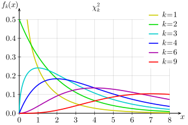
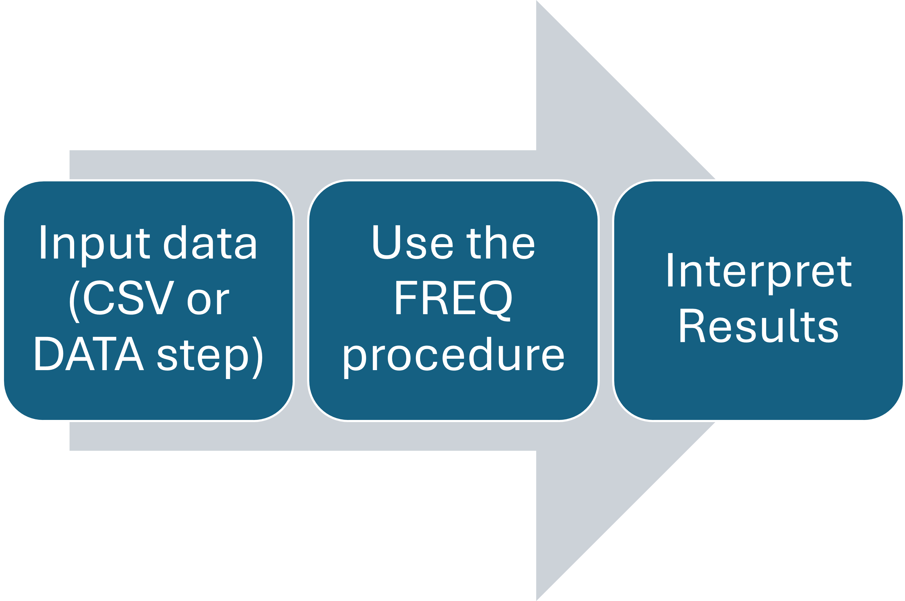
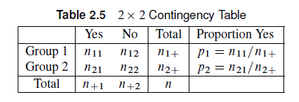
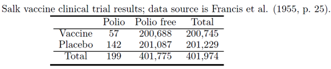
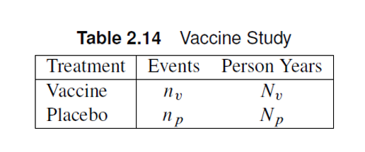
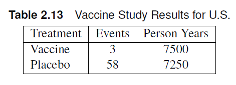

# Chapter 2: $2\times2$ tables

```{r}
#| echo: false
#| output: false

library(vcdExtra)
library(tidyverse)
```

## Outline {.smaller}

-   Contingency Tables
-   Chi-Square Statistics
-   Exact Tests
-   Difference in Proportions
-   Odds Ratio and Relative Risk
-   Sensitivity and Specificity
-   McNemar’s Test
-   Incidence Densities
-   Power Analysis

# Contingency Tables

## Contingency Tables

::: columns
::: {.column style="width:40%; font-size: 75%"}
-   Summarizes categorical data
    -   Response variable has two levels
    -   Exploratory variable has two levels
-   Example:
    -   Treatment/Placebo in RCT
    -   Case/Control in a retrospective study
:::

::: {.column style="width:60%"}

:::
:::

## Contingency Tables

-   Main Objective: Determine whether there is an association between the row and column variables.
    -   Is the risk variable associated with the prevalence rate?
-   Recall: Intro to Statistics
    -   Chi-square tests of homogeneity $H_0$: The two populations (rows) have the same distribution of the column variable
    -   Chi-square tests of independence $H_0$: The row and column variables are independent of each other.

## Contingency Tables: Convention

The indices of contingency tables denote the row and column of each number.

::: columns
::: {.column style="width:40%; font-size: 65%"}
-   $n_{xy}$ denotes the number at row $x$ and column $y$
-   Seeing a (+) sign indicates that it is a marginal sum.
    -   $n_{x+}$ denotes the sum of all columns in row $x$.
    -   $n_{+y}$ denotes the sum of all rows in column $y$.
-   The placement of the + sign denotes the margin in which it was summed.
-   $n$ is the total sample size.
:::

::: {.column style="width:60%"}
{fig-align="center"}
:::
:::

# Chi-square Statistics

## Chi-square Statistics

-   The null hypothesis of no association between row and column variables imply that the totals are fixed.
-   The probabilities of realization of each cell is determined by the [hypergeometric distribution](https://en.wikipedia.org/wiki/Hypergeometric_distribution).

## Chi-square Statistics

-   Recall: Pearson Chi-square statistics

$$
Q_P = \sum_{i=1}^2\sum_{j=1}^2 \frac{(n_{ij}-m_{ij})^2}{m_{ij}}
$$

::: callout-note
$m_{ij}$ is the expected value of the number of observations in row $i$ and column $j$, $n_{ij}$.
:::

## Mantel-Haenszel Chi-square statistic {.smaller}

-   Another form of the Chi-square statistic is the Mantel-Haenszel chi-square statistic, $Q$.For $2\times 2$ contingency tables,

$$
Q =  \frac{(n_{11}-m_{11})^2}{v_{11}}
$$ $$
m_{11} = n_{1+}n_{+1}/n; v_{11} = \frac{n_{1+}n_{2+}n_{+1}n_{+2}}{n^2(n-1)}
$$

::: callout-note
This statistic is based on the condition that all marginal totals are fixed and the probability distribution of random allocation of units to groups is given by the hypergeometric distribution.$m_{11}$ and $v_{11}$ are the mean and variance of the hypergeometric distribution based on the $2 \times 2$ table, respectively.
:::

::: callout-note
$Q$ is also known as the randomization chi-square.
:::

## Pearson Chi-square vs. Mantel-Haenszel Chi-square

-   MH Chi-square is more powerful than Pearson Chi-square
-   MH Chi-square tests need less samples than Pearson Chi-square, in general.
-   MH Chi-square tests can control for confounding variables.

$$
Q_P = \frac{n}{n-1}Q
$$

## Chi-square distribution

::: columns
::: {.column style="width:60%; font-size: 65%"}
-   The chi-square distribution, $\chi_k^2$, is defined by the number of degrees of freedom 𝑘, where 𝑘≥1.
-   Properties include:
    -   The value of $\chi^2$ can only assume non-negative values.
    -   The $\chi^2$ distribution is asymmetric.
    -   The sum of two or more independent chi-square variables also follows a chi-square distribution.
    -   Mean: $k$, Variance: $2k$
:::

::: {.column style="width:40%"}

:::
:::

## Chi-square distribution

For large $n$, both the MH/randomization chi-square and the Pearson chi-square approach a chi-square distribution with $1$ degree of freedom ($\chi^2_1$).

::: callout-warning
Rule of thumb: The expected value for each cell should be at least 5, i.e. $m_{ij} \geq 5$ for all $i,j$
:::

## Hypothesis testing

The null hypothesis of no association states that there is no association between row and column variables. - Assuming this is true and assumptions are satisfied, $Q$ and $Q_P$ follow a $\chi^2_1$ distribution for $2\times2$ tables.

::: callout-note
The p-values are given by $P(\chi^2 > Q_P)$ and $P(\chi^2 > Q)$ for Pearson and MH Chi-squares, respectively.
:::

## Hypothesis Testing: SAS



## FREQ procedure

-   The `weight` statement tells SAS if there is an aggregated count variable present in the data set.
-   The `tables` statement tells SAS to create a contingency table using the stated variables.
    -   Under tables, you can include the `cmh` or the `chisq` option to calculate the randomization and Pearson chi-square values.

Below is a sample code.

```         
proc freq;
weight count;
tables a*b/ cmh chisq;
run;
```

## Example

::: columns
::: {.column style="width:60%; font-size: 65%"}
The table shows the information from a randomized clinical trial that compared an experimental treatment to a placebo treatment for a respiratory disorder.

-   What is the Pearson chi-square value?
-   What is the Mantel-Haenszel chi-square value?
-   Is there strong evidence of an association between treatment and outcome?
:::

::: {.column style="width:40%"}
```{r}
#| echo: false
library(tidyverse)
dat <- expand.grid(Treatment=c("Placebo","Test"),
                  Outcome = c("Favorable","Unfavorable")) |> 
mutate(count = c(16,40,48,20))

xtabs(count ~ .,data=dat) 
```
:::
:::

## Example

::: columns
::: {.column style="width:50%; font-size: 65%"}
The table shows the information from a randomized clinical trial that compared an experimental treatment to a placebo treatment for a respiratory disorder.

-   What is the Pearson chi-square value? **21.7**

-   What is the Mantel-Haenszel chi-square value? **21.53**

-   Is there strong evidence of an association between treatment and outcome?

    -   *p \< 0.0001*; There is strong evidence of an association between the test treatment and the outcome.
:::

::: {.column style="width:50%"}
::: panel-tabset
### SAS Code

``` {.r code-line-numbers="3,11,13"}
SAScode <- "
data respire;
input treat $ outcome $ count; 
datalines;
test f 40
test u 20
placebo f 16
placebo u 48
;

proc freq data=respire order=data; 
weight count;
tables treat*outcome/chisq; 
run;
"
```

### R Code

```{r}
#| code-fold: true
dat <- expand.grid(Treatment=c("Placebo","Test"),
                  Outcome = c("Favorable","Unfavorable")) |> 
mutate(count = c(16,40,48,20))

xtabs(count ~ .,data=dat) -> dat_cc
```

Pearson Chi-square (without continuity adjustment)

```{r}
#| code-fold: true
#| echo: true
#install.packages("tidyverse")
library(tidyverse)
dat <- expand.grid(Treatment=c("Placebo","Test"),
                  Outcome = c("Favorable","Unfavorable")) |> 
mutate(count = c(16,40,48,20))

xtabs(count ~ .,data=dat) 
chisq.test(dat_cc, correct = F)
```

Randomization Chi-square

```{r}
#| code-fold: true
#| echo: true
# install.packages("vcdExtra")
CMH_CC <-vcdExtra::CMHtest(dat_cc) 
CMH_CC$table |> as.data.frame()|> gt::gt(rownames_to_stub = T)
```
:::
:::
:::

## Exercise

::: columns
::: {.column style="width:50%; font-size: 65%"}
Suppose we wish to determine if the frequency of falls is related to wheelchair use for Polio survivors. The data is shown in the table.

-   Write the SAS code to enter the data and analyze using the FREQ procedure.
-   What is the Pearson chi-square value?
-   What is the Mantel-Haenszel chi-square value?
-   Using a significance level of 0.05, do we have sufficient evidence to warrant the conclusion that wheelchair use and falling are associated?
:::

::: {.column style="width:50%"}
```{r}
# install.packages("vcdExtra")
dat <- expand.grid(Fall=c("Fallers","Nonfallers"),
                  Wheelchair = c("Yes","No")) |> 
mutate(count = c(62,18,121,32))

xtabs(count ~ .,data=dat) -> dat_cc
dat_cc
```
:::
:::

## Exercise

::: columns
::: {.column style="width:50%; font-size: 65%"}
Suppose we wish to determine if the frequency of falls is related to wheelchair use for Polio survivors. The data is shown in the table.

-   Write the SAS code to enter the data and analyze using the FREQ procedure.
-   What is the Pearson chi-square value? **0.0783**
-   What is the Mantel-Haenszel chi-square value? **0.0780**
-   Using a significance level of 0.05, do we have sufficient evidence to warrant the conclusion that wheelchair use and falling are associated?
    -   **p= 0.78, no evidence that wheelchair use and falling are associated.**
:::

::: {.column style="width:50%"}
::: panel-tabset
### SAS

``` {.r code-line-numbers="2,10,12"}
data wheelchair;
input fall $ wheelchair $ count;
datalines;
f yes 62
n yes 18
f no 121
n no 32
;

proc freq data=wheelchair order=data;
weight count;
tables fall*wheelchair/chisq;
run;
```

### R

Pearson Chi-square (without continuity adjustment)

```{r}
#| code-fold: true
#| echo: true
#install.packages("tidyverse")

chisq.test(dat_cc, correct = F)
```

Randomization Chi-square

```{r}
#| code-fold: true
#| echo: true
# install.packages("vcdExtra")
CMH_CC <-vcdExtra::CMHtest(dat_cc) 
CMH_CC$table |> as.data.frame()|> gt::gt(rownames_to_stub = T)
```
:::
:::
:::

# Exact Methods

## Fisher's Exact Test

The chi-square distribution assumption for $Q$ and $Q_P$ includes a large sample assumption.

::: callout-warning
What if $m_{ij} < 5$?
:::

The **Fisher's Exact Test** can be used to analyze these contingency tables.

## Fisher's Exact Test

Fisher's Exact Test is based on the hypergeometric distribution.

-   Calculates an *exact* p-value, unlike the chi-square test which only uses an approximation.
-   Easy to calculate for $2 \times 2$ and total sample sizes below 50, but computationally expensive as the number increases.

## Hypergeometric distribution

The hypergeometric distribution describes the probability of the cell count for the (i,j) cell in a $2\times2$ table assuming the null hypothesis of no association assuming the null hypothesis of no association is true.

$$
P(n_{11}) = \frac{n_{1+}!n_{2+}!n_{+1}!n_{+2}!}{n! n_{11}!n_{12}!n_{21}!n_{22}!}
$$

-   One of margins can be regarded as fixed depending on the treatment assignment/sampling method.
-   To get the **exact** p-value, we sum the probabilities of tables that are as *likely or less likely* given the fixed margins.

## Fisher's Exact Test: Hypotheses

Null hypothesis $H_0$: there is no association between the row and column variables

-   One sided $H_a$: There is a positive/negative association between the row and column variables. OR One combination of the row and column variable levels is more favored compared to the others.
-   Two-sided $H_a$: there is an association between the row and column variables.

::: callout-note
Only add probabilities of outcomes that have lower probabilities than the observed value based on the hypergeometric distribution.
:::

## Fisher's Exact Test: SAS

Including the `exact` or the `chisq` option under the `tables` statement will yield the results of the exact test.

```         
proc freq;
weight count;
tables a*b/ exact chisq;
run;
```

## Example

The table shown shows data from a study on treatments for healing severe infections. Calculate the exact p-value of this contingency table using the Fisher’s Exact Test.

-   Under the alternative hypothesis: The test treatment is positively associated with the outcome.
-   Under the alternative hypothesis: The test treatment is associated with the outcome.
-   At a significance level of 0.10, do you have enough evidence to conclude that the treatment is associated with the outcome?

```{r}
#| echo: false
library(tidyverse)
dat <- expand.grid(Treatment=c("Test","Control"),
                  Outcome = c("Favorable","Unfavorable")) |> 
mutate(count = c(10,2,2,4))

xtabs(count ~ .,data=dat) -> dat_cc
dat_cc
```

## Example

-   Under the alternative hypothesis: The test treatment is positively associated with the outcome. **p=0.0573**
-   Under the alternative hypothesis: The test treatment is associated with the outcome. **p=0.1070**
-   At a significance level of 0.10, do you have enough evidence to conclude that the treatment is associated with the outcome? **At** $\alpha = 0.10$, we do not have sufficient evidence to conclude that treatment is associated with the outcomes in healing severe infections.

::: callout-note
Be careful when selecting which one-sided alternative hypothesis to interpret from the results!
:::

::: panel-tabset
### SAS Code

``` r
data severe;
input treat $ outcome $ count;
datalines;
Test f 10
Test u 2
Control f 2
Control u 4
;
proc freq order=data data=severe;
weight count;
tables treat*outcome / chisq nocol;
run;
```

### Manual Calculation through R

-   One-sided hypothesis (+)

```{r}
#| echo: true

c(`Prob_n11=10`=factorial(12)^2*factorial(6)^2/(factorial(18)*factorial(10)*factorial(2)^2*factorial(4)),
`Prob_n11=11` = factorial(12)^2*factorial(6)^2/(factorial(18)*factorial(11)*factorial(1)^2*factorial(5)),
`Prob_n11=12` = factorial(12)^2*factorial(6)^2/(factorial(18)*factorial(12)*factorial(0)^2*factorial(6)))


factorial(12)^2*factorial(6)^2/(factorial(18)*factorial(10)*factorial(2)^2*factorial(4)) + #P($n_11$=10)
factorial(12)^2*factorial(6)^2/(factorial(18)*factorial(11)*factorial(1)^2*factorial(5)) + # P($n_11$ = 11)
factorial(12)^2*factorial(6)^2/(factorial(18)*factorial(12)*factorial(0)^2*factorial(6)) #P($n_11$ = 12)
```

-   Two-sided hypothesis (needs to include values \< 10.)

```{r}
#| echo: true

c(`Prob_n11=10`=factorial(12)^2*factorial(6)^2/(factorial(18)*factorial(10)*factorial(2)^2*factorial(4)),
`Prob_n11=11` = factorial(12)^2*factorial(6)^2/(factorial(18)*factorial(11)*factorial(1)^2*factorial(5)),
`Prob_n11=12` = factorial(12)^2*factorial(6)^2/(factorial(18)*factorial(12)*factorial(0)^2*factorial(6)),
`Prob_n11=9` = factorial(12)^2*factorial(6)^2/(factorial(18)*factorial(9)*factorial(3)^2*factorial(3)),
`Prob_n11=8` = factorial(12)^2*factorial(6)^2/(factorial(18)*factorial(8)*factorial(4)^2*factorial(2)),
`Prob_n11=7` = factorial(12)^2*factorial(6)^2/(factorial(18)*factorial(7)*factorial(5)^2*factorial(1)),
`Prob_n11=6` = factorial(12)^2*factorial(6)^2/(factorial(18)*factorial(6)*factorial(6)^2*factorial(0)))


factorial(12)^2*factorial(6)^2/(factorial(18)*factorial(10)*factorial(2)^2*factorial(4)) + #P($n_11$=10)
factorial(12)^2*factorial(6)^2/(factorial(18)*factorial(11)*factorial(1)^2*factorial(5)) + # P($n_11$ = 11)
factorial(12)^2*factorial(6)^2/(factorial(18)*factorial(12)*factorial(0)^2*factorial(6)) + #P($n_11$ = 12)
factorial(12)^2*factorial(6)^2/(factorial(18)*factorial(6)*factorial(6)^2*factorial(0)) #P($n_11$ = 6)
```
:::

## Exercise

Fisher’s experiment: A number of individuals gathered together for afternoon tea. A lady in the group said that she could differentiate between whether the milk or the tea was poured first into a cup. Fisher suggested to pour tea first into four cups and to pour milk first into four cups. The lady was blinded to which cups had milk or tea poured first, but she knew there were four of each. The contingency table is shown below. At $\alpha=0.05$, do we have sufficient evidence to conclude that the lady can differentiate tea based on how they were poured?

```{r}
dat <- expand.grid(Actual=c("Milk","Tea"),
                  Guess = c("Milk","Tea")) |> 
mutate(count = c(3,1,1,3))

xtabs(count ~ .,data=dat) -> dat_cc
dat_cc
```

## Exercise

::: columns
::: {.column style="width:40%; font-size: 65%"}
At $\alpha=0.05$, do we have sufficient evidence to conclude that the lady can differentiate tea based on how they were poured?

-   can be analyzed through SAS or mathematically through the hypergeometric distribution
-   use one-sided alternative hypothesis because direction is implied in the problem. Thus we consider P($n_{11}$=3) + P($n_{11}$ = 4).
-   P($n_{11}$=3) + P($n_{11}$ = 4) = 0.229+0.014 = 0.243
:::

::: {.column style="width:60%"}
::: panel-tabset
### SAS Code

``` r
data tea;
input actual$ guess $ count;
datalines;
milk milk 3
milk tea 1
tea milk 1
tea tea 3
;

proc freq data=tea order=data;
weight count;
tables actual*guess/chisq;
run;
```

### R (Math)

```{r}
#| echo: true

c(`Prob_n11=3`=factorial(4)^4/(factorial(8)*factorial(3)^2),
`Prob_n11=4`=factorial(4)^4/(factorial(8)*factorial(4)^2) )

factorial(4)^4/(factorial(8)*factorial(3)^2) + #P($n_11$=3)
factorial(4)^4/(factorial(8)*factorial(4)^2) # P($n_11$ = 4)
```
:::
:::
:::

# Difference in Proportions

## Difference in Proportions

-   We are often interested in comparing two independent populations

    -   Categorical response: proportions

-   Recall from Intro to Stats course: Difference of two proportions

    -   Confidence interval using the standard normal distribution

    -   Z-test to test for a significant difference in proportions of two populations

## Difference in Proportions: Estimation

::: columns
::: {.column style="width:40%; font-size: 65%"}
-   Independence of the two populations (Groups 1 and 2) mean that we have two independent binomial distributions.
-   Estimating the difference of the two proportions involves calculating the confidence intervals.
-   There are different methods to calculate the confidence interval for the difference in proportion.
:::

::: {.column style="width:60%"}
{fig-align="center"}
:::
:::

## Confidence Intervals: Wald

The commonly used confidence interval in estimating difference in proportions is the **Wald** confidence interval.

$$
p_1-p_2 \pm z_{1-\alpha/2}\sqrt{\frac{p_1(1-p_1)}{n_{1+}} + \frac{p_2(1-p_2)}{n_{2+}}}
$$

::: callout-warning
This CI fails when $p_1$ or $p_2$ are close to the extreme values (0 and 1). this CI does not account for the discreteness of the data.
:::

## Confidence Intervals: Corrected Wald

We introduce a correction term to the Wald confidence interval to account for the continuity of the data.

$$
p_1-p_2 \pm z_{1-\alpha/2}\sqrt{\frac{p_1(1-p_1)}{n_{1+}} + \frac{p_2(1-p_2)}{n_{2+}}} +1/2 (1/n_{1+} +1/n_{2+} )
$$

::: callout-warning
This CI still fails when $p_1$ or $p_2$ are close to the extreme values (0 and 1).
:::

## Confidence Intervals: Agresti-Caffo

We introduce a correction term to the Wald confidence interval to account for the extreme values.

$$
p_1-p_2 \pm z_{1-\alpha/2}\sqrt{\frac{\tilde{p}_1(1-\tilde{p}_1)}{n_{1+}+2} + \frac{\tilde{p}_2(1-\tilde{p}_2)}{n_{2+}+2}}  
$$ where

$$
\tilde{p}_1 = (n_{11}+1)/(n_{1+}+2) ; \tilde{p}_2 = (n_{21}+1)/(n_{2+}+2)
$$

::: callout-note
This correction keeps the coverage of the confidence interval at 95% for all possible values of $p_1$ and $p_2$.
:::

## Confidence Intervals: Other {.smaller}

| Confidence Intervals | SAS code   | Adjustment Type                                 |
|-------------------|-------------------|-----------------------------------|
| Wald                 | `wald`     | Default                                         |
| Corrected Wald       | `correct`  | Continuity correction                           |
| Agresti-Caffo        | `ac`       | Improved Coverage                               |
| Miettinen-Nurminen   | `mn`       | Uses goodness-of-fit to improve coverage        |
| Newcombe             | `newcombe` | hybrid interval that does well for small counts |
| Hauck-Anderson       | `ha`       | Accounts for row totals                         |
| Exact                | `exact`    | Maximizes p-value overall possible values       |

## Confidence Intervals: SAS

-   The FREQ procedure has all mentioned confidence intervals
    -   The options included in the `tables` statement are included in the previous slide.
    -   The `riskdiff` option of the `tables` statement allows us to specify which confidence intervals we need for the difference as well as the estimates for the group proportions.
    -   The `alpha` option can be used to change the confidence level.

Sample SAS code:

``` {.r code-line-numbers="3"}
proc freq;
weight count;
tables treat*outcome/riskdiff(correct cl=(mn ac)) alpha=0.05;
run;
```

## Example

::: columns
::: {.column style="width:50%; font-size: 65%"}
The contingency table shows the information from a randomized clinical trial that compared an experimental treatment to a placebo treatment for a respiratory disorder. Calculate the 95% confidence interval for the difference in proportion of favorable outcomes for both treatment groups.

-   Wald
-   Corrected Wald
-   Agresti-Caffo
-   Corrected Miettinen-Nurminen
:::

::: {.column style="width:50%; font-size: 125%"}
```{r}
#| echo: false
dat <- expand.grid(Treatment=c("Placebo","Test"),
                  Outcome = c("Favorable","Unfavorable")) |> 
mutate(count = c(16,40,48,20))

xtabs(count ~ .,data=dat)-> dat_cc
dat_cc
```
:::
:::

## Example

::: columns
::: {.column style="width:50%; font-size: 65%"}
The contingency table shows the information from a randomized clinical trial that compared an experimental treatment to a placebo treatment for a respiratory disorder. Calculate the 95% confidence interval for the difference in proportion of favorable outcomes for both treatment groups.

-   Corrected Wald **0.2409-0.5924**
-   Agresti-Caffo **0.2456-0.5416**
-   Corrected Miettinen-Nurminen **0.2460-0.5427**
:::

::: {.column style="width:50%; font-size: 125%"}
```{r}
#| echo: false
dat <- expand.grid(Treatment=c("Placebo","Test"),
                  Outcome = c("Favorable","Unfavorable")) |> 
mutate(count = c(16,40,48,20))

xtabs(count ~ .,data=dat)-> dat_cc
dat_cc
```
:::
:::

SAS Code

``` {.r code-line-numbers="12"}
data respire;
input treat $ outcome $ count; 
datalines;
test f 40
test u 20
placebo f 16
placebo u 48
;

proc freq data=respire order=data; 
weight count; 
tables treat*outcome/riskdiff(correct cl=(mn ac)) alpha=0.05; 
run;
```

## Exercise

::: columns
::: {.column style="width:50%; font-size: 65%"}
One of the most famous and largest clinical trials ever performed was in 1954. The data obtained from this RCT is shown in the contingency table. Calculate the *90%* confidence interval for the difference in proportion of polio-free children between the vaccine and placebo group.

-   Corrected Wald
-   Miettinen-Nurminen
-   Newcombe
:::

::: {.column style="width:50%; font-size: 125%"}

:::
:::

## Exercise

::: columns
::: {.column style="width:50%; font-size: 65%"}
One of the most famous and largest clinical trials ever performed was in 1954. The data obtained from this RCT is shown in the contingency table. Calculate the *90%* confidence interval for the difference in proportion of polio-free children between the vaccine and placebo group.

-   Corrected Wald **(0.0003,0.0005)**
-   Miettinen-Nurminen **(0.0003,0.0005)**
-   Newcombe **(0.0003,0.0005)**
:::

::: {.column style="width:50%; font-size: 125%"}

:::
:::

SAS Code

``` {.r code-line-numbers="14"}
data vaxx;
length treat $7.;
input treat $ outcome $ count; 
datalines;
vax n 200688
vax p 57
placebo n 201087
placebo p 142
;

proc freq data=vaxx order=data;
weight count;
tables treat*outcome/riskdiff(correct cl=(mn newcombe)) 
alpha=0.10;
run;
```

# Odds Ratio and Relative Risk

## Odds Ratio

-   Odds of success: the ratio of probability of success and failure of an outcome. $$
    Odds = p/(1-p)
    $$
-   Odds ratio between two groups: the ratio of the odds of success for Group 1 and Group 2. $$
    OR = \frac{p_1/(1-p_1)}{p_2/(1-p_2)} = (n_{11}n_{22}/n_{21}n_{12})
    $$
-   Commonly used in retrospective studies

## Relative Risk

-   The ratio of the risk developing a particular condition for individuals with risk factors present and absent

$$
RR = p_1/p_2 = \frac{(n_{11}/n_{1+})}{(n_{21}/n_{2+})}
$$

-   Commonly used in prospective studies

## Odds Ratio & Relative Risk {.smaller}

-   OR and RR are approximately equal when the condition is rare.
    -   \<10% of the time
-   For cross-sectional data, the relative risk is known as the prevalence ratio because the disease and risk factor are assessed at the same time.
-   When OR, RR \> 1, Group 1 is **more likely** than Group 2 to record success.
-   When OR, RR\< 1, Group 1 is **less likely** to record success.
-   When OR, RR= 1, there is **no association** between group and success because the two groups are equally likely to record success.

## Odds Ratio & Relative Risk: SAS

-   OR and RR are calculated using the measures option in the TABLES statement in PROC FREQ.
-   For small sample sizes, the exact confidence limits can be calculated for the odds ratios.

``` {.r code-line-numbers="3,4"}
proc freq;
weight count;
tables a*b/measures;
exact or rr;
run;
```

## Example

The contingency table shows data from a study on treatments for severe infections. Calculate the asymptotic and exact confidence limits for the odds ratio of favorable outcomes for test and control groups.

```{r}
#| echo: false
library(tidyverse)
dat <- expand.grid(Treatment=c("Test","Control"),
                  Outcome = c("Favorable","Unfavorable")) |> 
mutate(count = c(10,2,2,4))

xtabs(count ~ .,data=dat) -> dat_cc
dat_cc
```

## Example

The contingency table shows data from a study on treatments for severe infections. Calculate the asymptotic and exact confidence limits for the odds ratio of favorable outcomes for test and control groups.

```{r}
#| echo: false
library(tidyverse)
dat <- expand.grid(Treatment=c("Test","Control"),
                  Outcome = c("Favorable","Unfavorable")) |> 
mutate(count = c(10,2,2,4))

xtabs(count ~ .,data=dat) -> dat_cc
dat_cc
```

SAS Code

``` r
data severe;
input treat $ outcome $ count;
datalines;
Test f 10
Test u 2
Control f 2
Control u 4
;
proc freq order=data data=severe;
weight count;
tables treat*outcome / chisq nocol;
exact or;
run;
```

| Method     | Value and CI         |
|------------|----------------------|
| Asymptotic | 10 (1.0256, 97.5005) |
| Exact      | 10 (0.6896,166.3562) |

**The two methods lead to different conclusions.**

## Exercise

Two groups having the same symptoms of respiratory illness were sampled. One group was treated with an experimental treatment and the other group was treated with a placebo. The participants were asked whether there was an overall treatment in overall respiration.

-   Calculate the odds ratio of respiratory improvement between test and placebo groups.
-   What is the relative risk of having respiratory improvement if we consider the treatment as a risk factor?
-   Calculate the asymptotic 95% CI for each answer.

```{r}
#| echo: false
library(tidyverse)
dat <- expand.grid(Treatment=c("Test","Placebo"),
                  Outcome = c("Yes","No")) |> 
mutate(count = c(29,14,16,31))

xtabs(count ~ .,data=dat) -> dat_cc
dat_cc
```

## Exercise

Two groups having the same symptoms of respiratory illness were sampled. One group was treated with an experimental treatment and the other group was treated with a placebo. The participants were asked whether there was an overall treatment in overall respiration.

-   Calculate the odds ratio of respiratory improvement between test and placebo groups.**4.01 (1.67,9.66)**
-   What is the relative risk of having respiratory improvement if we consider the treatment as a risk factor? **2.07 (1.27,3.37)**
-   Calculate the asymptotic 95% CI for each answer.

```{r}
#| echo: false
library(tidyverse)
dat <- expand.grid(Treatment=c("Test","Placebo"),
                  Outcome = c("Yes","No")) |> 
mutate(count = c(29,14,16,31))

xtabs(count ~ .,data=dat) -> dat_cc
dat_cc
```

::: panel-tabset
### SAS Code

``` r
data resp;
input  Treatment $ Outcome  $ count;
datalines;
Test Yes 29
Placebo Yes 14
Test No 16
Placebo No 31
;
proc freq data=resp order=data;
weight count;
tables treatment*outcome/measures;
run;
```

### R Code

Odds ratio

```{r}
#| echo: true
library(epitools)
dat_cc |> oddsratio(rev=c("both"), method="wald",conf.level=0.95) -> or
or$measure
```

Relative Risk

```{r}
#| echo: true
dat_cc |> riskratio(rev=c("both"),method="wald")->rr
rr$measure
```
:::

# Sensitivity and specificity

## Sensitivity

True proportion of positive results that a test elicits when performed on subjects known to have the disease.

$$
Sens=TP/(TP+FN) = n_{11}/n_{1+}
$$ Sensitivity is the conditional probability of a positive test given that the subject has the disease ($P(PT|HD)$)

## Specificity

True proportion of negative results that a test elicits when performed on subjects known to be disease free.

$$
Sens=TN/(TN+FP) = n_{22}/n_{2+}
$$ Specificity is the conditional probability of a negative test when the subject does not have the disease ($P(NT|ND)$).

## Sensitivity and Specificity: SAS

The `FREQ` procedure can also calculate sensitivity and specificity.

-   `riskdiff` approximates these metrics using the risk estimates.
    -   Sensitivity: Row 1 risk estimate for Column 1
    -   Specificity: Row 2 risk estimate for Column 2

## Example

The following table shows the results of a study investigating a new screening device for a skin disease. Calculate the sensitivity and specificity of the screening device.

```{r}
#| echo: false
library(tidyverse)
dat <- expand.grid(Status=c("Disease Present","Disease Absent"),
                  Test = c("Positive","Negative")) |> 
mutate(count = c(52,20,8,100))

xtabs(count ~ .,data=dat) -> dat_cc
dat_cc
```

## Example

The following table shows the results of a study investigating a new screening device for a skin disease. Calculate the sensitivity and specificity of the screening device.

-   Sensitivity: 0.87 (0.75,0.94)
-   Specificity: 0.83 (0.75,0.90)

```{r}
#| echo: false
library(tidyverse)
dat <- expand.grid(Status=c("Disease Present","Disease Absent"),
                  Test = c("Positive","Negative")) |> 
mutate(count = c(52,20,8,100))

xtabs(count ~ .,data=dat) -> dat_cc
dat_cc
```

SAS Code

``` r
data screening;
input disease $ outcome $ count @@;
datalines;
present + 52 present - 8
absent + 20 absent - 100
;
proc freq data=screening order=data;
weight count;
tables disease*outcome / riskdiff;
run;
```

## Exercise

A pharmaceutical company developed a screening test that can be used to detect infection of the Lassa (virus). The newly developed test was said to be cheaper than the tests currently available to the public, but its performance was yet to be evaluated. The screening test was applied to 115 diagnosed cases (w/ Lassa virus) and 120 control participants (w/o Lassa virus) of the Lassa fever. The resulting contingency table is shown in the table.

-   What is the sensitivity of the test?
-   What is the specificity of the test?

```{r}
#| echo: false
library(tidyverse)
dat <- expand.grid(Status=c("Disease Present","Disease Absent"),
                  Test = c("Positive","Negative")) |> 
mutate(count = c(97,45,18,75))

xtabs(count ~ .,data=dat) -> dat_cc
dat_cc
```

## Exercise

A pharmaceutical company developed a screening test that can be used to detect infection of the Lassa (virus). The newly developed test was said to be cheaper than the tests currently available to the public, but its performance was yet to be evaluated. The screening test was applied to 115 diagnosed cases (w/ Lassa virus) and 120 control participants (w/o Lassa virus) of the Lassa fever. The resulting contingency table is shown in the table.

-   What is the sensitivity of the test? **0.8435 (0.76, 0.90)**
-   What is the specificity of the test? **0.6250 (0.53, 0.71)**

```{r}
#| echo: false
library(tidyverse)
dat <- expand.grid(Status=c("Disease Present","Disease Absent"),
                  Test = c("Positive","Negative")) |> 
mutate(count = c(97,45,18,75))

xtabs(count ~ .,data=dat) -> dat_cc
dat_cc
```

### SAS Code

``` r
data screening;
input disease $ outcome $ count @@;
datalines;
present + 97 present - 18
absent + 45 absent - 75
;
proc freq data=screening order=data;
weight count;
tables disease*outcome / riskdiff;
run;
```

# McNemar's Test

## McNemar's Test

-   When the 2x2 table provides information from matched pairs, the two responses are related to each other. Hence, independence cannot be assumed.

-   Null hypothesis: The marginal probabilities of each outcome are the same.

-   The test statistic for the McNemar’s test is $Q_M$ given by

$$
Q_M = (n_{12}-n_{21})^2/(n_{12}+n_{21})
$$

## McNemar's Test: SAS

-   The `agree` option in the `tables` statement can be used to perform the McNemar's test.
-   Exact p-values can be calculated using the `exact` statement.

### Sample SAS Code

``` r
proc freq;
weight count;
tables a*b/agree;
exact mcnem;
run;
```

## Example

The table displays data collected by political science researchers who polled husbands and wives on whether they approved of one of their U.S. senators. The cell counts represent the number of pairs of husbands and wives who fit the configurations indicated by the row and column levels. Use the McNemar’s test to determine whether there is no difference in husband and wife approvals on the state senator.

```{r}
#| echo: false
library(tidyverse)
dat <- expand.grid(Husband=c("Yes","No"),
                  Wife = c("Yes","No")) |> 
mutate(count = c(20,10,5,10))

xtabs(count ~ .,data=dat) -> dat_cc
dat_cc
```

## Example

The table displays data collected by political science researchers who polled husbands and wives on whether they approved of one of their U.S. senators. The cell counts represent the number of pairs of husbands and wives who fit the configurations indicated by the row and column levels. Use the McNemar’s test to determine whether there is no difference in husband and wife approvals on the state senator.

- exact p-value = 0.3018, which implies that there is no evidence of a difference between the senator approval ratings of the husbands and wives.

```{r}
#| echo: false
library(tidyverse)
dat <- expand.grid(Husband=c("Yes","No"),
                  Wife = c("Yes","No")) |> 
mutate(count = c(20,10,5,10))

xtabs(count ~ .,data=dat) -> dat_cc
dat_cc
```

### SAS Code

``` {.r code-line-numbers="12,13"}
data approval;
input hus_resp $ wif_resp $ count;
datalines;
yes yes 20
yes no 5
no yes 10
no no 10
;

proc freq order=data;
weight count;
tables hus_resp*wif_resp / agree;
exact mcnem;
run;
```

## Exercise

The tables show the data from a study that compared the diagnostic accuracy of magnetic resonance imaging (MRI) and ultrasound in patients who had been established as having localized prostate cancer by a gold standard test.

-   Use the McNemar’s test to determine whether the two methods have a different probabilities in diagnosing localized prostate cancer. (*Hint: Small cell counts*)

```{r}
#| echo: false
dat <- expand.grid(MRI=c("Localized","Advanced"),
                  Ultrasound = c("Localized","Advanced")) |> 
mutate(count = c(4,3,6,3))

xtabs(count ~ .,data=dat) -> dat_cc
dat_cc
```

## Exercise

The tables show the data from a study that compared the diagnostic accuracy of magnetic resonance imaging (MRI) and ultrasound in patients who had been established as having localized prostate cancer by a gold standard test.

-   Use the McNemar’s test to determine whether the two methods have a different probabilities in diagnosing localized prostate cancer. (*Hint: Small cell counts*)
    -   Use exact p-value
    -   $p=0.5078$. No evidence of any difference in probabilities in correctly diagnosing localized prostate cancer.

```{r}
#| echo: false
dat <- expand.grid(MRI=c("Localized","Advanced"),
                  Ultrasound = c("Localized","Advanced")) |> 
mutate(count = c(4,3,6,3))

xtabs(count ~ .,data=dat) -> dat_cc
dat_cc
```

### SAS Code

``` r
data imaging;
input mri $ ult $ count;
datalines;
loc loc 4
loc adv 6
adv loc 3
adv adv 3
;

proc freq order=data;
weight count;
tables mri*ult / agree;
exact mcnem;
run;
```

# Incidence Densities

## Incidence Densities {.smaller}

-   Counts of subjects who responded within a duration of exposure to an event.
-   Poisson distribution – counts
-   Examples:
    -   Bacteria colony count
    -   Disease incidence
    -   Accidents
    -   Vaccine failure
-   Common measure of duration of exposure/ time-at-risk: person-time

## Poisson Distribution {.smaller}

Recall that the Poisson distribution is described by the following density function:

$$
P(x)= e^{-\lambda}\lambda^x/x!
$$

where $\lambda$ is the expected number of events at a given unit of time.

-   \lambda is also referred to as incidence density.
-   For $t$ units of time, the expected number of events scales to $\lambda t$.
-   Main assumption: The time to event is a random variable following an exponential distribution.

## Incidence Density Ratios

::: columns
::: {.column style="width:50%; font-size: 65%"}
- The table shows the number of infections (events) and person years for participants of an RCT.
  - $n_v$ and $n_p$ are Poisson random variables with respective incidence densities equal to $\lambda_v$ and $\lambda_p$
- If $\lambda_v$ is the incidence density for the vaccine group, then the expected number of events is $\lambda_v N_v$.
- Similarly, the expected number of events in the placebo group is $\lambda_p N_p$
- We are interested in testing the null hypothesis $\lambda_v/\lambda_p = 1$.
  -   $\lambda_v/\lambda_p$ is referred to as the **Incidence Density Ratio (IDR)**
:::

::: {.column width="50%"}

:::
:::


## Incidence Density Ratios

The IDR can be estimated using conditional binomial distributions assuming $n_v$ and $n_p$ are independent Poisson processes.

$$
P(n_v|n_v+n_p) \sim Binomial\left(N=n_v + n_p, p = \frac{\lambda_vN_v}{\lambda_vN_v+\lambda_pN_p}\right)
$$

## Incidence Density Ratios: Confidence Interval

The binomial proportion can be estimated using the proportion of events in the treatment group:

$$
p = \frac{n_v}{n_v+n_p} = \frac{IDR(N_v/N_p)}{1+(IDR)(N_v/N_p)}
$$
Using algebra (Problem Set 1), *it is easy to show that*:

$$
IDR = \frac{p}{1-p}\left(N_p/N_v\right)
$$

## Incidence Density Ratios: Confidence Interval

You can calculate the confidence interval estimates for $p$ using the binomial distribution assumption ($p_L,p_U$) and apply the scaling factor to each confidence limit.

$$
95\% CI: \left(\frac{p_L}{1-p_L}(N_p/N_v),\frac{p_U}{1-p_U}(N_p/N_v)\right)
$$

## Incidence Density Ratios: SAS

- The `binomial` option in the `tables` statement produces the estimate and exact confidence limits for the binomial proportion $p$, i.e. $p_L$ and $p_U$.
- We use the estimate and exact confidence limits of $p$ in calculating the IDR.
- The `IML` procedure, which is the procedure used to perform mathematical equations, is used to calculate the IDR confidence limits.
  - Later on, we will use the `GENMOD` procedure to calculate exact confidence intervals for the IDR.


## Example

::: columns
::: {.column style="width:50%; font-size: 65%"}
The table shows the results of an international study of the effect of a rotavirus vaccine in nearly 70,000 infants on health care events. The events counted were hospitalizations or emergency room visits.

- Estimate the IDR of hospitalization/emergency room visits between the two groups.
- Calculate the 95% CI.

:::

::: {.column width="50%"}

:::
:::

## Example

::: columns
::: {.column style="width:50%; font-size: 65%"}
The table shows the results of an international study of the effect of a rotavirus vaccine in nearly 70,000 infants on health care events. The events counted were hospitalizations or emergency room visits.

- Estimate the IDR of hospitalization/emergency room visits between the two groups. **IDR = 0.05**
- Calculate the 95% CI. **(0.01, 0.15)**

:::

::: {.column width="50%"}

:::
:::

::: {.panel-tabset}
### SAS Code
```{.r code-line-numbers="12,13,16-27"}
data vaccine2;
input Outcome $ Count @@;
datalines;
vaccine 3 placebo 58
;

ods select BinomialCLs; *this statement filters the output.;


proc freq order=data data=vaccine2; # <1>
weight count;
tables Outcome / binomial (exact); *calculates the exact confidence limits for the binomial proportion;
ods output BinomialCLs=BinomialCLs; *outputs a dataset that includes the binomial CLs.;
run;

proc iml ;
Use BinomialCLs var{LowerCL UpperCL};
read all into CL;
print CL;
q = { 3, 7500, 58 , 7250 }; *vector of numbers from the table;
C= q[2]/q[4]; *q[i] represents the ith number in the q vector defined above. C is the person-years ratio Nv/Np;
P= q[1]/ (q[1] + q[3]); *estimate of the binomial distribution;
R= P/ ((1-P) *C) ; * IDR estimate;
CI= CL[1]/((1-CL[1])*C) || CL[2]/((1-CL[2])*C) ; *IDR CL;
print r CI;
quit;
```

1. `order=data` is important so as to keep the proportions consistent.


### R Code

```{r}
#| echo: true

events <- c(3,58)
person_years <- c(7500, 7250)

mult <- person_years[2]/person_years[1] #multiplier
DescTools::BinomCI(events[1],sum(events),method = "clopper-pearson") -> p_est


data.frame(IDR = p_est[1]/(1-p_est[1])*mult,
           IDR_lower = p_est[2]/(1-p_est[2])*mult,
          IDR_higher = p_est[3]/(1-p_est[3])*mult) |> gt::gt()
```


:::

## Exercise


::: columns
::: {.column style="width:50%; font-size: 65%"}
The table lists the number of accidents for day and night shift workers at a certain factory in Southeast Asia. The company wants you to investigate if there is any evidence of night shift workers having a higher accident density, i.e., higher incidence density of accidents, compared to the day shift.


:::

::: {.column width="50%"}
```{r}
#| echo: false
dat <- expand.grid(Shift=c("Night","Day"),
                  Metric = c("Accidents","Person-Hours")) |> 
mutate(count = c(25,20,1150,1240))

xtabs(count ~ .,data=dat) -> dat_cc
dat_cc
```
:::
:::


## Exercise


::: columns
::: {.column style="width:50%; font-size: 65%"}
The table lists the number of accidents for day and night shift workers at a certain factory in Southeast Asia. The company wants you to investigate if there is any evidence of night shift workers having a higher accident density, i.e., higher incidence density of accidents, compared to the day shift.

- IDR: 1.37 
- 95% CI: (0.72,2.56)


:::

::: {.column width="50%"}
```{r}
#| echo: false
dat <- expand.grid(Shift=c("Night","Day"),
                  Metric = c("Accidents","Person-Hours")) |> 
mutate(count = c(25,20,1150,1240))

xtabs(count ~ .,data=dat) -> dat_cc
dat_cc
```
:::
:::


::: {.panel-tabset}
### SAS Code
```{.r}
data accident;
/*data only has the events. Person-Years are used later.*/
input Outcome $ Count @@;
datalines;
night 25 day 20 # <1>
;

ods select BinomialCLs; *this statement filters the output.;

proc freq order=data data=accident;
weight count;
tables Outcome / binomial (exact) alpha=0.05; *calculates the exact confidence limits for the binomial proportion;
ods output BinomialCLs=BinomialCLs; *outputs a dataset that includes the binomial CLs.;
run;

proc iml ;
Use BinomialCLs var{LowerCL UpperCL};
read all into CL;
print CL;
q = { 25 1150 20 1240 }; *vector of numbers from the table;
C= q[2]/q[4]; *q[i] represents the ith number in the q vector defined above. C is the person-years ratio Nv/Np;
P= q[1]/ (q[1] + q[3]); *estimate of the binomial distribution;
R= P/ ((1-P) *C) ; * IDR estimate;
CI= CL[1]/((1-CL[1])*C) || CL[2]/((1-CL[2])*C) ; *IDR CL;
print r CI;
quit;
```

1. "Success" is an event happening during the night shift.

### R Code

```{r}
#| echo: true

events <- c(25,20)
person_years <- c(1150,1240)

mult <- person_years[2]/person_years[1] #multiplier
DescTools::BinomCI(events[1],sum(events),method = "clopper-pearson") -> p_est


data.frame(IDR = p_est[1]/(1-p_est[1])*mult,
           IDR_lower = p_est[2]/(1-p_est[2])*mult,
          IDR_higher = p_est[3]/(1-p_est[3])*mult) |> gt::gt()
```


:::

# Power Analysis

## Power Analysis

- Power is defined as the probability of rejecting the null hypothesis when it is false.
  - Acceptable range: 80% and above.
- Also known as (a priori) Sample Size Calculations
  - How many samples do I need to detect a set difference between the treatment and placebo group at a significance level of 0.05?

## Power Analysis: SAS

- The `POWER` procedure enables us to calculate how many samples are needed to detect a set effect size in examining the difference between two proportions from two different populations.
- Specifically, the TWOSAMPLEFREQ option
  - RCT: treatment vs. control
- We need to set an effect size (theory-based), significance level, and power level.
  - Other options can be found [here](https://documentation.sas.com/doc/en/statug/15.2/statug_power_syntax83.htm)

## Example

Suppose prior literature states that the incidence rate of a chronic disease is 0.40. Suppose we want to perform a prospective study to test the association between the disease incidence and family history, i.e. whether other family members were diagnosed with the chronic disease. We want to detect a proportion difference of 0.10 between groups with power of 80% (0.80) at a significance level of 0.05.

## Example

Suppose prior literature states that the incidence rate of a chronic disease is 0.40. Suppose we want to perform a prospective study to test the association between the disease incidence and family history, i.e. whether other family members were diagnosed with the chronic disease. We want to detect a proportion difference of 0.10 between groups with power of 80% (0.80) at a significance level of 0.05.

- We need 388 units per group (family +, family -). This brings us to ```r 388*2``` total units.

:::{.panel-tabset}

### SAS Code

```{.r}
proc power ;
twosamplefreq
	refproportion=0.4 
	alpha=0.05
	power=0.80
	proportiondiff=0.1
	npergroup=.;

run;
```

### RCode

```{r}
power.prop.test(p1=0.4,p2=0.5,power=0.8)
```

:::
