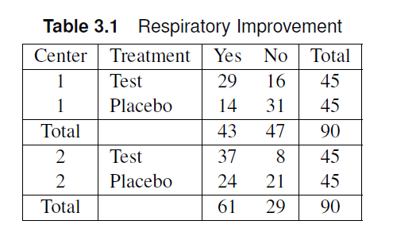
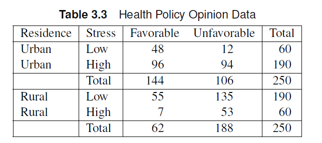
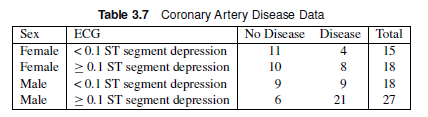
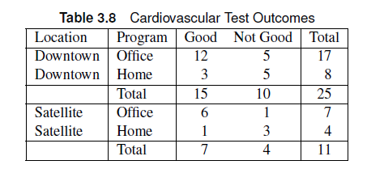

```{r}
#| echo: false
#| warning: false
#| output: false

library(tidyverse)
```


# Chapter 3: Sets of $2\times2$ tables

## Outline

- Mantel-Haenszel test
- Measures of Association
  - Common Odds ratio
  - Breslow-Day test
  - Zelen's Test

# Mantel-Haenszel Statistic 

## Sets of $2\times2$ tables

::: columns
::: {.column style="width:40%; font-size: 75%"}
- Consider a multi-location RCT
  - Different locations will have different contingency tables
  - We want to consolidate **all** data and account for the location effect in testing for the association between the treatment and outcome.
:::

::: {.column style="width:60%"}


:::
:::

## Stratified Analysis

- Stratified analysis examines the association between two variables while adjusting for the effect of other covariates.
  - The variable that define the strata may be an explanatory variable, location, or classification variable.
  - Each table corresponds to one level of the explanatory variables (stratum)

## Mantel-Haenszel Test

Recall the Mantel-Haenszel Chi-Square statistic

$$
Q = (n_{11}-m_{11})^2/v_{11}
$$
where $m_11$ is the expected value of the $n_11$ and $v_11$ is the variance of $n_11$ based on the hypergeometric distribution assumption.

- If there are $q$ $2\times 2$ tables, each table will have a value for $Q$.

## Mantel-Haenszel Test

The Mantel-Haenszel test assess the overall association of group and response after adjusting for the strata. If $n_{j11}$ is the $n_{11}$ value of the $j^{th}$ contingency table, the Mantel-Haenszel statistic, $Q_{MH}$ can be written as:

$$
Q_{MH} =    \frac{\left[\sum_{j=1}^q n_{j11} - \sum_{j=1}^q m_{j11}\right]^2}{\sum_{j=1}^q v_{j11}}
$$

::: callout-note
$Q_{MH}$ is often called an **average partial association statistic**.
:::


## Mantel-Haenszel Statistic

- The statistic $Q_{MH}$ relies on detecting patterns of the differences of proportions in each table
- The statistic $Q_{MH}$ approximately follows a chi-square distribution with one degree of freedom if the combined random sample sizes are large.
  - Individual cell counts and isolated table sample sizes may be small.
  - The _Mantel-Fleiss criterion_ can be used to check if the chi-square assumption holds. The MF score should be greater than 5.


## Mantel-Haenszel Test: SAS

- The `cmh` option in the `tables` statement produces the Mantel-Haenszel statistic values. There will be three Mantel-Haenszel values included in the output.

- Nonzero Correlation
- Row Mean Scores Differ
- General Association

::: callout-note
For $2 \times 2$ tables, the scores and degrees of freedom do not differ for these three MH-statistics. These measures will be distinguished later in the course.
:::

## Mantel-Haenszel Test: SAS

- The `mf` option in the `tables` statement produces the Mantel-Fleiss criterion. Recall that the Mantel-Fleiss criterion (MF) should be greater than 5 for the chi-square distributional assumption to be valid.


## Example

::: columns
::: {.column style="width:40%; font-size: 75%"}
The table shows the results of a study about how general daily stress affects one’s opinion on a proposed new health policy. Participants were sampled from urban and rural areas.

- Is there enough evidence that there is an association between the opinion and stress levels of residents after controlling for residential area? Use 𝛼=0.05 as the significance level.


:::

::: {.column style="width:60%"}
```{r}
#| echo: false
#| output: false
dat  <- expand.grid(Outcome = c("Favorable","Unfavorable"),
                    Residence=c("Urban","Rural"),
                    Stress = c("Low","High")
                  ) |> 
mutate(count = c(48,12,55,135,96,94,7,53))

xtabs(count ~  Stress + Outcome + Residence  ,data=dat) -> dat_cc
dat_cc
```


:::
:::


## Example


The table shows the results of a study about how general daily stress affects one’s opinion on a proposed new health policy. Participants were sampled from urban and rural areas.

- Is there enough evidence that there is an association between the opinion and stress levels of residents after controlling for residential area? Use 𝛼=0.05 as the significance level.

::: {.panel-tabset}

### SAS Code

```{.r code-line-numbers="11,12"}
data stress;
input region $ stress $ outcome $ count @@;
datalines;
urban low f 48 urban low u 12
urban high f 96 urban high u 94
rural low f 55 rural low u 135
rural high f 7 rural high u 53
;
proc freq order=data data=stress;
weight count;
tables region*stress*outcome / all chisq cmh (mf) nocol nopct; *CMH includes the mantel-haenszel statistics. MF gives the mantel-fleiss condition;
run;
```

### R Code

```{r}
#| echo: true
#| code-fold: true
library(vcdExtra)
dat  <- expand.grid(Outcome = c("Favorable","Unfavorable"),
                    Residence=c("Urban","Rural"),
                    Stress = c("Low","High")
                  ) |> 
mutate(count = c(48,12,55,135,96,94,7,53))

xtabs(count ~  Stress + Outcome + Residence  ,data=dat) -> dat_cc

CMHtest(dat_cc,
        strata="Residence",
        types="ALL",
        overall=T)
```

### Answer

$\chi^2 = 23.05$, $df=1$, $p < 0.0001$. There is strong evidence that the stress level is associated with the opinion outcome. 
:::


## Example

::: columns
::: {.column style="width:40%; font-size: 75%"}
The table shows the results of an RCT for a test treatment designed for respiratory infections. Is there a significant association between the treatment and the outcome after controlling for the center?

- Is the Mantel-Fleiss criterion satisfied?


:::

::: {.column style="width:60%"}
```{r}
#| echo: false
#| output: true
dat  <- expand.grid(Improvement = c("Yes","No"),
                    Center=c(1,2),
                    Treatment = c("Test","Placebo")
                  ) |> 
mutate(count = c(29,16,37,8,14,31,24,21))

xtabs(count ~  Treatment+Improvement + Center, data=dat) -> dat_cc
dat_cc
```

:::
:::


## Example


The table shows the results of an RCT for a test treatment designed for respiratory infections. Is there a significant association between the treatment and the outcome after controlling for the center?

- Is the Mantel-Fleiss criterion satisfied?


::: {.panel-tabset}

### SAS Code

```{.r}

data resp;
length treatment $7.;
input treatment $ improvement $ center $ count;
datalines;
Test Yes 1 29
Placebo Yes 1 14
Test No 1 16
Placebo No 1 31
Test Yes 2 37
Placebo Yes 2 24
Test No 2 8
Placebo No 2 21
;


proc freq data=resp order=data;
weight count;
tables center*treatment*improvement / cmh (MF) nocol norow nopct;
run;

```


### R Code
```{r}
#| code-fold: true
#| echo: true
#| output: true
dat  <- expand.grid(Improvement = c("Yes","No"),
                    Center=c(1,2),
                    Treatment = c("Test","Placebo")
                  ) |> 
mutate(count = c(29,16,37,8,14,31,24,21))

xtabs(count ~  Treatment+Improvement + Center, data=dat) -> dat_cc
dat_cc


CMHtest(dat_cc,
        strata="Center",
        types="ALL",
        overall=T)

```


### Answer

- The Mantel-Fleiss criterion was determined to be 36, which means the chi-square assumption holds.
- $Q_{MH}=18.4$, $p < 0.0001$, there is strong evidence of an association between the treatment and improvement.
:::

# Measures of Association

## Common Odds Ratio

- An odds ratio can be calculated for each stratum based on the 2x2 table values.
  - What if there are multiple strata?
- If the odds ratios are expected to be the same over all strata (homogenous), then we can calculate a common odds ratio $\psi$.

## Common Odds Ratio 

- The Mantel-Haenszel estimator $\hat{\psi}_{MH}$ can approximate the common odds ratio such that

$$
\hat{\psi}_{MH} = \frac{\sum_{j=1}^q n_{j11}n_{j22}/n_j}{\sum_{j=1}^q n_{j12}n_{j21}/n_j}
$$

::: callout-note
We can calculate confidence intervals (asymptotic and exact) for common odds ratios!
:::

## Common Odds Ratio: Confidence Intervals

There are two confidence intervals for the common odds ratios provided by SAS: The Mantel-Haenszel and Logit confidence limits.

:::{.panel-tabset}
### Mantel-Haenszel

- based on an estimate of the variance of $\log \psi_{MH}$
- Not sensitive to small sample sizes

### Logit

- based on weighted regression estimates
- reasonable but requires adequate sample sizes, i.e. $n_{hij} \geq 5$


:::

## Homogeneity of Odds Ratios

::: callout-warning
It is important to remember that the common odds ratio assumes the odds ratio is uniform across all strata!
:::

The Breslow-Day test or the Zelen's test can be used to test if the homogeneity assumption is satisfied.

::: {.panel-tabset}
### Breslow-Day test

- Null hypothesis: All strata are homogeneous.
- Assume the null value of the odds ratio is $\psi_{MH}$ for each stratum
- Calculate the expected values of the cells based on $\psi_{MH}$

$$
Q_{BD}  = \sum_{h=1}^{q} \sum_{i=1}^{q} \sum_{j=1}^{q} \frac{(n_{hij}-m_{hij})^2}{m_{hij}}
$$
which approximately follows a chi-square distribution with $(n-1)$ degrees of freedom.

### Zelen's Test

Zelen's test is similar to the Breslow-Day test, but uses exact methods. 

  - Recall: Fisher's Exact Test
  - calculates the probability of all possible sets of tables.
  - p-value is the sum of all table probabilities that are lower than the probability of the observed table.
:::

## Homogeneity of Odds ratios

If the Breslow-Day test or Zelen's test is significant, then the common odds ratio might not be an appropriate measure of association.

- The strata must be analyzed separately (similar to interactions in linear models.)

## Common Odds Ratios: SAS

- The common odds ratios are calculated with the `cmh` option
  - Only includes asymptotic (MH and logit) CI limits.
  - Including the `measures` options yields plots of common odds ratios and stratum-level odds ratios.
- The Breslow-Day test is also included in the `cmh` option
- The `comor` and `eqor` options in the `exact` statement yield the exact common odds ratio and the Zelen's test results, respectively.

Sample SAS code:

```{.r code-line-numbers="2,3"}
proc freq;
tables a*b*c/cmh measures;
exact comor eqor;
run;
```

## Example


::: columns
::: {.column style="width:50%; font-size: 75%"}
The table shows  the data from a study on coronary artery disease. Investigators were interested in whether electrocardiogram (ECG) measurement was associated with disease status. Gender was thought to be associated with disease status, so investigators post-stratified the data into male and female groups. In addition, there was interest in examining the odds ratios.

:::

::: {.column style="width:50%"}

:::
:::

## Example

The table shows  the data from a study on coronary artery disease. Investigators were interested in whether electrocardiogram (ECG) measurement was associated with disease status. Gender was thought to be associated with disease status, so investigators post-stratified the data into male and female groups. In addition, there was interest in examining the odds ratios.

:::{.panel-tabset}
### SAS Code
```{.r}
data ca;
input sex $ ECG $ disease $ count;
datalines;
female <0.1 yes 4
female <0.1 no 11
female >=0.1 yes 8
female >=0.1 no 10
male <0.1 yes 9
male <0.1 no 9
male >=0.1 yes 21
male >=0.1 no 6
;
proc freq data=ca ;
weight count;
tables sex*disease / nocol nopct chisq measures;
tables sex*ECG*disease / nocol nopct cmh measures;
run;
```

### Answer{.smaller}

- Sex was determined to be associated with disease status ($\chi^2=6.9, p=0.0084$)
- Controlling for sex, there is strong evidence that the ECG measurements are associated with disease status ($\chi^2=4.5, p=0.03$).
- The Breslow-Day test yielded a non-significant p-value (p=0.64), hence we can use the common odds ratios
- The MH odds ratio was estimated to be 2.86 (95% CI: 1.1,7.5). We can interpret this value as: The odds of having the disease is 2.86 times higher for patients with a high ECG segment depression compared to those with a low ECG segment depression.
:::


## Exercise 

::: columns
::: {.column style="width:50%; font-size: 75%"}
Table 3.8 shows the data from research done by a small company in initiating exercise programs (office/home) in their two locations in a nearby suburbs. After a year, participants and non-participants underwent a cardiovascular stress test to assess their fitness, and their result was recorded as good or not good depending on age-adjusted criteria. The exercise counselor was interested in whether type of program was associated with good test results.

- Calculate the common odds ratio $\psi_{MH}$ and the **exact** 95% confidence intervals.
- Use Zelen’s test to test if the odds ratio is uniform in both locations.

:::

::: {.column style="width:50%"}

:::
:::

## Exercise

Table 3.8 shows the data from research done by a small company in initiating exercise programs (office/home) in their two locations in a nearby suburbs. After a year, participants and non-participants underwent a cardiovascular stress test to assess their fitness, and their result was recorded as good or not good depending on age-adjusted criteria. The exercise counselor was interested in whether type of program was associated with good test results.

- Calculate the common odds ratio $\psi_{MH}$ and the **exact** 95% confidence intervals.
- Use Zelen’s test to test if the odds ratio is uniform in both locations

:::{.panel-tabset}
### SAS Code

```{.r code-line-numbers="14"}
data exercise;
input location $ program $ outcome $ count @@;
datalines;
downtown office good 12 downtown office not 5
downtown home good 3 downtown home not 5
satellite office good 6 satellite office not 1
satellite home good 1 satellite home not 3
;

proc freq order=data;
weight count;
tables location*program*outcome /cmh(mf);
exact comor eqor; 
run;
```


### Answer

- Mantel-Fleiss criterion is not satisfied (MF=4.65), so be careful with using the asymptotic chi-square test for $Q_{MH}$.
  - This motivates using exact methods in calculating effect sizes.
- Common odds ratio was estimated to be 5.84 (**EXACT** 95% CI: 1.05, 33.3). There is sufficient evidence at the 0.05 significance level that the program type is associated with the quality of cardiovascular test results.
  - The Zelen's test yielded $p=1$, which means there is no evidence against homogeneity.

:::