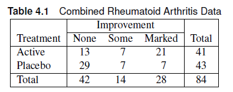
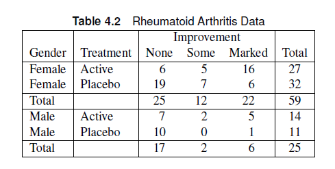
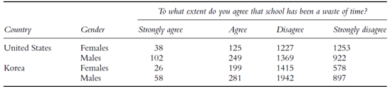
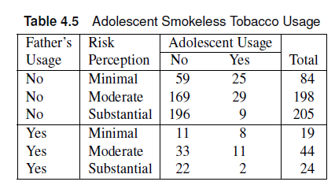
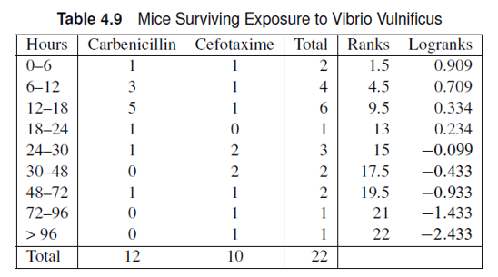

```{r}
#| echo: false
#| warning: false
#| output: false

library(tidyverse)
library(vcdExtra)
```

# \$ 2 \times r\$ and $s \times 2$ tables

## Outline

-   $2 \times r$ table
-   Sets of $2 \times r$ tables
-   $s \times 2$ table
-   Sets of $s \times 2$ tables
    -   Relationships between Sets of Tables
    -   Exact Analysis of Association ($s \times 2$) tables)

# what if there are more than two outcomes?

## Multiple Categorical Outcomes

-   Likert Scale (Strongly Disagree, Disagree, Neutral, Agree, Strongly Agree)
-   Part of a whole (None, Some, All)
-   We would need more than two columns in our contingency table to account for these other outcomes.
    -   Variables can be forced to be “binary”, but some important information can be lost.
-   If there are $r$ outcome levels and $2$ levels of the exploratory variable, we use a $2 \times r$ contingency table.
    -   Focus on outcomes being ordinally scaled.

## $2\times r$ table

::: columns
::: {.column style="width:40%; font-size: 75%"}
Let $A_j$ be the $j^{th}$ outcome level.

-   Since $A_J$ is ordinal, then $A_1 < A_2 < A_3 <... A_r$.
    -   The $\leq$ can replace $<$ as long as at least one is a strict inequality

To account for ordinality, we assign a set of scores $\mathbf{a}$ reflecting the relationship between response levels.

$$
\mathbf{a} = \{a_1, a_2, a_3,... a_r\} : a_1 < a_2 < ...< a_r
$$
:::

::: {.column style="width:60%"}

:::
:::

## Row Mean Scores

We can define a group mean for $X_1$, denoted by $\bar{f}_1$.

$$
\bar{f}_1 = \sum_{j=1}^r \frac{a_j n_{1j}}{n_{1+}}
$$

The random variable $\bar{f}_1$ approximately has a normal distribution when the central limit theorem is imposed.

-   High row sum

We refer to these scores as **Row Mean Scores**

## 2 \times r table: Null hypothesis

Null hypothesis $H_0$: There is no association between the row (X) and column (A) variables.

Under the null hypothesis:

-   The expected value of the mean can be calculated as:

$$
\mu_a =  \sum_{j=1}^r \frac{a_j n_{+j}}{n}
$$

## Mean Score Statistic

We can define a mean score statistic, $Q_S$, given by

$$
Q_S = \frac{(\bar{f}_1 - \mu_1)^2}{V}
$$

::: callout-note
-   $V$ is the variance of $\bar{f}_1$ under the null hypothesis.
-   $Q_S$ follows a chi-square distribution with one degree of freedom.
:::

## Mean Score Statistic

-   Targets alternative hypothesis of mean shifts to the hypothesis of no association
    -   Uses fewer degrees of freedom compared to Pearson chi-square

::: callout-note
Pearson chi-square requires $(r-1)$ degrees of freedom compared to 1 degree of freedom for $Q_S$
:::

-   The mean score statistic can also be used to determine the tendency of one group having better scores compared to the other.
-   The $Q_S$ sample size condition is less stringent:

::: callout-note
Choose one or more cutpoints \$ j = (2,3,...(r-1))\$, add the first through $j^{th}$ columns together and add the $(j-1)^{th}$ through $r^{th}$ columns together. If both of these sums are 5 or greater for at least one cutpoint in each row, then the sample size is adequate.
:::

## $2 \times r$ analysis: SAS {.smaller}

-   Data should be encoded in increasing order of the outcome variable.
-   The `FREQ` procedure will give us the mean score statistic:
    -   **ORDER=DATA should be included in the code with the `PROC FREQ` statement. (See sample code)**
-   Can be obtained using the `cmh` option or `chisq` option in the `tables` statement
    -   $Q_S$: Mantel-Haesnzel Chi-square statistic in the SAS output
    -   `CMH`: “*Row Mean Scores Differ*” statistic.
      - The CMH values would now display different values unlike the $2 \times 2$ tables.

## Example {.smaller}

The data shown in the table comes from a randomized, double-blind clinical trial investigating a new treatment for rheumatoid arthritis. Investigators compared the new treatment with a placebo; the response measured was whether there was no, some, or marked improvement in the symptoms of rheumatoid arthritis when the active treatment was administered.

- Is there sufficient evidence to conclude that the active treatment group has higher improvement compared to the placebo group?



## Example

The data shown in the table comes from a randomized, double-blind clinical trial investigating a new treatment for rheumatoid arthritis. Investigators compared the new treatment with a placebo; the response measured was whether there was no, some, or marked improvement in the symptoms of rheumatoid arthritis when the active treatment was administered.

- Is there sufficient evidence to conclude that the active treatment group has higher improvement compared to the placebo group?

::: {.panel-tabset}

### SAS Code

```{.r}
data arth;
input treat $ response $ count @@;
datalines;
active none 13 active some 7 active marked 21
placebo none 29 placebo some 7 placebo marked 7
;
proc freq data=arth order=data;
weight count;
tables treat*response / cmh chisq nocol nopct;
run;
```

### R Code

```{r}
library(vcdExtra)
dat  <- expand.grid(Treat=c("Active","Placebo"),
                    Response = c("None","Some","Marked")
                  ) |> 
mutate(count = c(13,29,7,7,21,7))

xtabs(count ~  Treat+Response  ,data=dat) -> dat_cc
dat_cc

CMHtest(dat_cc,
        types="ALL",
        overall=T)
```
### Answer

$Q_S$ = 12.86, p=0.0003. We have strong evidence to conclude that the active treatment displayed higher improvement compared to the placebo group.

- The active group has a higher proportion of marked + some improvement, which enables us to formulate the following conclusion.

:::

## Exercise

A survey was administered to students at a US-based university who are habitual smokers to determine the likelihood of using a mobile app to help them quit smoking. Is there sufficient evidence to conclude that heavy smokers are less likely to use a mobile app compared to light smokers?

```{r}
#| echo: false
#| warning: false
library(gridExtra)
dat  <- expand.grid(Smokers=c("Heavy","Light"),
                    Response = c("Very Unlikely","Unlikely","Likely","Very Likely")
                  ) |> 
mutate(count = c(36,38,75,59,56,64,17,23))

xtabs(count ~  Smokers+Response  ,data=dat) -> dat_cc
dat_cc
```

## Exercise

A survey was administered to students at a US-based university who are habitual smokers to determine the likelihood of using a mobile app to help them quit smoking. Is there sufficient evidence to conclude that heavy smokers are less likely to use a mobile app compared to light smokers?

```{r}
#| echo: false
#| warning: false
library(gridExtra)
dat  <- expand.grid(Smokers=c("Heavy","Light"),
                    Response = c("Very Unlikely","Unlikely","Likely","Very Likely")
                  ) |> 
mutate(count = c(36,38,75,59,56,64,17,23))

xtabs(count ~  Smokers+Response  ,data=dat) -> dat_cc
grid.table(dat_cc)
```

:::{.panel-tabset}
### SAS Code

```{.r}
data smoke;
input treat $ response $ count @@;
datalines;
heavy vu 36 heavy u 75 heavy l 56 heavy vl 17
light vu 38 light u 59 light l 64 light vl 23
;

proc freq data=smoke order=data;
weight count;
tables treat*response / cmh chisq nocol nopct;
run;
```

### R Code

```{r}
library(vcdExtra)
CMHtest(dat_cc,
        types="rmeans",
        overall=T)
```

### Answer

$Q_S$ = 1.04, p=0.31. There is insufficient evidence that heavy smokers are less likely to use a mobile app compared to light smokers.
:::


# Sets of $2\times r$ tables

## Sets of $2\times r$ tables

- We extend the Mantel-Haenszel strategy to $2\times r$ tables for ordinal responses
- Compute mean scores for the responses
  - Calculate mean score differences across tables
  - Similar approach to the difference in proportions ($Q_S$)
- Assume hypergeometric distributions for the contingency tables in the different strata.
  - Also assume that the across-strata sample sizes are sufficiently large for each group (row sums)

## Extended Mean Score Statistic

- $Q_{SMH}$ is the extended Mantel-Haenszel mean score statistic.
  - Also known as the ANOVA statistic
  - Function of the weighted average of the differences in mean scores of the two treatments for all strata.
- $Q_{SMH}$ is good for detecting consistent patterns of differences across strata.
- Sample size requirements involve collapsing each stratum table into a 2x2 table by choosing cutpoints (Just like that in $Q_S$), then apply the Mantel-Fleiss criterion.

## Different Types of Scores


::: {.panel-tabset}
### Integer Scores
- (0,1,2,...)
- Response levels are ordered categories that correspond to discrete counts.
- Produce same results regardless of starting number.
- Default in SAS.

### Rank 

- Rank scores based on the row totals.
- In stratified analysis, rank scores are not robust when there are large strata.

$$
R_i^1 = \sum_{k<i} n_{k+} + \frac{n_{i+}+1}{2}
$$
### Ridit
- Ridit scores are standardized rank scores based on the sample size

$$
R_i^3 = 1/(n+1) \left[\sum_{k<i} n_{k+} + \frac{n_{i+}+1}{2}\right]
$$

### Standardized Midranks
- Also known as modified ridit scores.
- Constrained to lie between 0 and 1.
- Requires no scaling of response levels.
- Used when there is no argument for equal spaces between ordinal levels

$$
R_i^3 = 1/(n+1) \left[\sum_{k<i} n_{k+} + \frac{n_{i+}+1}{2}\right]
$$

### Logrank Scores
- Useful when the distribution is L-shaped.
- Need to apply the logarithmic transformation of the rank scores before applying to the `tables` statement.
:::


## Different Types of Scores

::: callout-note
When there is no strata, the rank, ridit, and modridit scores correspond to the Wilcoxon rank-sum test. 
:::

::: callout-note
In stratified analyses, the _modridit scores_ are preferred out of these rank-based scores because it produces an extension of the Wilcoxon rank-sum test.
:::

## Measures of Association in Sets of $ 2 \times r$ tables

:::{.panel-tabset}
### Somers' D
- Measure of association for ordinally scaled data.
- For ordinal scores with two groups, let $G1$ be the score of group 1 and $G2$ be the score of group 2

$$
D = \frac{P(G1 > G2) - P(G1 < G2)}{P(G1>G2)+P(G1<G2) + P(G1=G2)}
$$

::: callout-note
SAS will provide two values of the Somers'D: $D(R|C)$ and $D(C|R)$

- $D(R|C)$ treats the _column_ as the independent variable.
- $D(C|R)$ treats the _row_ as the independent variable

:::

### Mann-Whitney rank measure of association

- Assesses association between a dichotomous predictor variable and an ordinal outcome.
- Can be calculated from Somers'D

$$
g_h = (D+1)/2
$$
where the standard error of $g_h$ is $v_h = v_D/2$.
:::

## Extension of the Mann-Whitney Rank Measure

- When there are $q$ strata, we can calculate a test statistic $Q_H$ such that

$$
Q_H = \sum_{h=1}^q (g_h-\tilde{g})^2/v_h  
$$
$$
\tilde{g} = \frac{\sum_{h=1}^q g_h\left(n_{h1}n_{h2}/(n_{h1}+n_{h2})\right)}{\sum_{h=1}^q \left(n_{h1}n_{h2}/(n_{h1}+n_{h2})\right)}
$$

- This is an extension of the van Elteren's rank sum test.

## Scores: SAS

- The default score used in SAS are integer/table scores
- Scoring method can be specified using the SCORES option in SAS
  - TABLE: integer
  - RIDIT: midranks
  - MODRIDIT: standardized midranks
  - RANK: rank scores.
- Use the Cochran-Mantel-Haenszel table (CMH) in testing the hypothesis
  - Difference in mean scores: “Row means differ”

```{.r}
proc freq;
tables A*B/scores=MODRIDIT;
run;

```


## Somers' D: SAS

- `measures` includes the Somers' D estimate with the standard errors (`ASE` column).
- The Mann-Whitney rank-sum statistic can be calculated using PROC IML.
- The `cl` option calculates confidence intervals for Somers' D

```{.r}
proc freq;
tables A*B/scores=MODRIDIT measures cl;
run;
```

## Mann-Whitney: SAS (optional)

```{.r}
proc freq ;
weight count;
tables S*A*B/ measures scores=modridit;
output out=somerout smdcr; # <1>
ods output CrosstabFreqs=myFreqs; # <2>
run;
data ns;
set myFreqs; where _type_="110";
run;

proc iml;
use somerout var{_SMDCR_ E_SMDCR};
read all into combined;
use ns var{Frequency};
read all into total;
print total;
WH=(total[1,]#total[2,]) / (total[1,]+total[2,]) //
(total[3,]#total[4,]) / (total[3,]+total[4,]);
print wh;
GH=(combined[,1]+1)/2;
SEGH=(combined[,2])/2;
print wh GH SEGH;
QH= (GH[1] - GH[2])**2 / SSQ(SEGH);
pvalue=1-probchi(QH,1);
print GH SEGH QH pvalue;
gtilde1=sum(GH # WH);
gtilde2=sum(WH);
gtilde=gtilde1/gtilde2;
gtildevar=(sum(WH##2 # SEGH##2)) /((sum(WH))**2);
segtilde=sqrt(gtildevar);
qgtilde=(gtilde-.5)**2/gtildevar;
print gtilde gtildevar qgtilde;
quit;
```

1. Outputs somers'D(C|R) and error
2. crosstabs outputs the contigency table

## Example

::: columns
::: {.column style="width:50%; font-size: 75%"}
The data shown in the table comes from a randomized, double-blind clinical trial investigating a new treatment for rheumatoid arthritis. Investigators compared the new treatment with a placebo; the response measured was whether there was no, some, or marked improvement in the symptoms of rheumatoid arthritis when the active treatment was administered.

- Is there sufficient evidence to conclude that the active treatment group has higher improvement compared to the placebo group after controlling for gender?
- Compare the results using table scores and modridit scores.
:::

::: {.column style="width:50%"}

:::
:::


## Example


::: columns
::: {.column style="width:50%; font-size: 75%"}

- Is there sufficient evidence to conclude that the active treatment group has higher improvement compared to the placebo group after controlling for gender?
- Compare the results using table scores and modridit scores.
:::

::: {.column style="width:50%"}

:::
:::

:::{.panel-tabset}
### SAS Code
```{.r}
data arth;
input gender $ treat $ response $ count @@;
datalines;
female active none 6 female active some 5 female active marked 16
female placebo none 19 female placebo some 7 female placebo marked 6
male active none 7 male active some 2 male active marked 5
male placebo none 10 male placebo some 0 male placebo marked 1
;

proc freq data=arth order=data;
weight count;
tables gender*treat*response / cmh nocol nopct; # <1>
tables gender*treat*response / cmh nocol nopct scores=modridit; # <2>
run;
```

1. Table Scores
2. Modridit scores (Standardized Midranks)

### R Code

```{r}
#| echo: true
dat <- expand.grid(Improvement=c("None","Some","Marked"),
            Treatment = c("Active","Placebo"),
            gender=c("Female","Male")
            ) |> 
mutate(count = c(6,5,16,19,7,6,7,2,5,10,0,1))
xtabs(count ~  Treatment + Improvement + gender  ,data=dat) -> dat_cc
dat_cc
CMHtest(dat_cc,
        types="ALL",
        cscores = 1:ncol(dat_cc), # <1>
        overall=T, strata="gender")

CMHtest(dat_cc,
        types="ALL",
        overall=T,
        cscores="midrank", # <2>
        strata="gender")
```

1. table scores
2. standardized midrank scores

### Answer

$Q_{SMH} = 14.6$, p<0.001. There is sufficient evidence to conclude that the active treatment group has higher improvement compared to the placebo group.

When using the modridit scores, $Q_{SMH}=15.00, p<0.001$. Same conclusion with a slight deviation between statistics.

:::

## Exercise 

The following data is obtained from the 2003 Programme for International Student Assessment (PISA) study. 

- Use the appropriate analysis to determine whether the attitude toward school is different between students in the US and Korea after controlling for gender.
- Calculate the relevant Somers’ D values for each gender.

:::{.panel-tabset}

### Contingency Table


### SAS Data

```{.r}
data school;
input gender $ location $ response $ count @@;
datalines;
female US sd 1253 female US d 1227 female US a 125 female US sa 38
female korea sd 578 female korea d 1415 female korea a 199 female korea sa 26
male US sd 922 male US d 1369 male US a 249 male US sa 102
male korea sd 897 male korea d 1942 male korea a 281 male korea sa 58
;
```

:::

## Exercise 

The following data is obtained from the 2003 Programme for International Student Assessment (PISA) study. 

- Use the appropriate analysis to determine whether the attitude toward school is different between students in the US and Korea after controlling for gender.
- Calculate the relevant Somers’ D values for each gender.

:::{.panel-tabset}

### SAS Code

```{.r}
proc freq data=school order=data;
weight count;
tables gender*location*response/all nocol nopct measures cl;
tables gender*location*response/all nocol nopct measures scores=modridit cl;
run;
```

### R Code

```{r}
#| echo: true
dat <- expand.grid(Rating=c("StD","D","A","StA"),
            gender=c("Female","Male"), 
            country = c("US","Korea")) |> 
mutate(count = c(1253,1227,125,38,922,1369,249,102,578,1415,199,26,897,1942,281,58))

xtabs(count ~  country +Rating + gender  ,data=dat) -> dat_cc
dat_cc

CMHtest(dat_cc,
        types="ALL",
        cscores = 1:ncol(dat_cc), 
        overall=T, strata="gender")


CMHtest(dat_cc,
        types="ALL",
        overall=T,
        cscores="midrank",
        strata="gender")


```

### Answer

Using MODRIDIT scores, we get $Q_{SMH} = 149.88, p<0.001$. Using TABLE scores, we get $Q_{SMH} = 91.3, p<0.001$. There is sufficient evidence that  there is a difference in the attitude toward school between the students from US and Korea.

- I would use the modridit scores because the spacing between ratings is non-uniform.
- You can use multiple scores and see whether the resulting inference is the same.

- The Somers' D (C|R) for females is 0.22 (0.19,0.25)
- The Somer's D (C|R) for males is 0.04 (0.01,0.07)

:::

# $s \times 2$ table

## $s \times 2$ table

- Used when there are multiple groups defined by an ordinal variable with a dichotomous outcome. 
- Example: Degree of gambling experience, degree of smoking experience, Educational Attainment

## $s \times 2$ table

::: columns
::: {.column style="width:40%; font-size: 75%"}
Assume $X$ is an ordinal variable. 


To account for ordinality, we assign a set of scores $\mathbf{c}$ reflecting the relationship between response levels.

$$
\mathbf{c} = \{c_1, c_2, c_3,... c_s\} : c_1 < c_2 < ...< c_s
$$

In $2 \times r$ tables, $\mathbf{a} = (a_1,a_2)$ is effectively (0,1)
:::

::: {.column style="width:60%"}

:::
:::

## $s \times 2$ table

The expected frequency can be expressed as 

$$
\bar{f} = \sum_{i=1}^s\sum_{j=1}^2 \frac{c_ia_jn_{ij}}{n}
$$


## $s \times 2$ table

The null hypothesis $H_0$: There is no association between the two variables. To test this hypothesis, we can use a randomization statistic $Q_{CS}$ such that

$$
Q_{CS} = \frac{(\bar{f}-\mu_c\mu_a)^2}{v_cv_a/(n-1)} = (n-1)r_{ac}^2
$$

::: callout-note
- $\mu_c$ is the expected value of the row scores
- $\mu_a$ is the expected value of the column scores.
- $v_c$ is the variance of the row scores
- $v_a$ is variance of the column scores
:::

::: callout-note
$Q_{CS}$ is also referred to the correlation statistic. $Q_{CS}$ follows a chi-square distribution with one degree of freedom.
:::

::: callout-note
$Q_{CS}$ is related to the Pearson correlation coefficient $r_{ac}$
:::


## Cochran-Armitage test

A similar statistic to the correlation statistic is the $z^2$ statistic used in the Cochran-Armitage test.

- The Cochran-Armitage trend test tests for trends in binomial proportions across levels of an ordinal covariate.

$$
z^2 = Q_{CS} \left[\frac{n}{n-1}\right]
$$

## $s \times 2$ analysis: SAS

- The correlation statistic can be found in the SAS Output as the Mantel-Haenszel chi-square statistic from the `chisq` option.
- SAS can also perform the Cochran-Armitage trend test by including the `trend` option in the `tables` statement.
- The Pearson correlation coefficient and the Somers’ D(C|R) are of particular interest in the `measures` output since both metrics account for ordinality.

```{.r}
proc freq;
weight count;
tables a*b/trend chisq measures;
run;
```

## Example

A random sample of 200 married men, all retired, were classified according to education and number of children. The data is shown in the table.

- Is there sufficient evidence of association between the father’s educational attainment and the number of children?
- Using the Cochran-Armitage trend test to determine if there is an increasing trend in number of children with increasing educational attainment.

```{r}
dat <- expand.grid(education=c("secondary","college","graduate"), Kids = c("At most 3","More than 3")) |> 
mutate(count=c(51,61,29,32,17,10))

xtabs(count ~  education+Kids  ,data=dat) -> dat_cc
dat_cc

```


## Example

A random sample of 200 married men, all retired, were classified according to education and number of children. The data is shown in the table.

- Is there sufficient evidence of association between the father’s educational attainment and the number of children?
- Using the Cochran-Armitage trend test to determine if there is an increasing trend in number of children with increasing educational attainment.

:::{.panel-tabset}

### SAS Code

```{.r}
data educ;
input education $ kids3 $ count @@;
datalines;
secondary leq 51 secondary g 32
college leq 61 college g 17
graduate leq 29 graduate g 10
;
run;

proc freq data= educ order=data;
weight count;
tables education*kids3/chisq measures trend cl; # <1>
run;
```

1. `chisq` gives $Q_{CS}$, `measure`s provides Somers and pearson, `trend` gives cochran-armitage, `cl` calculates confidence intervals.

### Answer

$Q_{CS} = 3.47, p =0.06$. There is weak evidence of association between the father's educational attainment and number of offspring.

The one-sided Cochran-Armitage test yielded a p-value = 0.03, which is sufficient evidence to support a decreasing trend in number of children with increasing educational attainment.

:::

# Sets of $s \times 2$ tables

## Sets of $s \times 2$ tables

- Just like 2xr tables, there is also a statistic for the association of two ordinal variables for a combined set of strata called the extended Mantel-Haenszel correlation statistic ($Q_{CSMH}$).
  - $Q_{CSMH}$ approximately follows a chi-square distribution with df=1 when the combined strata sample sizes is greater than or equal to 40 (sufficiently large).

## Example

The table contains two contingency tables of risk perception (minimal, moderate, and substantial) and adolescent tobacco usage by father’s usage. 

- Comment on whether there is an association between risk perception and adolescent usage when the father does not use tobacco.
- Is there a discernible trend in the proportions of adolescent usage over the levels of risk perception after controlling for father’s tobacco usage?



## Example

The table contains two contingency tables of risk perception (minimal, moderate, and substantial) and adolescent tobacco usage by father’s usage. 

- Comment on whether there is an association between risk perception and adolescent usage when the father does not use tobacco.
- Is there a discernible trend in the proportions of adolescent usage over the levels of risk perception after controlling for father’s tobacco usage?

:::{.panel-tabset}
### Contingency table


### SAS Code

```{.r}
data tobacco;
length risk $11. ;
input f_usage $ risk $ usage $ count @@;
datalines;
no minimal no 59 no minimal yes 25
no moderate no 169 no moderate yes 29
no substantial no 196 no substantial yes 9
yes minimal no 11 yes minimal yes 8
yes moderate no 33 yes moderate yes 11
yes substantial no 22 yes substantial yes 2
;
proc freq;
weight count;
tables f_usage*risk*usage /cmh chisq measures trend;
tables f_usage*risk*usage /cmh scores=modridit;
run;
```

### Answer

When the father is not a tobacco user, $Q_{CS}=34.3, p<0.001$, which means there is sufficient evidence of an association between risk perception and participant tobacco use.

$Q_{CSMH}=39.3$ using modified ridit scores ($Q_{CSMH}=40.7$ for table scores), resulting to a p-value p<0.001. There is sufficient evidence of an association between risk perception and participant tobacco use.

:::

# $s \times 2$: Exact Analysis

## Exact Analysis

- For small sample sizes, $Q_{CS}$ does not satisfy the asymptotic requirements.
- We use exact tests to calculate the correct Mantel-Haenszel statistics.
- We manually calculate the Wilcoxon rank and logrank scores for each row.
  - Wilcoxon vs logrank: Logrank is better when there are more counts in the lower end of the row ordinal variable.
  
## Exact Analysis: SAS

- The `exact` statement is used to perform an exact test on the correlation statistic. 
  - `exact mhchi` would perform the statement on the Mantel-Haenszel statistic.
  - `scorout` outputs the scores used in the exact analysis

```{.r}
proc freq;
tables a*b /scorout;
exact mhchi;
run;
```

## Example

The table shows data from a study of mice who were exposed to a bacterial challenge and treated with the drugs carbenicillin or cefotaxmine (Bowdre, et al. 1983). Surviving mice were assessed at intervals of 6 to 24 hours. Is there evidence that there is a difference in performance between the two drugs?

:::{.panel-tabset}

### Contingency Table


### SAS Data

```{.r}
data mice;
input LogRank Treatment $ count @@;
datalines;
0.909 Ca 1 0.909 Ce 1
0.709 Ca 3 0.709 Ce 1
0.334 Ca 5 0.334 Ce 1
0.234 Ca 1 0.234 Ce 0
-0.099 Ca 1 -0.099 Ce 2
-0.433 Ca 0 -0.433 Ce 2
-0.933 Ca 1 -0.933 Ce 1
-1.433 Ca 0 -1.433 Ce 1
-2.433 Ca 0 -2.433 Ce 1
;
```

:::


## Example

The table shows data from a study of mice who were exposed to a bacterial challenge and treated with the drugs carbenicillin or cefotaxmine (Bowdre, et al. 1983). Surviving mice were assessed at intervals of 6 to 24 hours. Is there evidence that there is a difference in performance between the two drugs?

:::{.panel-tabset}
### SAS Code

```{.r}
data mice;
input LogRank Treatment $ count @@;
datalines;
0.909 Ca 1 0.909 Ce 1
0.709 Ca 3 0.709 Ce 1
0.334 Ca 5 0.334 Ce 1
0.234 Ca 1 0.234 Ce 0
-0.099 Ca 1 -0.099 Ce 2
-0.433 Ca 0 -0.433 Ce 2
-0.933 Ca 1 -0.933 Ce 1
-1.433 Ca 0 -1.433 Ce 1
-2.433 Ca 0 -2.433 Ce 1
;

proc freq order=data;
weight count;
tables LogRank*Treatment / norow nocol nopct scorout chisq; # <1>
tables LogRank*Treatment / noprint scores=rank scorout chisq; # <2>
exact mhchi;
run;
```

1. Using Logranks
2. using ranks. Note that logranks preserves the order of the original data set.


### Answer

The exact logrank analysis showed that $Q_{CS}=4.06, p=0.04$, which means we have sufficient evidence of an association/difference between the treatment and specimen survival.

However, the exact *rank* analysis showed that $Q_{CS}=3.51, p=0.06$, which means we have weak evidence of an association/difference between the treatment and specimen survival.

I would favor the logrank analysis better because it encapsulates the data better and accounts for the higher representation of the lower end of the ordinal variable.
:::