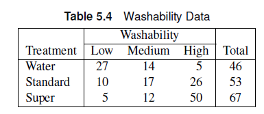
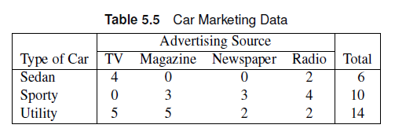
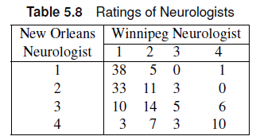

```{r}
#| echo: false
#| warning: false
#| output: false

library(tidyverse)
library(vcdExtra)
```

# $s \times r$ tables

## Outline

-   Association
    -   Test for General Association
    -   Mean Score Test
    -   Correlation Test
    -   Exact Tests
-   Measures of Association
    -   Ordinal
    -   Nominal
-   Observer Agreement (inter-rater reliability)
-   Test for Ordered Differences

# What if there are more than two groups outcomes?

## Multiple Categorical Outcomes

Common examples include Likert Scale (Strongly Disagree, Disagree, Neutral, Agree, Strongly Agree) responses and parts of a whole (None, Some, All).

::: callout-note
We would need more than two columns in our contingency table to account for these other outcomes. Variables can be forced to be “binary”, but some important information can be lost.
:::

## Multiple Groups

It is also common to compare responses from multiple groups such as Race, Income Status, and Exposure levels. Dichotomizing these variables to fit into a 2x2 will also result in loss of information.

# Associations in $s \times r$ tables

## $s \times r$ tables

We now evolve the contingency table from a $2 \times 2 \to  s  \times r$, where $s$ is the number of rows and $r$ is the number of columns. Both $s$ and $r$ are expected to be at least 2.


## General Association Statistic

When the groups and the response variable categories can be nominally scaled, we can only test for general association.

::: callout-note
### Statistical Hypotheses

-   $H_0$: there is no general association between the groups and response variables.
-   $H_A$: there is a general association between the two variables
:::

## General Association Statistic

The randomization statistic based on Mantel-Haenszel statistics can be calculated from the Pearson chi-square statistic, $Q_P$.

$$
Q = \left(\frac{n-1}{n}\right) Q_P
$$ 

where,

$$
Q_P = \sum_{i=1}^s\sum_{j=1}^r \frac{(n_{ij}-m_{ij})^2}{m_{ij}}
$$

::: callout-important
When $n$ is large, $Q \approx Q_P$. Like the Pearson chi-square, $Q$ follows a chi-square distribution with $(s-1)(r-1)$ degrees of freedom.
:::

## Mosaic Plot

 A mosaic plot visualizes the proportion in each cell of the contingency table.
 
::: callout-note
The horizontal space is divided by sizes corresponding to the relative count of x-axis variable levels, while the vertical space is divided up according to relative sizes of the y-axis variable levels.
:::

## Mosaic Plot in `R`

The `mosaic()` function in the `vcd` package creates a mosaic plot for data frames/contingency tables. Shown below is the mosaic plot for the `UCBAdmissions` data set, which shows the aggregate data on applicants to graduate school at UC Berkeley in 1973.


::: panel-tabset

### Plot

```{r}
library(vcd)
mosaic(~Admit +Dept,
       highlighting="Admit",
       highlighting_fill=c("blue","red"),
       data=UCBAdmissions)
```

### Notes

::: callout-tip
The `highlighting` option provides `mosaic` information about which variables need to be shaded. The `highlighting_fill` provides the colors you want to use the highlight these variables.
:::


:::

## General Association: SAS

-   In SAS, the Pearson chi-square statistic $Q_P$ is the value referred to as ‘Chi-square”
-   Note that $Q$ is **NOT** the Mantel-Haenszel statistic in the `chisq` output in SAS.
    -   $Q$ is the “General Association” cell in the `cmh` output.
-   We can use the `plots` option in the `tables` statement to create a mosaic plot.

``` r
proc freq;
weight count;
tables a*b/cmh plots=mosaicplot; # <1>
run;
```

1.  `cmh` calculates the general association Cochran-Mantel-Haenszel statistic. `plots=mosaicplot` tells SAS to create a mosaic plot with $a$ and $b$.

## General Association: `R`

The `CMHtest()` function provides the general association Cochram-Mantel-Haenszel statistic.

```{r}
#| eval: false

CMHtest(contingencytable)
```


## Example


The table contains data from a study concerning the distribution of party affiliation in a city suburb. The interest was whether there was an association between registered political party and neighborhood.

::: panel-tabset

### Questions

-   What is the Pearson chi-square value?
-   What is the randomization statistic?
-   Is there sufficient evidence of an association between political party and neighborhood?
-   Create a mosaic plot for this problem.


### `SAS` 

``` r
data neighbor;
length party $ 11 neighborhood $ 10;
input party $ neighborhood $ count @@;
datalines;
democrat longview 360 democrat bayside 221
democrat sheffeld 140 democrat highland 160
republican longview 316 republican bayside 208
republican sheffeld 97 republican highland 106
independent longview 160 independent bayside 200
independent sheffeld 311 independent highland 291
;

proc freq data=neighbor;
weight count;
tables party*neighborhood /
plots=mosaicplot chisq cmh nocol nopct; #<1>
run;
```

1.  Included both `chisq` and `cmh` to show discrepancy.

### `R` Data

```{r}
dat <- expand.grid(Party=c("Democrat","Independent","Republican"),
                   Neighborhood = c("Bayside","Highland","Longview","Sheffield"))

dat$count <- c(221,200,208,160,291,106,360,160,316,140,311,97)
```

### `R` Code

```{r}
dat_cc <- xtabs(count~Party+Neighborhood,data=dat)
dat_cc

mosaic(data=dat_cc,
       ~Party+Neighborhood,
       highlighting="Party")
```
Pearson chi-square:

```{r}
chisq.test(dat_cc)
```
Randomization Statistic (use general association):

```{r}
CMHtest(dat_cc)
```


### Answer

$Q_P$ = 273.92, $Q$ = 273.81. The corresponding p-value $p<0.001$ suggests there is an association between party affiliation and neighborhood.


::: callout-note

In SAS, note that the Mantel-Haenszel statistic reported in the `chisq` output corresponds to the correlation statistic which doesn't make sense in this case (discussed later).

:::

:::

## Exercise

Secondary school teachers were randomly sampled from four school districts in Nevada and asked what marker color they used in grading students’ work.

-   What is the Pearson chi-square statistic?
-   What is the randomization statistic?
-   Generate a mosaic plot for this example. Can you see a trend between the colors and/or the counties?
-   At a significance level of 0.05, do we have sufficient evidence of a general association between the two variables?


::: panel-tabset

### Data

``` r
data color;
input county $ color $ count @@;
datalines;
cl blu 22 cl red 57 cl green 12 cl blk 15
ca blu 12 ca red 30 ca green 6 ca blk 15
do blu 17 do red 34 do green 17 do blk 10
wa blu 5 wa red 56 wa green 7 wa blk 9
;
run;
```

```{r}
dat <- expand.grid(county=c("clark","carson","douglas","washoe"),
                   color = c("blue","red","green","black")) 
dat$count <- c(22,12,17,5,57,30,34,56,12,6,17,7,15,15,10,9)

dat_cc <- xtabs(count~county+color,data=dat)
```

### SAS Code

``` r

data color;
input county $ color $ count @@;
datalines;
cl blu 22 cl red 57 cl green 12 cl blk 15
ca blu 12 ca red 30 ca green 6 ca blk 15
do blu 17 do red 34 do green 17 do blk 10
wa blu 5 wa red 56 wa green 7 wa blk 9
;
run;

proc freq data=color;
weight count;
tables county*color/
plots=mosaicplot chisq cmh nocol nopct measures cl;
run;
```

### Answer

$Q_P$= 24.36, $Q$ = 24.28, p = 0.004, which means there is strong evidence of an association between school district and marker color used for grading.

```{r}

dat <- expand.grid(county=c("clark","carson","douglas","washoe"),
                   color = c("blue","red","green","black")) 
dat$count <- c(22,12,17,5,57,30,34,56,12,6,17,7,15,15,10,9)

dat_cc <- xtabs(count~county+color,data=dat)

mosaic(data=dat_cc,
       ~color + county,
       highlighting="color",
       highlighting_fill=c("blue","red","green","black"))
```
:::

## Associations Involving Ordinal Variables

Suppose the column variable is ordinal such that $A_j$ is the $j^{th}$ outcome level. Since $A_J$ is ordinal, then $A_1 < A_2 < A_3 <... A_r$.

To account for ordinality, we assign a set of scores $\mathbf{a}$ reflecting the relationship between response levels.

$$
\mathbf{a} = \{a_1, a_2, a_3,... a_r\} : a_1 < a_2 < ...< a_r
$$

::: callout-note
The relationship can be $\leq$ instead of $<$ as long as at least one pair is a strict inequality.
:::

## Row Mean Scores

Consider the following contingency table:


We can define a group mean for $X_1$, denoted by $\bar{f}_1$.

$$
\bar{f}_1 = \sum_{j=1}^r \frac{a_j n_{1j}}{n_{1+}}
$$

::: callout-note
The scores $\bar{f}_j$ are referred to as **row mean scores**. The random variable $\bar{f}_j$ approximately has a normal distribution when the central limit theorem is imposed. This occurs when the row sums are high.

The term $a_j$ are the assigned scores for the columns. These can be regular integral scores (0,1,2,3,...) or based on rank. Rank-based scores yield midranks for tied values and are standardized for tied values.
:::

## Mean Score Tests: Null Hypothesis

The null hypothesis for tests involving the row mean scores is $H_0$: There is no association between the row (X) and column (A) variables. 
Under the null hypothesis, the expected value of the row mean scores, $\mu_a$, can be calculated as:

$$
\mu_a =  \sum_{j=1}^r \frac{a_j n_{+j}}{n}
$$

The corresponding alternative hypothesis is $H_a:$ There is a location shift across the groups.
## Mean Score Tests: Test Statistic

The test statistic is the mean score statistic $Q_S$ for an $s \times r$ table is given by:

$$
Q_S = \frac{(n-1)\sum_{i=1}^sn_{i+}(f_i-\mu_a)^2}{nv_a}
$$

where $v_a = \sum_{j=1}^r(a_j-\mu_a)^2(n_{+j}/n)$ is the variance of the row mean scores. This is consistent with an ANOVA approach in comparing means across each group.

## Mean Score Tests: Sample Considerations

::: callout-note
The $Q_S$ sample size condition is less stringent: 

- The row totals should be greater than 20.
- Choose one or more cutpoints $j = (2,3,...(r-1))$, add the first through $j^{th}$ columns together and add the $(j+1)^{th}$ through $r^{th}$ columns together. If both of these sums are 5 or greater for at least one cutpoint in each row, then the sample size is adequate.
:::

If the sample size conditions are reached, $Q_S$ approximately follows a chi-square distribution with $(s-1)$ degrees of freedom, where $s$ is the number of rows.

::: callout-note
The mean score test uses less degrees of freedom compared to the general association test and the Pearson chi-square test.
:::

## Mean Score Tests: `SAs`

Included in the `cmh` table as "Row Mean Scores Differ". 

::: callout-note
Use `scores=ridit` to use standardized rank scores or `scores=modridit` to use the expected valurs of the order statistics of the uniform distribution on (0,1).
:::

## Mean Score Tests: `R`

The `CMHtest()` default output includes the `Row mean scores differ` row in the analysis. Ensure that the ordinal variable is assigned as the column variable.

```{r}
#| eval: false

CMHtest(contingencytable,
        cscores="midrank")
```


::: callout-note
The Col mean scores differ functions similarly with the ordinal variable assigned as the rows.

The `cscores` argument lets `R` know what $a_j$ to use for the columns. `CMHtest` will use integers as scores, which assumes the ordinal variable is equally spaced. To use rank-based scores, we can specify `cscores="midrank"`. 
:::

## Example

The data shown comes from a study on headache pain relief. A new treatment was compared with the standard treatment and a placebo. Researchers measured the number of hours of substantial relief from headache pain

::: panel-tabset
### Question + Data

-   Is the chi-square approximation valid for this case?
-   What kind of scoring method is most appropriate for this data set?
-   Make the appropriate conclusion based on the result of the mean score tests using a significance level $\alpha=0.05$.


### SAS Code

``` r
data pain;
input treatment $ hours count @@;
datalines;
placebo 0 6 placebo 1 9 placebo 2 6 placebo 3 3 placebo 4 1
standard 0 1 standard 1 4 standard 2 6 standard 3 6 standard 4 8
test 0 2 test 1 5 test 2 6 test 3 8 test 4 6
;

proc freq data=pain order=data;
weight count;
tables treatment*hours/ cmh nocol nopct;
run;
```

### R Code

```{r}
dat <- expand.grid(Treatment = c("Placebo","Standard","Test"),
                   Hours = 0:4)

dat$Count <- c(6,1,2,9,4,5,6,6,6,3,6,8,1,8,6)

dat_cc <- xtabs(Count~Treatment+Hours,data=dat)
dat_cc
```
Now we can perform the mean score test. The integer scoring method is most appropriate because of the equal distance between the ordinal column variable values.

```{r}
CMHtest(dat_cc)
```


### Answer

-   Use column 3 (Hours = 2) as cutoff. The use of the chi-square approximation is justified!

-   The integer scoring method is most appropriate.

-   $Q_S$ = 13.7, df=2, p=0.001. At $\alpha=0.05$, there is sufficient evidence to conclude that at least one treatment group is different compared to the others.

::: callout-warning
If we used the general association test, we would end up with p=0.07 and failing to reject the null hypothesis instead.
:::


:::

## Exercise

The table shows data from a study that investigates intent to breastfeed of women who are interested in having children. The women who participated in the study were asked if they intended to breastfeed your child up to 6 months after birth. The researchers want to know if there is an effect of the order of pregnancy on their intent to breastfeed.


::: panel-tabset

### SAS Data

``` r
data preg;
input pregnancy $  outcome $ score  count @@ ;
datalines;
npnc sd 1 8 npnc d 2 22 npnc n 3 24 npnc a 4 27 npnc sa 5 15
npc sd 1 15 npc d 2 23 npc n 3 15 npc a 4 19 npc sa 5 9
fp sd 1 18 fp d 2 8 fp n 3 22 fp a 4 23 fp sa 5 11
pwc sd 1 35 pwc d 2 13 pwc n 3 10 pwc a 4 9 pwc sa 5 6
; 
```
::: callout-note
### Variables

- npnc: not pregnant, no children 
- npc: not pregnant with children
- fp: first pregnancy
- pwc: pregnant with children
- sd: strongly disagree
- d: disagree
- n: neutral
- a: agree
- sa: strongly agree
:::


### SAS Code

``` r
proc freq data=preg order=data;
weight count;
tables pregnancy*outcome / cmh nocol nopct;
run;

proc means data=preg order=data; # <1>
freq count;
class pregnancy;
var score;
run;
```

1.  The `means` procedure is shown to display the mean scores and how they indeed differ for each pregnancy order.

### R Data

```{r}
dat <- expand.grid(Pregnancy = c("NPNC","NPC","FP","PWC"),
                   Outcome =c("S Disagree","Disagree","Neutral","Agree","S Agree"))

dat$Count <- c(8,15,18,35,22,23,8,13,24,15,22,10,27,19,23,9,15,9,11,6)

dat_cc <- xtabs(Count~Pregnancy+Outcome,data=dat)
dat_cc

```

### R Code

```{r}
CMHtest(dat_cc)
```


### Answer

$Q_S= 27.2$, df=3, p=5.35e-6. There is sufficient evidence of an effect of pregnancy order on intent to breastfeed.
:::

## Ordinal Row and Column Variables

When the row variable is also ordinal, we can assign row scores $c_j$ such that

$$
\mathbf{c} = \{c_1, c_2, c_3,... c_s\} : c_1 < c_2 < ...< c_s
$$

:::callout-note
Because both variables are ordinal, we can test for correlation between the two variables.
:::


Then for each cell, the expected frequency, $\bar{f}$ can be written as:

$$
\bar{f} = \sum_{i=1}^s\sum_{j=1}^r \frac{c_ia_jn_{ij}}{n}
$$


## Correlation Tests

The null hypothesis for the association tests remains to be $H_0$: There is no association between the two variables. To test this hypothesis, we can use a randomization statistic $Q_{CS}$ that accounts for the ordinality of both variables.

$$
Q_{CS} = \frac{(\bar{f}-\mu_c\mu_a)^2}{v_cv_a/(n-1)} = (n-1)r_{ac}^2
$$


::: callout-note

- $\mu_c$ is the expected value of the row scores
- $\mu_a$ is the expected value of the column scores.
- $v_c$ is the variance of the row scores
- $v_a$ is variance of the column scores

$r_{ac}$ is the Pearson correlation coefficient, which measures the correlation between the ordinal variables.
:::

## Correlation Tests

$Q_{CS}$ follows a chi-square distribution with 1 degree of freedom, regardless of the size of the table, when the sample size is at least 20.


## Correlation Tests: `SAS`

$Q_{CS}$ is the Mantel-Haenszel chi-square statistic displayed by the `chisq` and `cmh` output.

## Correlation Tests: `R`

$Q_{CS}$ is part of the `CMHtest()` output. 

::: callout-note
The default scores for the row and column scores are integer scores. Specify `rscores`/`cscores` as `midrank` to use rank-based scores.
:::

## Example

A water treatment company is studying water additives and investigating how they affect clothes washing. The treatments studied were no treatment (plain water), the standard treatment, and a double dose of the standard treatment, called super. Washability was measured as low, medium, and high. The company claims that the dose of water treatment affects the washability of water. Do we have sufficient evidence to support this claim?

::: panel-tabset

### Data




### SAS Code

``` r
data wash;
input treatment $ washability $ count @@;
datalines;
water low 27 water medium 14 water high 5
standard low 10 standard medium 17 standard high 26
super low 5 super medium 12 super high 50
;

proc freq order=data data=wash;
weight count;
tables treatment*washability / chisq cmh;
tables treatment*washability / scores=modridit cmh
noprint nocol nopct;
run;
```

### R Code

```{r}
dat <- expand.grid(Treatment=c("Water","Standard","Super"),
                   Washability=c("Low","Medium","High"))

dat$Count <- c(27,10,5,14,17,12,5,26,50)

dat_cc <- xtabs(Count~Treatment+Washability,data=dat)
dat_cc
```
```{r}
CMHtest(dat_cc)

CMHtest(dat_cc,
        rscores="midrank",
        cscores="midrank")
```


### Answer

$Q_{CS}=50.6$, p\<0.0001. There is sufficient evidence to claim that the dose of water treatment is associated with the washability of the water.

If modridit scores are used, $Q_{CS}=49.5$.
:::

## Exercise

A random sample of 400 college students are classified according to class status and drinking habits. Test the null hypothesis that class status and drinking habits are not correlated to each other.

::: panel-tabset

### Data

::: {.callout-note title="Variables"}
non: nondrinkers; mod: moderate; hea: heavy; fres: freshman; soph: sophomore; jun: junior; sen:senior
:::

```{.r}
data drink; 
input habit $ status $ count @@;
datalines;
non fres 55 non soph 34 non jun 27 non sen 17
mod fres 32 mod soph 29 mod jun 36 mod sen 39
hea fres 29 hea soph 41 hea jun 33 hea sen 28
;
```

```{r}
dat <- expand.grid(habit = c("Nondrinkers","Moderate","Heavy"),
                   Status = c("Freshmen","Sophomore","Junior","Senior"))

dat$Count <- c(55,32,29,34,29,41,27,36,33,17,39,28)
```

### R Code

```{r}
dat_cc <- xtabs(Count~habit+Status,data=dat)
dat_cc
```

```{r}
CMHtest(dat_cc)
```


### SAS Code

```{.r}
data drink;
input habit $ status $ count @@;
datalines;
non f 55 non soph 34 non j 27 non sen 17
mod f 32 mod soph 29 mod j 36 mod sen 39
hea f 29 hea soph 41 hea j 33 hea sen 28
;

proc freq data=drink order=data;
weight count;
tables habit*status/cmh chisq;
run;
```

### Answer

Table Scores: $Q_{CS}$ = 9.18, p=0.0024. At $\alpha=0.05$, here is sufficient evidence to support the claim that class status and drinking habits are correlated to each other.
:::

## Exact Tests

For a 2x2 contingency table, we have Fisher’s Exact Test. The Fisher's Exact test can be generalized to larger contingency tables using a multivariate hypergeometric distribution.
Unlike Fisher’s Exact Test for 2x2 tables, there are no one-sided alternative hypothesis.

::: callout-note
Exact p-value is the sum of p-values associated with contingency tables where the test statistic is larger than the observed table.
:::

## Exact Tests: SAS

-   The `exact` statement can be used to calculate exact p-values and perform exact tests.
    -   `Fisher` – Fisher’s exact test
    -   `PCHI` – Pearson chi-square statistic
    -   `LRCHI` – likelihood ratio chi-square statistic
    -   `MHCHI` - Mantel-Haenszel statistic (Correlation tests)

## Exact Tests: SAS

::: callout-warning
Exact tests are computationally intensive. More cells lead to more calculations, which makes exact computation not feasible.

-   You can set the `MAXTIME` option in the exact statement to tell SAS to stop computations beyond a certain number of seconds.
:::

## Exact Tests: `R`

If the sample size is small enough, the `fisher.test()` function can be used to implement exact tests.

::: callout-tip
`SAS` has better functions to perform exact tests for the Pearson and randomization statistics.
:::


## Example 

A marketing research firm organized a focus group to consider issues of new car marketing. Members of the group included people who had purchased a car from a local dealer in the last month. Researchers were interested in whether there was an association between the type of car bought and how group members found out about the car in the media. Cars were classified as sedans, sporty, and utility. The types of media included television, magazines, newspapers, and radio.

::: panel-tabset

### Data




### SAS Code

``` r
data market;
length AdSource $ 9. ;
input car $ AdSource $ count @@;
datalines;
sporty paper 3 sporty radio 4 sporty tv 0 sporty magazine 3
sedan paper 0 sedan radio 2 sedan tv 4 sedan magazine 0
utility paper 2 utility radio 2 utility tv 5 utility magazine 5
;
proc freq;
weight count;
table car*AdSource / norow nocol nopct;
exact fisher pchi lrchi;
run;
```

### R Code

```{r}
dat<- expand.grid(Car=c("Sedan","Sporty","Utility"),
                  AdSource=c("TV","Magazine","Newspaper","Radio"))

dat$Count <- c(4,0,5,0,3,5,0,3,2,2,4,2)

dat_cc <- xtabs(Count~Car+AdSource,data=dat)
dat_cc
```

```{r}
fisher.test(dat_cc)
```


### Answer

We need to use Fisher's exact test because of the small sample size. The p-value was calculated to be 0.047, which is sufficient evidence to conclude that there is an association between car type and media at the 0.05 level of significance.
:::

## Exercise

A university professor wanted to test the general association between the most used social media app and the type of high school attended by freshmen. The professor asked 23 students in his class about their social media habits and respective high schools.

:::{.panel-tabset}

### Data

|                       | Tiktok | Instagram | Snapchat | Other |
|-----------------------|--------|-----------|----------|-------|
| Priv., in-state     | 3      | 2         | 3        | 0     |
| Pub., in-state      | 3      | 1         | 0        | 0     |
| Priv., out-of-state | 4      | 1         | 0        | 1     |
| Pub., out-of-state  | 1      | 0         | 0        | 1     |


### SAS Code

```{.r}
data sm;
input school $ social $ count @@;
datalines;
Pr_IS t 3 Pr_IS i 2 Pr_IS s 3 Pr_IS o 0
Pu_IS t 3 Pu_IS i 1 Pu_IS s 0 Pu_IS o 0
Pr_OS t 4 Pr_OS i 1 Pr_OS s 0 Pr_OS o 1
Pu_OS t 1 Pu_OS i 0 Pu_OS s 0 Pu_OS o 1
;

proc freq data=sm order=data;
weight count;
tables school*social;
exact fisher pchi lrchi;
run;
```

### R Code

```{r}
dat <- expand.grid(School=c("Priv_In","Public_In","Priv_Out","Public_Out"),
                   Social=c("Tiktok","Instagram","Snapchat","Other"))

dat$Count <- c(3,3,4,1,2,1,1,0,3,0,0,0,0,0,1,1)

dat_cc <- xtabs(Count~School+Social,data=dat)
dat_cc
```
```{r}
fisher.test(dat_cc)
```


### Answer

The Fisher's exact test yielded p=0.4878, which means there is insufficient evidence to claim that social media habits are associated with the type of high school attended by the students.

:::

# Measures of Association

## Measures of Association

We only have information on whether the row and column variables are associated, but not by how much.

::: callout-note
We only have the standardized statistic and the p-value (ex. t-statistic, p-value), but not the strength of association (ex. Pearson correlation)
:::

::: callout-tip
The strength of association depends on the scale of the measurements (Ordinal vs. Nominal). For ordinal variables, the appropriate score assignment should also be considered.
:::
  

## Ordinal variables

When both row and column variables are ordinal, we can use correlation coefficients.

::: callout-note
When scores are equally spaced, the **Pearson** correlation coefficient is appropriate. For data without an obvious scale, the **Spearman** correlation coefficient is more appropriate. 

These are not calculable in `R` for contingency tables.
:::


## Ordinal Variables

- Association can also be measured by classifying all possible pairs of subjects as concordant or discordant pairs.
  - Concordant: Subject ranks higher on the row variable also ranks higher on the column variable
  - Discordant: Subject that ranks higher on the row variable also ranks lower on the column variable
  - Depends on relative ordering of the levels of variables


::: callout-note
Measures of association that use these pairs are Gamma $\gamma$, Kendall's $\tau_B$, Stuart's $\tau_C$, Somers' Delta.

- All measures range from -1 to 1, inclusive.
:::


## Measures of Association

These measures differ in adjusting for ties and sample size.

- Somers’ D depends on the location of the explanatory variable.
- Stuart’s $\tau_C$ includes an adjustment for table size  to a correction for ties. Recommended when two ordinal variables under consideration have different numbers of values.
- Kendall’s $\tau_B$ is preferred when the contingency table is square ($m\times m$)
- Gamma does not account for ties, so it is only recommended if there are no ties.

## Measures of Association

When the sample size is large enough, 95% confidence intervals can be calculated for these measures using a normal approximation.

$$
measure \pm 1.96*ASE
$$

where ASE is the asymptotic standard error reported in the `measures` output from the `freq` procedure.
  - The confidence interval can be calculated using the `cl` option in the `freq` procedure.
  
## Exercise

Consider the water treatment example. Calculate the following measures of association with the corresponding 95% CI.

- Pearson correlation
- Spearman Correlation
- Gamma
- Kendall’s $\tau_b$
- Stuart’s $\tau_c$
- Somers’ Delta 


## Exercise

Consider the water treatment example. Calculate the following measures of association with the corresponding 95% CI.

:::{.panel-tabset}
### SAS Code
```{.r}
data wash;
input treatment $ washability $ count @@;
datalines;
water low 27 water medium 14 water high 5
standard low 10 standard medium 17 standard high 26
super low 5 super medium 12 super high 50
;
proc freq order=data data=wash;
weight count;
tables treatment*washability /  measures cl;
run;
```


### Answer

- Pearson Correlation: 0.55 (0.44,0.67)
- Spearman Correlation: 0.55 (0.43, 0.66)
- Gamma: 0.6974 (0.57-0.82)
- $\tau_b$: 0.50 (0.39,0.61)
- $\tau_C$: 0.48 (0.37,0.59)
- Somers' D C|R: 0.49 (0.38,0.59)

:::

## Exercise 

A random sample of 400 college students are classified according to class status and drinking habits. Calculate the following measures of association and the 95% CI.

- Pearson correlation
- Spearman Correlation
- Gamma
- Kendall’s $\tau_b$
- Stuart’s $\tau_c$
- Somers’ Delta 

```{.r}
data drink; # <1>
input habit $ status $ count @@;
datalines;
non fres 55 non soph 34 non jun 27 non sen 17
mod fres 32 mod soph 29 mod jun 36 mod sen 39
hea fres 29 hea soph 41 hea jun 33 hea sen 28
;
```
1.  non: nondrinkers; mod: moderate; hea: heavy; fres: freshman; soph: sophomore; jun: junior; sen:senior

## Exercise 

A random sample of 400 college students are classified according to class status and drinking habits. Calculate the following measures of association and the 95% CI.


:::{.panel-tabset}
### SAS Code
```{.r}
data drink;
input habit $ status $ count @@;
datalines;
non f 55 non soph 34 non j 27 non sen 17
mod f 32 mod soph 29 mod j 36 mod sen 39
hea f 29 hea soph 41 hea j 33 hea sen 28
;

proc freq data=drink order=data;
weight count;
tables habit*status/measures cl;
run;
```


### Answer

- Pearson Correlation: 0.15 (0.06,0.25)
- Spearman Correlation: 0.16 (0.06, 0.25)
- Gamma: 0.18 (0.07,0.30)
- $\tau_b$: 0.13 (0.05,0.21)
- $\tau_C$: 0.14 (0.05,0.22)
- Somers' D C|R: 0.14 (0.05,0.22)

:::

## Nominal Variables 

It is slightly tricky to define association between two nominal variables. There are two measures of association that could measure the strength of association between nominal variables.

- Lambda $\lambda$
- Uncertainty coefficients

Both of these measures are included in the `measures` output.

:::callout-warning
Note that SAS will calculate all measures despite the nature of the variables. It is your job as an analyst to only report the relevant measures.

Do not use ordinal measures for nominal variables. Do not use nominal measures for ordinal variables
:::

## Lambda $\lambda$

Lambda measures the probable improvement in predicting the column variable given knowledge of the row variable.

- Asymmetric: Can be C|R or R|C depending on where the explanatory variable is located
- Symmetric: weighted average of the two asymmetric $\lambda$ values.

## Uncertainty coefficient

The uncertainty coefficient, similar to $R^2$, measures the proportion of uncertainty in column variable as explained by the row variable.

- Asymmetric: Can be C|R or R|C depending on where the explanatory variable is located
- Symmetric: weighted average of the two asymmetric uncertainty coefficients.


## Exercise

::::: columns
::: {.column style="width:40%; font-size: 75%"}
The table contains data from a study concerning the distribution of party affiliation in a city suburb. The interest was whether there was an association between registered political party and neighborhood.

-   What are the appropriate measures of association to report?
- Provide the estimate and the 95% CI of these measures.
:::

::: {.column style="width:60%"}

:::
:::::

## Exercise 
The table contains data from a study concerning the distribution of party affiliation in a city suburb. The interest was whether there was an association between registered political party and neighborhood.

-   What are the appropriate measures of association to report?
- Provide the estimate and the 95% CI of these measures.

::: panel-tabset
### SAS Code

```{.r}
data neighbor;
length party $ 11 neighborhood $ 10;
input party $ neighborhood $ count @@;
datalines;
democrat longview 360 democrat bayside 221
democrat sheffeld 140 democrat highland 160
republican longview 316 republican bayside 208
republican sheffeld 97 republican highland 106
independent longview 160 independent bayside 200
independent sheffeld 311 independent highland 291
;

proc freq data=neighbor;
weight count;
tables party*neighborhood /
measures cl;
run;
```


### Answer

You can choose to report the asymmetric $\lambda$, symmetric $\lambda$, asymmetric uncertainty coefficient, or the symmetric uncertainty coefficient. 

The asymmetric uncertainty coefficient R|C is estimated to be 0.05 (95% CI: 0.04,0.06). The estimated proportion of uncertainty in party affiliation explained by the neighborhood is estimated to be 0.05.
:::

# Observer Agreement

## Observer Agreement

Errors are inevitable in making measurements!

  - Biggest error: Observer error

:::callout-note
How do we account for observer error, especially for multiple observer measurements?
:::

## Observer Agreement: $\kappa$

The kappa statistic $\kappa$ measures the extent of agreement between two observers.

- $\kappa$=0: any agreement is made by chance
- $\kappa$=1: perfect agreement
- $\kappa \geq$ 0.8: excellent agreement
- $\kappa \geq$ 0.4: moderate agreement

::: callout-note
This is similar to the intraclass correlation coefficient in ANOVA models.
:::
  
## Observer Agreement: $\kappa$

$\kappa$ is calculated from the following equation:

$$
\kappa = (\Pi_O - \Pi_E)/(1-\Pi_E)
$$
where $\Pi_O$ is the probability that observers agreed based on the data, $\Pi_E$ is the expected probability of agreement if the two observer ratings are assumed to be independent.

## Observer Agreement

- When there is order in the categories, we might need to account how different the disagreements are.
- We can use weighted $\kappa$ measurements such as:
  - Cicchetti-Allison weights puts more weight on cells closest to the diagonal.
  - Fleiss-Cohen kappa weights use a squared distance between categories, which penalizes highly discordant pairs.


## Bowker's Test

- Tests whether the contingency table is symmetric about the diagonals.
  - Works for square tables 
  - Same as McNemar’s test when the table is $2\times 2$


## Observer Agreement: SAS

- The `AGREE` option in the tables statement generates the kappa statistics and Bowker’s symmetry test.
  - `AGREE (WT=FC)` specifies to use the *Fleiss-Cohen* criterion for the Weighted Kappa statistic.
- The agreement plot is also shown.
  - Comparison of shaded portions of the rectangles to the entire area of the rectangle provides information about the agreement between the two raters.
- Exact testing can also be done by specifying `KAPPA` in the `EXACT` statement.
  - Small cell counts with multiple 0 cell counts.

## Example 

- The data comes from a study concerning the diagnostic classification of multiple sclerosis patients. Patients from Winnipeg and New Orleans were classified into one of four diagnostic classes by both a Winnipeg neurologist and a New Orleans neurologist.
  - Calculate the estimate and 95% confidence interval for the simple and weighted Kappa statistic.
  - What can you say about the agreement between the New Orleans and Winnipeg neurologists?



### SAS Code

```{.r}
data classify;
input no_rater w_rater count @@;
datalines;
1 1 38 1 2 5 1 3 0 1 4 1
2 1 33 2 2 11 2 3 3 2 4 0
3 1 10 3 2 14 3 3 5 3 4 6
4 1 3 4 2 7 4 3 3 4 4 10
;
```


## Example 

- The data comes from a study concerning the diagnostic classification of multiple sclerosis patients. Patients from Winnipeg and New Orleans were classified into one of four diagnostic classes by both a Winnipeg neurologist and a New Orleans neurologist.
  - Calculate the estimate and 95% confidence interval for the simple and weighted Kappa statistic.
  - What can you say about the agreement between the New Orleans and Winnipeg neurologists?
  
::: {.panel-tabset}
### SAS Code
```{.r}
data classify;
input no_rater w_rater count @@;
datalines;
1 1 38 1 2 5 1 3 0 1 4 1
2 1 33 2 2 11 2 3 3 2 4 0
3 1 10 3 2 14 3 3 5 3 4 6
4 1 3 4 2 7 4 3 3 4 4 10
;


proc freq;
weight count;
tables no_rater*w_rater / agree norow nocol nopct;
run;

```

### Answer

Simple $\kappa$: 0.21 (0.11,0.31)
Weighted $\kappa$: 0.38 (0.28,0.48)

Since the weighted $\kappa$ is higher than the simple $\kappa$, we can infer that there were more disagreements closer to the diagonal. There is a slight to moderate agreement between the two neurologists.
:::

## Exercise 
Two radiologists rated 85 patients with respect to liver lesions. The ratings were designated on an ordinal scale as:

0 ='Normal'; 1 ='Benign’ ; 2 ='Suspected'; 3 ='Cancer’

- Calculate the simple and weighted kappa statistics and the corresponding 95% confidence intervals.
- Compare the asymptotic and exact p-values in testing whether there is an agreement between the two radiologists.

```{.r}

data radiology;
input rater1 rater2 count;
cards;
0 0 21
0 1 12
0 2  0
0 3  0
1 0  4
1 1 17
1 2  1
1 3  0
2 0  3
2 1  9
2 2 15
2 3  2
3 0  0
3 1  0
3 2  0
3 3  1
;
run;

```

## Exercise 
Two radiologists rated 85 patients with respect to liver lesions. The ratings were designated on an ordinal scale as:

0 ='Normal'; 1 ='Benign’ ; 2 ='Suspected'; 3 ='Cancer’

- Calculate the simple and weighted kappa statistics and the corresponding 95% confidence intervals.
- Compare the asymptotic and exact p-values in testing whether there is an agreement between the two radiologists.


::: {.panel-tabset}
### SAS Code
```{.r}
data radiology;
input rater1 rater2 count;
cards;
0 0 21
0 1 12
0 2  0
0 3  0
1 0  4
1 1 17
1 2  1
1 3  0
2 0  3
2 1  9
2 2 15
2 3  2
3 0  0
3 1  0
3 2  0
3 3  1
;
run;

proc freq data=radiology;
tables rater1*rater2/norow nocol nopct agree;
weight count;
test kappa;
exact kappa;
run;
```

### Answer

Simple $\kappa$: 0.47 (0.33,0.62)
Weighted $\kappa$: 0.57 (0.44,0.70)

The exact p-value is p<0.001, which shows there is sufficient evidence of an agreement between the radiologists. Based on the simple and weighted kappa values, there is moderate agreement between the two radiologists.
:::

# Ordered Differences

## Test for Ordered Differences

- What if the columns are ordinal but the rows are nominal?
  - Recall: rows could pertain to different groups.
  - Recall: Mean score tests account for location shifts in the mean response
- What if we want to know if the mean scores are monotonously increasing or decreasing across levels of the row variable?
  - Example: Showing increasing prevalence of disease in specific environments.

## Test for Ordered Differences 

The Jonckheere-Terpstra test is a nonparametric test that is based on sums of Mann-Whitney test statistics

  - Rank-based test

This test detects whether there are differences in the trend of group effects.

  - Are the scores strictly increasing or decreasing?

:::callout-note
The null hypothesis $H_0$ assumes that the distribution of ordered responses is the same for all groups. For one-sided tests, this tests detect whether $d_1 \leq d_2 \leq... d_s$ where $d_i$ corresponds to the $i^{th}$ group effect.
:::

:::callout-note
The Jonckheere-Terpstra test can be performed by adding the `JT` option to the `tables` statement. An exact implementation of the Jonckheere-Terpstra test can also be performed by adding the `JT` option to the `exact` statement.
::: 

## Example 

Investigators conducted a randomized clinical trial in four hospitals, where patients were assigned to one of four surgical procedures for the treatment of severe duodenal ulcers. The treatments include:

- v + d: vagotomy and drainage
- v + a: vagotomy and antrectomy (removal of 25% of gastric tissue)
- v + h: vagatomy and hemigastrectomy (removal of 50% of gastric tissue)
- gre: gastric resection (removal of 75% of gastric tissue)

The response measured was the severity (none, slight, moderate) of symptoms, which is expected to increase directly with the proportion of gastric tissue removed. Investigators wanted to determine whether the distribution of the severity of duodenal ulcers is increasing as the amount of gastric tissue removed increased. Ignore hospital effects.

### SAS Code
```{.r}
data operate;
input hospital trt $ severity $ wt @@;
datalines;
1 v+d none 23 1 v+d slight 7 1 v+d moderate 2
1 v+a none 23 1 v+a slight 10 1 v+a moderate 5
1 v+h none 20 1 v+h slight 13 1 v+h moderate 5
1 gre none 24 1 gre slight 10 1 gre moderate 6
2 v+d none 18 2 v+d slight 6 2 v+d moderate 1
2 v+a none 18 2 v+a slight 6 2 v+a moderate 2
2 v+h none 13 2 v+h slight 13 2 v+h moderate 2
2 gre none 9 2 gre slight 15 2 gre moderate 2
3 v+d none 8 3 v+d slight 6 3 v+d moderate 3
3 v+a none 12 3 v+a slight 4 3 v+a moderate 4
3 v+h none 11 3 v+h slight 6 3 v+h moderate 2
3 gre none 7 3 gre slight 7 3 gre moderate 4
4 v+d none 12 4 v+d slight 9 4 v+d moderate 1
4 v+a none 15 4 v+a slight 3 4 v+a moderate 2
4 v+h none 14 4 v+h slight 8 4 v+h moderate 3
4 gre none 13 4 gre slight 6 4 gre moderate 4
;
```


## Example 

Investigators conducted a randomized clinical trial in four hospitals, where patients were assigned to one of four surgical procedures for the treatment of severe duodenal ulcers. The treatments include:

- v + d: vagotomy and drainage
- v + a: vagotomy and antrectomy (removal of 25% of gastric tissue)
- v + h: vagatomy and hemigastrectomy (removal of 50% of gastric tissue)
- gre: gastric resection (removal of 75% of gastric tissue)

The response measured was the severity (none, slight, moderate) of symptoms, which is expected to increase directly with the proportion of gastric tissue removed. Investigators wanted to determine whether the distribution of the severity of duodenal ulcers is different across all treatments, ignoring the hospital effects.

:::{.panel-tabset}

### SAS Code

```{.r}
data operate;
input hospital trt $ severity $ wt @@;
datalines;
1 v+d none 23 1 v+d slight 7 1 v+d moderate 2
1 v+a none 23 1 v+a slight 10 1 v+a moderate 5
1 v+h none 20 1 v+h slight 13 1 v+h moderate 5
1 gre none 24 1 gre slight 10 1 gre moderate 6
2 v+d none 18 2 v+d slight 6 2 v+d moderate 1
2 v+a none 18 2 v+a slight 6 2 v+a moderate 2
2 v+h none 13 2 v+h slight 13 2 v+h moderate 2
2 gre none 9 2 gre slight 15 2 gre moderate 2
3 v+d none 8 3 v+d slight 6 3 v+d moderate 3
3 v+a none 12 3 v+a slight 4 3 v+a moderate 4
3 v+h none 11 3 v+h slight 6 3 v+h moderate 2
3 gre none 7 3 gre slight 7 3 gre moderate 4
4 v+d none 12 4 v+d slight 9 4 v+d moderate 1
4 v+a none 15 4 v+a slight 3 4 v+a moderate 2
4 v+h none 14 4 v+h slight 8 4 v+h moderate 3
4 gre none 13 4 gre slight 6 4 gre moderate 4
;

proc freq data=operate order=data;
weight wt;
tables trt*severity /  jt;
run;
```

### Answer

The JT statistic was estimated to be 35,697, corresponding to a one-sided p-value $p=0.005$, which is sufficient evidence to claim that the severity of the duodenal ulcer increases with the amount of gastric tissue removed.
:::


