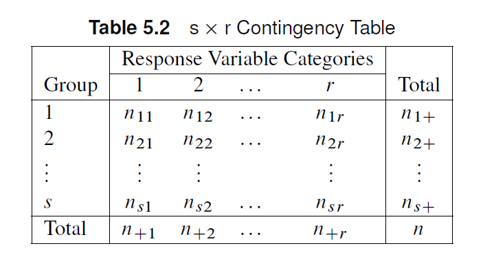
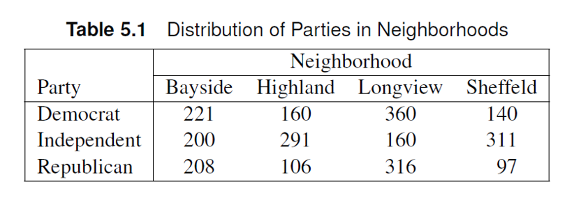
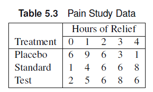

```{r}
#| echo: false
#| warning: false
#| output: false

library(tidyverse)
library(vcdExtra)
```

# $s \times r$ tables

## Outline

- Association
  - Test for General Association
  - Mean Score Test
  - Correlation Test
  - Exact Tests
- Measures of Association
  - Ordinal
  - Nominal
- Observer Agreement (inter-rater reliability)
- Test for Ordered Differences

## $s \times r$ tables

We have evolved the contingency table from a $2 \times 2 \to $s \times 2$ \to 2 \times r$.

Let's generalize the trends we've seen with the $s \times r$ table.

## Nominal Categorical variables

::: columns
::: {.column style="width:40%; font-size: 75%"}
Unlike the $s \times 2$ table, the response variables can now have $r$ levels and be strictly nominal.
:::

::: {.column style="width:60%"}

:::
:::

## General Association Statistic

- The groups and the response variable categories can be nominally scaled.
  - $H_0$: there is no general association between the groups and response variables.
  - $H_A$: there is a general association between the two variables

## General Association Statistic

The randomization statistic based on Mantel-Haenszel statistics can be calculated from the Pearson chi-square statistic, $Q_P$.

$$
Q = \left(\frac{n-1}{n}\right) Q_P
$$
$$
Q_P = \sum_{i=1}^s\sum_{j=1}^r \frac{(n_{ij}-m_{ij})^2}{m_{ij}}
$$

when $n$ is large, $Q \approx Q_P$. Like the Pearson chi-square, $Q$ follows a chi-square distribution with $(s-1)(r-1)$ degrees of freedom.

## Mosaic Plot

::: columns
::: {.column style="width:40%; font-size: 75%"}
- A mosaic plot visualizes the proportion in each cell of the contingency table.
  - Horizontal space is divided by sizes corresponding to the relative count of x-axis variable levels
  - Vertical space is divided up according to relative sizes of the y-axis variable levels.

:::

::: {.column style="width:60%"}
```{r}
#| echo: false
library(vcd)
mosaic(~Admit + Dept,
       highlighting="Admit",
       data=UCBAdmissions)
```
:::
:::

## General Association: SAS

- In SAS, the Pearson chi-square statistic $Q_P$ is the value referred to as ‘Chi-square”
- Note that $Q$ is **NOT** the Mantel-Haenszel statistic in the `chisq` output in SAS. 
  - $Q$ is the “General Association” cell in the `cmh` output.
- We can use the `plots` option in the `tables` statement to create a mosaic plot.

```{.r}
proc freq;
weight count;
tables a*b/cmh plots=mosaicplot; # <1>
run;
```

1. `cmh` calculates the general association Mantel-Haenszel statistic. `plots=mosaicplot` tells SAS to create a mosaic plot with $a$ and $b$.

## Example

::: columns
::: {.column style="width:40%; font-size: 75%"}
The table contains data from a study concerning the distribution of party affiliation in a city suburb. The interest was whether there was an association between registered political party and neighborhood.

- What is the Pearson chi-square value?
- What is the randomization statistic?
- Is there sufficient evidence of an association between political party and neighborhood? 

:::
::: {.column style="width:60%"}

:::
:::

## Example

The table contains data from a study concerning the distribution of party affiliation in a city suburb. The interest was whether there was an association between registered political party and neighborhood.

- What is the Pearson chi-square value?
- What is the randomization statistic?
- Is there sufficient evidence of an association between political party and neighborhood? 

:::{.panel-tabset}
### SAS Code

```{.r}
data neighbor;
length party $ 11 neighborhood $ 10;
input party $ neighborhood $ count @@;
datalines;
democrat longview 360 democrat bayside 221
democrat sheffeld 140 democrat highland 160
republican longview 316 republican bayside 208
republican sheffeld 97 republican highland 106
independent longview 160 independent bayside 200
independent sheffeld 311 independent highland 291
;

proc freq data=neighbor;
weight count;
tables party*neighborhood /
plots=mosaicplot chisq cmh nocol nopct measures cl; #<1>
run;

```

1. Included both `chisq` and `cmh` to show discrepancy.

### Answer

$Q_P$ = 273.92, $Q$ = 273.81. The corresponding p-value $p<0.001$ suggests there is an association between party affiliation and neighborhood.

- Note that the Mantel-Haenszel statistic reported in the `chisq` output corresponds to the correlation statistic which doesn't make sense in this case.
:::

## Exercise
::: columns
::: {.column style="width:40%; font-size: 75%"}
Secondary school teachers were randomly sampled from four school districts in Nevada and asked what marker color they used in grading students’ work. 

- What is the Pearson chi-square statistic? 
- What is the randomization statistic? 
- Generate a mosaic plot for this example. Can you see a trend between the colors and/or the counties?
- At a significance level of 0.05, do we have sufficient evidence of a general association between the two variables?

:::
::: {.column style="width:60%"}

Data set: 
```{.r}
data color;
input county $ color $ count @@;
datalines;
cl blu 22 cl red 57 cl green 12 cl blk 15
ca blu 12 ca red 30 ca green 6 ca blk 15
do blu 17 do red 34 do green 17 do blk 10
wa blu 5 wa red 56 wa green 7 wa blk 9
;
run;
```

:::
:::

## Exercise

Secondary school teachers were randomly sampled from four school districts in Nevada and asked what marker color they used in grading students’ work. 

- What is the Pearson chi-square statistic? 
- What is the randomization statistic? 
- Generate a mosaic plot for this example. Can you see a trend between the colors and/or the counties?
- At a significance level of 0.05, do we have sufficient evidence of a general association between the two variables?

:::{.panel-tabset}
### SAS Code
```{.r}

data color;
input county $ color $ count @@;
datalines;
cl blu 22 cl red 57 cl green 12 cl blk 15
ca blu 12 ca red 30 ca green 6 ca blk 15
do blu 17 do red 34 do green 17 do blk 10
wa blu 5 wa red 56 wa green 7 wa blk 9
;
run;

proc freq data=color;
weight count;
tables county*color/
plots=mosaicplot chisq cmh nocol nopct measures cl;
run;
```

### Answer

$Q_P$= 24.36, $Q$ = 24.28, p = 0.004, which means there is strong evidence of an association between school district and marker color used for grading.

```{r}
#| echo: false

library(ggmosaic)
dat <- expand.grid(county=c("cl","ca","do","wa"),
                   color = c("blu","red","green","blk")) |> 
  mutate(count=c(22,12,17,5,57,30,34,56,12,6,17,7,15,15,10,9))

dat_cc <- xtabs(count~county+color,data=dat)
# spine(dat_cc)
dat |> ggplot() + geom_mosaic(aes(weight=count,x=product(county,color),fill=color)) + scale_fill_manual(values = c("blue","red","green","black"),name="Color") + theme_minimal()
```

:::

## Mean Score Tests

- Used when the column variable is ordinal.
- Row variable could be nominal
  - $H_0$: there is no difference in mean scores across the groups
  - $H_a$: at least one group has a different mean score compared to the others
- Scores are calculated for each row
- Recall: 2xr tables

## Mean Score Tests

- The mean score statistic $Q_S$ can be used to test the difference between the mean scores.
  - Consistent with the ANOVA approach
- Recall 2xr table: Sample size requirement
- Set a cutoff column, the totals to the left and right of this column should be greater than 5.
  - Row totals should be **greater than 20**
- Included in the `cmh` table as "Row Mean Scores Differ"

## Example

::: columns
::: {.column style="width:50%; font-size: 75%"}

The data shown comes from a study on headache pain relief. A new treatment was compared with the standard treatment and a placebo. Researchers measured the number of hours of substantial relief from headache pain

  - Is the chi-square approximation valid for this case?
  - What kind of scoring method is most appropriate for this data set?
  - Make the appropriate conclusion based on the result of the mean score tests  using a significance level $\alpha=0.05$.

:::
::: {.column style="width:50%"}

:::
:::

## Example

The data shown comes from a study on headache pain relief. A new treatment was compared with the standard treatment and a placebo. Researchers measured the number of hours of substantial relief from headache pain

  - Is the chi-square approximation valid for this case?
  - What kind of scoring method is most appropriate for this data set?
  - Make the appropriate conclusion based on the result of the mean score tests using a significance level $\alpha=0.05$.
  
::: {.panel-tabset}
### SAS Code
```{.r}
data pain;
input treatment $ hours count @@;
datalines;
placebo 0 6 placebo 1 9 placebo 2 6 placebo 3 3 placebo 4 1
standard 0 1 standard 1 4 standard 2 6 standard 3 6 standard 4 8
test 0 2 test 1 5 test 2 6 test 3 8 test 4 6
;

proc freq data=pain order=data;
weight count;
tables treatment*hours/ cmh nocol nopct;
run;
```

### Answer

- Use column 3 (Hours = 2) as cutoff. The use of the chi-square approximation is justified!

- The integer scoring method is most appropriate.
- $Q_S$ = 13.7, p=0.001. There is sufficient evidence to conclude that at least one treatment group is different compared to the others.
:::

