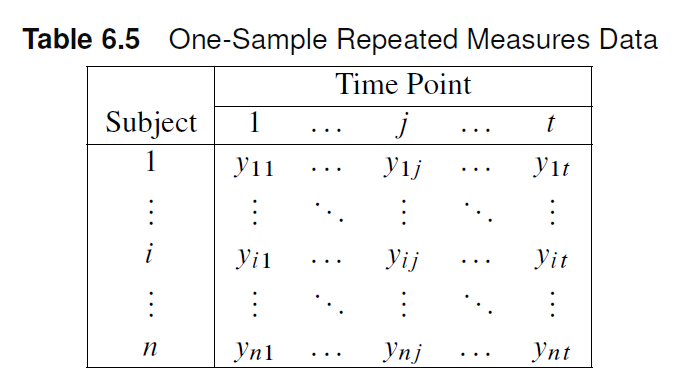
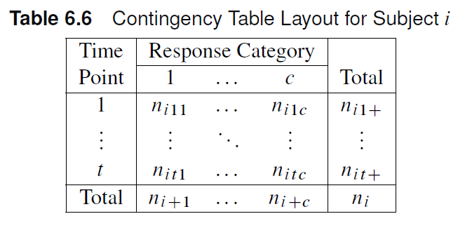

# Sets of $s \times r$ tables

## Outline

-   General Mantel-Haenszel Method
-   Mantel-Haesnzel Applications
-   Repeated Measures

## General Mantel-Haenszel Method

-   Recall: 2x2, sx2, 2xr, sxr tables all use Mantel-Haenszel Statistics
    -   Able to account for ordinality unlike Pearson Chi-Square tests
    -   Less stringent sample size requirements
-   MH statistics in sets of contingency tables removes the confounding influence of the stratification variable.

## General Mantel-Haenszel Method

::: callout-note
$H_0$: The response variable is distributed at random with respect to the groups defined by the row variables
:::

Depending on the nature of the row and column variables, the Mantel-Haenszel statistic has different forms:

-   $Q_{GMH}$: General Mantel-Haenszel statistic
-   $Q_{SMH}$: Mean Score Statistic
-   $Q_{CSMH}$: Correlation Statistic

## General Mantel-Haenszel Method {.smaller}

| MH Statistic | Alternative Hypothesis     | SAS Output Label        | Degrees of Freedom | Scale Requirements              | Nonparametric Equivalents |
|--------------|----------------------------|-------------------------|--------------------|---------------------------------|---------------------------|
| $Q_{GMH}$    | General Association        | General Association     | $(s-1)(r-1)$       | None                            |                           |
| $Q_{SMH}$    | Mean score location shifts | Row Means Scores Differ | $(s-1)$            | Column Variable Ordinal         | Kruskal-Wallis            |
| $Q_{CSMH}$   | Linear Association         | Nonzero correlation     | $1$                | Row and Column Variable Ordinal | Spearman Correlation      |

: Extended Mantel-Haenszel Statistics

## Example {.smaller}

Investigators conducted a randomized clinical trial in four hospitals, where patients were assigned to one of four surgical procedures for the treatment of severe duodenal ulcers. The treatments include:

- v + d: vagotomy and drainage
- v + a: vagotomy and antrectomy (removal of 25% of gastric tissue)
- v + h: vagatomy and hemigastrectomy (removal of 50% of gastric tissue)
- gre: gastric resection (removal of 75% of gastric tissue)

The response measured was the severity (none, slight, moderate) of symptoms, which is expected to increase directly with the proportion of gastric tissue removed. Investigators wanted to determine whether the distribution of the severity of duodenal ulcers is different across all treatments, **controlling** for hospital effects.

### SAS Data set
```{.r}
data operate;
input hospital trt $ severity $ wt @@;
datalines;
1 v+d none 23 1 v+d slight 7 1 v+d moderate 2
1 v+a none 23 1 v+a slight 10 1 v+a moderate 5
1 v+h none 20 1 v+h slight 13 1 v+h moderate 5
1 gre none 24 1 gre slight 10 1 gre moderate 6
2 v+d none 18 2 v+d slight 6 2 v+d moderate 1
2 v+a none 18 2 v+a slight 6 2 v+a moderate 2
2 v+h none 13 2 v+h slight 13 2 v+h moderate 2
2 gre none 9 2 gre slight 15 2 gre moderate 2
3 v+d none 8 3 v+d slight 6 3 v+d moderate 3
3 v+a none 12 3 v+a slight 4 3 v+a moderate 4
3 v+h none 11 3 v+h slight 6 3 v+h moderate 2
3 gre none 7 3 gre slight 7 3 gre moderate 4
4 v+d none 12 4 v+d slight 9 4 v+d moderate 1
4 v+a none 15 4 v+a slight 3 4 v+a moderate 2
4 v+h none 14 4 v+h slight 8 4 v+h moderate 3
4 gre none 13 4 gre slight 6 4 gre moderate 4
;
```

## Example

The response measured was the severity (none, slight, moderate) of symptoms, which is expected to increase directly with the proportion of gastric tissue removed. Investigators wanted to determine whether the distribution of the severity of duodenal ulcers is different across all treatments, **controlling** for hospital effects.

:::{.panel-tabset}
### SAS Code

```{.r}
proc freq data=operate order=data;
weight wt;
tables hospital*trt*severity / cmh; # <1>
tables hospital*trt*severity / cmh scores=modridit; # <2>
run;
```

1. Table Scores
2. Modridit scores

### Answer

Both variables are ordinal, hence we can test for correlation using $Q_{CSMH}$. Using modridit scores, we get $Q_{CSMH}=6.93$, p=0.0085. Hence, we have sufficient evidence that the proportion of gastric tissue removed is associated with symptom severity in patients.
:::

## Exercise {.smaller}

The following data were collected in a study of shoulder harness usage in observations for a sample of North Carolina cars. The researchers wanted to test for an association between car size and usage after adjusting for geographical area and location.

```{.r}
data shoulder;
input area $ location $ size $ usage $ count @@;
datalines;
coast urban large no 174 coast urban large yes 69
coast urban medium no 134 coast urban medium yes 56
coast urban small no 150 coast urban small yes 54
coast rural large no 52 coast rural large yes 14
coast rural medium no 31 coast rural medium yes 14
coast rural small no 25 coast rural small yes 17
piedmont urban large no 127 piedmont urban large yes 62
piedmont urban medium no 94 piedmont urban medium yes 63
piedmont urban small no 112 piedmont urban small yes 93
piedmont rural large no 35 piedmont rural large yes 29
piedmont rural medium no 32 piedmont rural medium yes 30
piedmont rural small no 46 piedmont rural small yes 34
mountain urban large no 111 mountain urban large yes 26
mountain urban medium no 120 mountain urban medium yes 47
mountain urban small no 145 mountain urban small yes 68
mountain rural large no 62 mountain rural large yes 31
mountain rural medium no 44 mountain rural medium yes 32
mountain rural small no 85 mountain rural small yes 43
;
```

## Exercise


The following data were collected in a study of shoulder harness usage in observations for a sample of North Carolina cars. The researchers wanted to test for an association between car size and usage after adjusting for geographical area and location.

:::{.panel-tabset}
### SAS Code

```{.r}
proc freq data=shoulder order=data;
weight count;
tables area*location*size*usage / cmh scores=modridit;
;
run;
```

### Answer

Both variables are ordinal. We can use the extended correlation statistic $Q_{CSMH}$. Using modridit scores, $Q_{CSMH}$ =6.64, p=0.01. There is sufficient evidence to conclude that car size and shoulder harness usage are correlated.

:::

## Repeated Measures

- Commonly used in longitudinal studies
  - Cohort studies
- Dental experiments: multiple teeth from each subject
- Mantel-Haenszel statistics can be calculated to determine whether there is an association between a repeated measurement factor (usually time) and a response variable adjusting for an effect of subject.
  - Controlling for subject adjusts for the variability between subjects, which focuses the analysis to within-subject.
  

## Repeated Measures


- Consider an experiment with $n$ subjects.
  - The treatment is applied to each subject.
  - The response is measured at $t$ time points. 
  - Cohort studies/ longitudinal RCT
- In general, the repeated measures can come from multiple subjects. Responses can come from:
  - Same location
  - Same family/litter
  - Matched pairs

## Repeated Measures

Consider a repeated measures design with $t$ time points and a response variable with $C$ levels.




::: callout-note
Each time point will have a measured response value. For a sample size $n$, we will end up with $n$ contingency tables with shape $t \times C$
:::



::: callout-note
$n_{ijk} = 1$ if response $k$ is measured at time $j$. Otherwise, $n_{ijk}=0$
:::

## Repeated Measures: Hypotheses

- Mantel-Haenszel statistics can be used to test the hypothesis of no association between time and response.
  - Assumption: marginal totals per subject in response and time is fixed.
  - $H_0$: The response variable is distributed at random with respect to the time points
  - The null hypothesis is referred to as the hypothesis of interchangeability or marginal homogeneity.
- As in previous chapters, $Q_{CSMH}$, $Q_{SMH}$, and $Q_{GMH}$ pertain to different alternatives to no association.

## Repeated Measures: Caution

:::callout-warning
Odds ratio estimates and CI limits assumes independence between contingency table entries, which is broken in repeated measures data. Breslow-Day assumptions are also not satisfied.

The Breslow-Day statistic as well as the MH and logit estimates of the odds ratio should be taken with a grain of salt. 

:::

## Example {.smaller}

A running shoe company produces a new model of running shoe that includes a harder material for the insert that corrects for overpronation. However, the company is concerned that the material will induce heel tenderness as a result of some loss of cushioning on the strike of each step. It conducted a study on 87 runners who used the new shoe for a month. Researchers asked the participants whether they experienced occasional heel tenderness before and after they used the new shoe. Is there a difference in proportion of people reporting more heel tenderness with the new running shoes compared with the older running shoes?

### SAS Data

```{.r}
data pump;
input subject time $ response $ @@;
datalines;
1 before no 1 after no 2 before no 2 after no
3 before no 3 after no 4 before no 4 after no
5 before no 5 after no 6 before no 6 after no
7 before no 7 after no 8 before no 8 after no
9 before no 9 after no 10 before no 10 after no
11 before no 11 after no 12 before no 12 after no
13 before no 13 after no 14 before no 14 after no
15 before no 15 after no 16 before no 16 after no
17 before no 17 after no 18 before no 18 after no
19 before no 19 after no 20 before no 20 after no
21 before no 21 after no 22 before no 22 after no
23 before no 23 after no 24 before no 24 after no
25 before no 25 after no 26 before no 26 after no
27 before no 27 after no 28 before no 28 after no
29 before no 29 after no 30 before no 30 after no
31 before no 31 after no 32 before no 32 after no
33 before no 33 after no 34 before no 34 after no
35 before no 35 after no 36 before no 36 after no
37 before no 37 after no 38 before no 38 after no
39 before no 39 after no 40 before no 40 after no
41 before no 41 after no 42 before no 42 after no
43 before no 43 after no 44 before no 44 after no
45 before no 45 after no 46 before no 46 after no
47 before no 47 after no 48 before no 48 after no
49 before no 49 after yes 50 before no 50 after yes
51 before no 51 after yes 52 before no 52 after yes
53 before no 53 after yes 54 before no 54 after yes
55 before no 55 after yes 56 before no 56 after yes
57 before no 57 after yes 58 before no 58 after yes
59 before no 59 after yes 60 before no 60 after yes
61 before no 61 after yes 62 before no 62 after yes
63 before no 63 after yes 64 before yes 64 after no
65 before yes 65 after no 66 before yes 66 after no
67 before yes 67 after no 68 before yes 68 after no
69 before yes 69 after yes 70 before yes 70 after yes
71 before yes 71 after yes 72 before yes 72 after yes
73 before yes 73 after yes 74 before yes 74 after yes
75 before yes 75 after yes 76 before yes 76 after yes
77 before yes 77 after yes 78 before yes 78 after yes
79 before yes 79 after yes 80 before yes 80 after yes
81 before yes 81 after yes 82 before yes 82 after yes
83 before yes 83 after yes 84 before yes 84 after yes
85 before yes 85 after yes 86 before yes 86 after yes
87 before yes 87 after yes
;

```

## Example

Is there a difference in proportion of people reporting more heel tenderness with the new running shoes compared with the older running shoes?

:::{.panel-tabset}
### SAS Code

```{.r}

data pump;
input subject time $ response $ @@;
datalines;
1 before no 1 after no 2 before no 2 after no
3 before no 3 after no 4 before no 4 after no
5 before no 5 after no 6 before no 6 after no
7 before no 7 after no 8 before no 8 after no
9 before no 9 after no 10 before no 10 after no
11 before no 11 after no 12 before no 12 after no
13 before no 13 after no 14 before no 14 after no
15 before no 15 after no 16 before no 16 after no
17 before no 17 after no 18 before no 18 after no
19 before no 19 after no 20 before no 20 after no
21 before no 21 after no 22 before no 22 after no
23 before no 23 after no 24 before no 24 after no
25 before no 25 after no 26 before no 26 after no
27 before no 27 after no 28 before no 28 after no
29 before no 29 after no 30 before no 30 after no
31 before no 31 after no 32 before no 32 after no
33 before no 33 after no 34 before no 34 after no
35 before no 35 after no 36 before no 36 after no
37 before no 37 after no 38 before no 38 after no
39 before no 39 after no 40 before no 40 after no
41 before no 41 after no 42 before no 42 after no
43 before no 43 after no 44 before no 44 after no
45 before no 45 after no 46 before no 46 after no
47 before no 47 after no 48 before no 48 after no
49 before no 49 after yes 50 before no 50 after yes
51 before no 51 after yes 52 before no 52 after yes
53 before no 53 after yes 54 before no 54 after yes
55 before no 55 after yes 56 before no 56 after yes
57 before no 57 after yes 58 before no 58 after yes
59 before no 59 after yes 60 before no 60 after yes
61 before no 61 after yes 62 before no 62 after yes
63 before no 63 after yes 64 before yes 64 after no
65 before yes 65 after no 66 before yes 66 after no
67 before yes 67 after no 68 before yes 68 after no
69 before yes 69 after yes 70 before yes 70 after yes
71 before yes 71 after yes 72 before yes 72 after yes
73 before yes 73 after yes 74 before yes 74 after yes
75 before yes 75 after yes 76 before yes 76 after yes
77 before yes 77 after yes 78 before yes 78 after yes
79 before yes 79 after yes 80 before yes 80 after yes
81 before yes 81 after yes 82 before yes 82 after yes
83 before yes 83 after yes 84 before yes 84 after yes
85 before yes 85 after yes 86 before yes 86 after yes
87 before yes 87 after yes
;

proc freq data=pump order=data; #<1>
tables subject*time*response/ noprint cmh; *noprint does not print the 87 contingency tables.;
run;
```

1. There's no weight statement because each line is an observational unit.

### Answer

- We can construct 2x2 tables for each runner and control for each subject. The resulting CMH tables will have the same results because of the shape of the contingency tables.
- $Q_{CSMH}$=5, p=0.03, which means there is strong evidence that there is a difference in heel tenderness before and after using the new shoe.
- All extended Mantel-Haenszel statistic will yield the same result because the resulting contingency table for each subject is a 2x2 table.

### McNemar's test

```{.r}
data shoes;
input before $ after $ count;
datalines;
yes yes 19
yes no 5
no yes 15
no no 48
;

proc freq data=shoes order=data;
weight count;
tables before*after/agree;
run;

```

The McNemar's test yields the same result as $Q_{CSMH}$.
:::

## Exercise

The DRUG2 dataset shows the data from a study in which 46 patients were each treated with three drugs (A, B, and C). The response to each drug was recorded as favorable (F) or unfavorable (U). Use the appropriate test to determine whether the three drugs have equal probabilities for favorable response.

- Which Mantel-Haenszel statistic is the most appropriate for this example?
- At a significance level of 0.01, is there sufficient evidence against the hypothesis that the three drugs have equal probabilities?

### SAS Data

```{.r code-line-numbers="14-23"}
data drug;
input druga $ drugb $ drugc $ count;
datalines;
F F F 6
F F U 16
F U F 2
F U U 4
U F F 2
U F U 4
U U F 6
U U U 6
;
run;
data drug2; set drug;
keep patient drug response;
retain patient 0;
do i=1 to count;
patient=patient+1;
drug='A'; response=druga; output;
drug='B'; response=drugb; output;
drug='C'; response=drugc; output;
end;
run;
```

## Exercise

- Which Mantel-Haenszel statistic is the most appropriate for this example?
- At a significance level of 0.01, is there sufficient evidence against the hypothesis that the three drugs have equal probabilities?

:::{.panel-tabset}
### SAS Code

```{.r}
proc freq data=drug2 order=data;
tables patient*drug*response/cmh noprint;
run;
```

### Answer

The most appropriate MH statistic to examine is "Row Means Differ".

The statistic $Q_{SMH}=8.47$ yields a p-value $p=0.0145$. At a significance level of 0.01, there is marginally sufficient evidence that at least one drug has a different probability of a favorable response.
:::

## Ordinal Response with Missing Data

Experiments using a repeated measures design tend to include plenty of missing data.


- Missing data decreases the power of the study.
  - Including missing data in the analysis still gives a higher power than excluding incomplete cases in the analysis.

- Techniques to deal with missing data include:
  - Multiple imputation
  - Omission
  - Adjusting ANOVA scores
