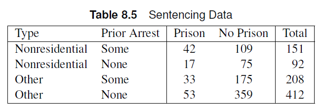
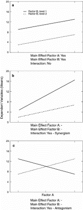

# Chapter 8: Logistic Regression: Dichotomous Response

## Outline

-   Dichotomous Explanatory Variables
    -   The LOGISTIC procedure
    -   CLASS statement
-   Qualitative Explanatory Variables
-   Continuous and Ordinal Explanatory Variables
-   Diagnostics
-   Likelihood methods
    -   The GENMOD procedure

## Review: Mantel-Haenszel Tests

-   Mantel-Haenszel statistics investigate association between two
    variables with adjustment for a stratification variable.
    -   General association
    -   Location shifts for means
    -   Linear/increasing trends -Mantel-Haenszel does not involve
        statistical models.
    -   Can’t be used for estimation

## Logistic Regression

-   Statistical modeling method that enables us to:
    -   make inferences
    -   estimate/predict outcome variables
-   Describes the relationship between a categorical response variable
    and multiple explanatory variables
    -   Continuous explanatory variables can be included in the analysis
    -   Responses can be dichotomous or polytomous

## Logistic Regression

-   Possible applications include epidemiology, medical research,
    agronomy, and social science research.

## Logistic Regression: Dichotomous Variables

-   When both response and explanatory variables are dichotomous, it
    corresponds to a $2 \times 2$ table.
    -   Rows pertain to groups/populations/subpopulations
-   Logistic regression enables us to write a model for the probability
    of success for each group.

## Logistic Regression: Model

Let $\theta_{mi}$ be the probability of success fo the $i^{th}$ group in
the $m^{th}$ strata.The logistic model can be used to describe the
variation among {$\theta_{mi}$}

$$
\theta_{mi} = \frac{1}{1+\exp[-\eta_{mi}]}
$$

## Logistic Regression: Model

Where

$$
\eta_{mi} = \alpha + \sum_{k=1}^t \beta_kx_{mik}
$$ and $t$ is the number of explanatory variables.

::: callout-note
$\eta_{mi}$ is referred to as the linear predictor of the model.
:::

## Logistic Regression: Model

Using algebra, we can invert the equation to the following form:

$$
\eta_{mi} = \alpha + \sum_{k=1}^t \beta_kx_{mik} = \log\left[\frac{\theta_{mi}}{1-\theta_{mi}}\right]
$$

::: callout-note
$\log\left[\frac{\theta_{mi}}{1-\theta_{mi}}\right]$ is referred to as
the **logit** transformation of $\theta_{mi}$, which is the logarithm of
the odds.
:::

## Odds and Odds Ratios

The odds of success for an individual in the $m^{th}$ strata and
$i^{th}$ group can be calculated as

$$
\theta_{mi}/(1-\theta_{mi}) = e^{\eta_{mi}}
$$

The odds ratio between the $i^{th}$ and $j^{th}$ group in the $m^{th}$
strata can easily be calculated.

$$
OR = \frac{odds_{mj}}{odds_{mi}} = e^{\eta_{mj}}/e^{\eta_{mi}} = e^{\eta_{mj}-\eta_{mi}}
$$

## Advantages

-   The logit transformation enables us to monitor the change in log
    odds.
-   Easy to calculate ods ratio.
-   The linear predictor can take on values from $(-\infty,\infty)$, but
    the values of $\theta_{mi}$ will be constrained in \[0,1\].

::: callout-tip
If you used linear regression to model a proportion, it assumes that the
response variable can be negative or above 1.
:::

## Fit Statistics

-   The model performance can be measured using the **deviance** and
    **goodness-of-fit** statistics.

::: callout-note
Both use chi-square statistics to assess model fit.
:::

## Chi-square statistics

::: callout-note
Likelihood ratio chi-square measures the difference between two models
by using the ratio of the two likelihoods as a chi-square statistic.
:::

::: callout-note
Pearson chi-square goodness of fit uses observed and expected values to
test for a goodness of fit.
:::

## Chi-square statistics

-   If the chi-square statistic divided by the degrees of freedom is
    higher than one, then the data has some variation that is
    unaccounted for in the model.
    -   This is called overdispersion
-   The high ratio between the chi-square statistic and degrees of
    freedom can also mean that the data does not follow a binomial
    distribution well.
    -   Heterogeneity
-   Both cases are accounted for using generalized linear mixed
    models/generalized estimating equations.

## Chi-square statistics: sample size

Sample size guidelines for the chi-square assumption for these fit
statistics include:

-   Each group should have at least ten subjects.
-   80% of the predicted counts should be at least 5.
-   No 0 counts, remaining 20% of the counts should be above 2.
-   Failure to satisfy these assumptions means exact tests should be
    used.

## Chi-square statistics: hypothesis test

The null hypothesis for both deviance and goodness-of-fit tests is that
the departures of the observed data from the predicted values based on
the model are random.

-   Failure to reject the null hypothesis means we have no evidence
    against good agreement between observed and predicted values based
    on the model.

## Fit Statistics

-   The Akaike Infomation Criterion (AIC) and the Bayesian Information
    Criterion (BIC) can also be used to assess model fit.

::: callout-note
The Bayesian Information Criterion is also known as the Schwarz
Criterion (SC).
:::

::: callout-note
AIC predicts estimation error based on the provided model. BIC also
predicts estimation error but uses a different penalization scheme for
errors.
:::

-   The AIC (or BIC) for the full model (intercept + covariates) should
    be lower than the AIC (or BIC) of the intercept-only model.

## The Main Effect Model

Recall that the linear predictor can be written as:

$$
\eta_i = \alpha + \beta_1x_{i1} + \beta_2x_{i2} + ...
$$ ::: callout-note $\alpha$ is the intercept of the linear model :::

::: callout-note
$\beta_k$ are the coefficients of the explanatory variables. These
coefficients will tell us the effect of predictor $x_ik$.
:::

## The Main Effect Model

-   The current form of the linear predictor assumes the explanatory
    variables are in quantitative form.
-   When the explanatory variables are categorical, we need to create
    dichotomous dummy variables to denote each level of the variables.
    -   The case $x_{ik}=0$ is called the reference level of the
        variables. When all $x_{ik}=0$ the linear predictor collapses to
        the intercept $\alpha$.

::: callout-note
For dummy dichotomous variables, odds ratios can be caluclated as an
effect size of association.
:::

## The Main Effect Model

::: callout-note
The main effect model follows a regression framework, which means we can
use ANOVA to test for effect significance.
:::

## The LOGISTIC Procedure

The LOGISTIC procedure can perform logistic regression in SAS.

-   Can take both categorical and continuous explanatory variable
-   Syntax is slightly different from the FREQ procedure.

## The LOGISTIC Procedure

The LOGISTIC procedure provides estimates for $\beta$ as in regression
analysis.

### Sample Syntax

``` r
proc logistic data=data;
freq count; # <1>
model y(event='Yes') = x1 x2 /scale=none aggregate; # <2>
run;
```

1.  `freq` functions similar to `weight` in the `FREQ` procedure. When
    the data consists of an observation for each row, this statement is
    not needed.
2.  `model` specifies the model for the response `y` using the
    explanatory variables `x1` and `x2`. `event` tells SAS what the
    "success" response level is. The `scale` option produces
    goodness-of-fit statistics. The `aggregate` option requests that SAS
    treat each unique combination of the explanatory variable values as
    a distinct group in computing the goodness-of-fit statistics.

## Example

The data shows people who visited a clinic and required a
catheterization. The response is the presence of coronary artery
disease. The explanatory variables are ECG segment depression and sex.
Use logistic regression methods to obtain odds ratio estimates and
create a logistic regression model to estimate the probability of
developing CA disease based on sex and ECG segment depression.


### Data Set

``` r
data coronary;
input sex ecg ca count @@;
datalines;
0 0 0 11 0 0 1 4
0 1 0 10 0 1 1 8
1 0 0 9 1 0 1 9
1 1 0 6 1 1 1 21
;
```

## Example

The data shows people who visited a clinic and required a
catheterization. The response is the presence of coronary artery
disease. The explanatory variables are ECG segment depression and sex.
Use logistic regression methods to obtain odds ratio estimates and
create a logistic regression model to estimate the probability of
developing CA disease based on sex and ECG segment depression.

::: panel-tabset
### SAS Code

``` r
proc logistic data=coronary ;
freq count;
model ca(event='1')=sex ecg / scale=none aggregate;
run;
```

### Answer

Both chi-square tests had p-values above 0.05, which meant there was no
evidence that the errors were not random.

The AIC values for the full model are lower than the intercept-only
model, which meant model performance increased after including our
covariates.

Assuming the probability of developing CA is given by $\theta_CA$, the
logistic model was estimated to be:

$$
logit~[\hat{\theta_{CA}}] = -1.17 + 1.28*SEX + 1.05*ECG
$$

There is a significant effect of sex ($\beta = 1.28$, p=0.01) and
segment depression ($\beta = 1.05$, p=0.03) on the probability of
developing CA disease. In terms of odds ratios, the odds that males
develop CA is 3.58 (95% CI: 1.35,9.52) times that of females. Additionally, the odds of
developing CA with higher segment depression is 2.87 (95% CI: 1.08, 7.62) times that of
patients with lower segment depression in their ECG.
:::

## Exercise

A simple random sample of individuals from different age groups were
asked about their caffeine and exercise habits.

|             |              |              |             |
|-------------|--------------|--------------|-------------|
| Age Group   | Caffeine     | Yes Exercise | No Exercise |
| Young Adult | Yes Caffeine | 121          | 152         |
| Young Adult | No Caffeine  | 36           | 97          |
| Older Adult | Yes Caffeine | 44           | 132         |
| Older Adult | No Caffeine  | 15           | 130         |

-   Use logistic regression to estimate the logistic model for the data.
    Use Young Adult and No caffeine as the reference levels.
-   Is there a significant age group effect on exercise habits?
-   Is there a significant effect of caffeine intake on exercise habits?
-   Calculate and interpret the appropriate odds ratios for age group
    and caffeine intake.
-   Does the model fit the data well?


## Exercise

A simple random sample of individuals from different age groups were
asked about their caffeine and exercise habits.

:::{.panel-tabset}
### SAS Code

```{.r}
data caf;
input agegrp  caffeine  exercise  count;
datalines;
0 1 1 121
0 1 0 158
0 0 1 36
0 0 0 97
1 1 1 44
1 1 0 132
1 0 1 15
1 0 0 130
;

proc logistic;
freq count;
model exercise(event='1')=agegrp caffeine / scale=none aggregate;
run;
```

### Answer

Suppose the probability of exercise is given by $\theta$,The estimated logistic regression model is: $logit (\theta) = -1.08 -0.93*AGEGRP + 0.84*CAFFEINE$.

There is a significant effect of age in the likelihood of exercising. The odds of an older participant reporting regular exercise is 0.39 (95% CI: 0.28, 0.56; p<0.001) times that of younger participants.

There is a significant effect of caffeine intake on exercise. The odds of a participant reporting regular exercise when they consume caffeine is 2.3 (95% CI: 1.6,3.3; p<0.001) times that of those who do not consume caffeine.

The deviance (p=0.39) and goodness-of-fit chi-square tests (p=0.40) showed no evidence against the randomness of errors, which indicates good model fit. The AIC and SC values also decreased after including covariates, also supporting good fit.

:::


## CLASS statement

- The `class` statement can create dummy variable coding automatically through the LOGISTIC procedure.
  - The REF option allows us to set the reference level for each variable.
  
  
```{.r code-line-numbers=2}
proc logistic;
class cat;
model y = x cat/scale=none aggregate;
run;
```

## Model parameterizations

::: callout-note
**Effect parameterization** produces deviation from the _grand mean_. This is the default parameterization in the LOGISTIC procedure.

- The reference level corresponds to $X=-1$.
:::

::: callout-note
**Reference cell parameterization** produces measureents based on reference level. This can be specified in the class statement as `param=ref` in the LOGISTIC procedure.

- The reference level corresponds to $X=0$.
:::

## Example

The data is based on a study on prison sentencing for persons convicted of a burglary or larceny. The researchers wanted to test whether the type of crime (nonresidential or other) and prior arrests (some or none) affect whether the offender was sent to prison.

-   Perform a logistic regression analysis to estimate the appropriate logistic model for the data. Comment on the significance of the main effects and estimate the odds ratio and the 95% CI.
  -   Using effect parameterization
  -   Using reference cell parameterization




## Example

The data is based on a study on prison sentencing for persons convicted of a burglary or larceny. The researchers wanted to test whether the type of crime (nonresidential or other) and prior arrests (some or none) affect whether the offender was sent to prison.

-   Perform a logistic regression analysis to estimate the appropriate logistic model for the data. Comment on the significance of the main effects and estimate the odds ratio and the 95% CI.
  -   Using effect parameterization
  -   Using reference cell parameterization
  
:::{.panel-tabset}
### SAS Code

```{.r}
data sentence;
input type $ prior $ sentence $ count @@;
datalines;
nrb some y 42 nrb some n 109
nrb none y 17 nrb none n 75
other some y 33 other some n 175
other none y 53 other none n 359
;

proc logistic data=sentence order=data;
title "effect";
class type(ref="nrb") prior(ref="none") / ; # <1>
freq count;
model sentence(event='y') = type prior / scale=none aggregate;
run;


proc logistic data=sentence order=data;
title "reference";
class type(ref="nrb") prior(ref="none") / param=ref; # <2>
freq count;
model sentence(event='y') = type prior / scale=none aggregate;
run;


```

1. Default: effect parameterization
2. Reference cell parameterization used after `param=ref` is specified.

### Answer

Effect parameterization: $logit (\theta_{ij}) = -1.48 - 0.30 * TYPE +0.17* PRIOR$

Reference Cell parameterization: $logit (\theta_{ij}) = -1.36- 0.59 * TYPE +0.35* PRIOR$

The odds of sending an offender to prison after committing other crimes is 0.55 times (95% CI: 0.38, 0.81) that when committing non-residential crimes. There is strong evidence against the null hypothesis of no difference.

The odds of sending an offender with some prior arrests are 1.42 times (95% CI: 0.974, 2.06) times more likely to be sent to prison than those who have no prior arrests. There is moderate evidence against the null hypothesis of no difference.

:::


## Exercise

Recall the age x caffeine x exercise habits exercise. Use the class statement to perform logistic regression using effect and reference cell parameterization. Comment on the significance of the main effects and estimate the odds ratio and the 95% CI.


## Exercise

Recall the age x caffeine x exercise habits exercise. Use the class statement to perform logistic regression using effect and reference cell parameterization. Comment on the significance of the main effects and estimate the odds ratio and the 95% CI.

:::{.panel-tabset}

### SAS Code
```{.r}
title "effect";
proc logistic data=caf;
freq count;
class agegrp (REF='0') caffeine (REF='0');
model exercise(event='1')=agegrp caffeine / scale=none aggregate;
run;

title "ref cell";
proc logistic data=caf;
freq count;
class agegrp (REF='0') caffeine (REF='0')/param=ref;
model exercise(event='1')=agegrp caffeine / scale=none aggregate;
run;
```

### Answer

Effect parameterization: $logit (\theta_{ij}) = -1.12 - 0.47 * AGEGRP +0.42* CAFFEINE$

Reference Cell parameterization: $logit (\theta_{ij}) = -1.08- 0.91 * AGEGRP +0.84* CAFFEINE$

There is strong evidence of an effect of age (p<0.001). The odds of older adults reporting regular exercise is 0.39 (95% CI: 0.28, 0.56) times that of younger adults.

There is strong evidence of an association with caffeine consumption (p<0.001). The odds of reporting regular exercise for participants who consumed caffeine is 2.32 times that of those who do not consume caffeine.
:::

## Saturated models

- Saturated models often include an interaction term $A*B$, which tests the difference of the effect of B in the different levels of $A$.

::: {.callout-note title="Simple Effects"}
The effect of $B$ conditional on the level of $A$ is referred to as _simple effects_.
:::

## Interaction Models

The interaction model in the logistic regression framework can be written as:

$$
logit(\theta) = \alpha + \beta_1 x_1  + \beta_2 x_2 + \beta_{12}x_1x_2
$$

::: callout-tip
Interaction terms should be tested first ($x_1x_2$). If the interaction is not significant, it can be dropped from the model, leaving you with a main effects model.
:::

## Interaction models

::: columns
::: {.column style="width:70%; font-size: 75%"}
- Interaction tests are Wald chi-square tests with $(a-1)(b-1)$ degrees of freedom, where $a$ is the number of levels of A and $b$ is the number of levels of B.
- The degrees of freedom is also equal to the number of coefficients that should be allotted to the interactions.
  - Interactions can be visually recognized using interaction plots.
  
:::
::: {.column style="width:30%; font-size: 100%"}

:::
:::

## Non-Dichotomous Explanatory Variables

- What if the explanatory variables have more than two levels?
  - Nominal
  - Ordinal
  - Continuous

## Non-Dichotomous Explanatory Variables

- Recall: Regression models
  - If an explanatory variable has $n$ levels, $(n-1)$ dichotomous dummy variables are needed to be produced to include the explanatory variable in the regression model.
  - In interaction models, this leads to more interaction terms.

For a variable with $(a-1)$ levels
$$
logit(\theta) = \alpha + \beta_1x_{a1} + \beta_2x_{a2} + ... + \beta_{(a-1)}x_{a,a-1}
$$

- The matrix form of the predictor variables is called the Design Matrix.

## Non-Dichotomous Explanatory Variables

For a model with two variables/factors: one with $(a-1)$ levels and the other with $(b-1)$ levels, the interaction model can be written as:

$$
logit(\theta) = \alpha + \beta_{a1}x_{a1} + \beta_{a2}x_{a2} + ... + \beta_{a,(a-1)}x_{a,a-1} +  \beta_{b1}x_{b1} + \beta_{b2}x_{b2} + ... + \beta_{b(b-1)}x_{b,b-1} + Interaction
$$

$$
Interaction = \beta_{a1b1}x_{a1}x_{b1} + \beta_{a1b2}x_{a1}x_{b2} + \beta_{a2b1}x_{a2}x_{b1} +... + \beta_{a,a-1;b,b-1}x_{a,a-1}x_{b,b-1}
$$

## Nominal Explanatory Variables

Since there is no order in the levels of explanatory variables, we might be interested in the difference between specific levels

- Example: How did the difference in placebo and test treatments compare between Hospital 1 and Hospital 2?
- Example: How did the difference in placebo and test treatments compare in Hospital 2?

## Contrasts

- Contrasts are used in performing a formal test for estimable effects
- The null hypotheses for these tests are usually the hypothesis of no effect
  - “There is no main effect of Variable/ Factor A”
  - “There is no interaction”
  - “The estimated treatment mean of the first level of Factor A and first level of Factor B is zero”

## Contrasts: Estimable Effects

::: {.callout-note title="Estimable Effects"}
Estimable effects are effects that can be expressed as the sum or difference of linear predictors $\eta_{ij}$.
:::

Example: How did the difference in placebo and test treatments compare between Hospital 1 and Hospital 2?

- The null hypothesis can be expressed as $\eta_{t1}-\eta_{p1} -(\eta_{t2}-\eta_{p2}) = 0$. This effect is estimable!
- The expression can be expressed in terms of $\beta_i$ by substituting the linear predictor expressions.

## Contrasts: Joint Tests

Suppose we have an explanatory variable/factor $A$ with three levels, which requires **two** different dummy variables. The regression model can be expressed as:

$$
logit \theta = \alpha + \beta_1 X_{a1} + \beta_2 X_{a2}
$$

To test for a main effect of $A$, we need to test the following null hypotheses simultaneously: $\beta_1=0$ and $\beta_2=0$. These could be done using **joint tests**.

- The joint tests use Wald statistics similar to an ANOVA.

## Contrasts: SAS

We use the `contrast` statement in the `LOGISTIC` procedure to test these contrasts.

:::callout-note
In SAS, we focus on the coefficients of each term defined in the linear predictor. Each linear predictor is broken down into the effect and interaction terms and simplified. The resulting **coefficients** would then make it to the contrast statement.
:::

## Example

Suppose we are interested in modeling the mortality rate of cardiothoracic surgery across 4 hospitals. The resulting logistic regression model would be:


$$
logit \theta = \alpha + \beta_1X_{h1} + \beta_1X_{h2} + \beta_3X_{h3}
$$

Suppose we want to test for a difference in mortality between hospital 1 and hospital 4.

:::{.panel-tabset}
### Reference Cell
The effect due to Hospital 1 corresponds to the case $(X_{h1},X_{h2},X_{h3} = 1,0,0)$ yields a regression model given by: $\alpha + \beta_1$.
Hospital 4 corresponds to the case $(X_{h1},X_{h2},X_{h3} = 0,0,0)$, which yields a regression model given by: $\alpha$.

Then the difference between Hospital 1 and Hospital 4 can be calculated as $\alpha +\beta_1 - \alpha = \beta_1 $. The corresponding null hypothesis of no difference can the be written as $ 1* \beta_1 + 0*\beta_2 + 0*\beta_3 = 0$

In SAS, we can code this as:

```{.r}
contrast A 1 0 0 ;
```

### Effect
The effect due to Hospital 1 corresponds to the case $(X_{h1},X_{h2},X_{h3} = 1,0,0)$ yields a regression model given by: $\alpha + \beta_1$.
Hospital 4 corresponds to the case $(X_{h1},X_{h2},X_{h3} = -1,-1,-1)$, which yields a regression model given by: $\alpha -\beta_1 - \beta_2 - \beta_3$.

Then the difference between Hospital 1 and Hospital 4 can be calculated as 
$$\alpha +\beta_1 - [\alpha -\beta_1 - \beta_2 - \beta_3] = 2\beta_1 +\beta_2 + \beta_3$$. 

The corresponding null hypothesis of no difference can the be written as:

$$
2\beta_1 +1* \beta_2 + 1*\beta_3 = 0
$$

In SAS, we can code this as:

```{.r}
contrast A 2 1 1 ;
```
:::

## Exercise

Consider a Factor A with three levels $(A_1,A_2,A_3)$, with $A_3$ as the reference level. Provide the corresponding null hypothesis and formulate the SAS contrast statements for both reference cell and effect parameterization.

  - There is no difference between the first and third levels of A.
  - The mean effect of $A_1$ and $A_2$ is equal to the effect of $A_3$.

## Exercise

Consider a Factor A with three levels $(A_1,A_2,A_3)$, with $A_3$ as the reference level. Provide the corresponding null hypothesis and formulate the SAS contrast statements for both reference cell and effect parameterization.

  - There is no effect difference between the first and third levels of A.
  - The mean effect of $A_1$ and $A_2$ is equal to the effect of $A_3$.

The logit model can be expressed as:

$$
logit(\theta) = \alpha + \beta_1 X_1 + \beta_2 X_2
$$


:::{.panel-tabset}
### Item 1

Reference Cell: 
Effect $A_1 = \alpha + \beta_1$
Effect $A_3 = \alpha$

No effect difference between the first and third levels: $A_1-A_3 = 0 \to \beta_1=0$

```{.r}
contrast A 1 0;
```

Effect parameterization:
Effect $A_1 = \alpha + \beta_1$
Effect $A_3 = \alpha-\beta_1 - \beta_2$

No effect difference between the first and third levels: $A_1-A_3 = 0 \to 2\beta_1 +\beta_2=0$

```{.r}
contrast A 2 1;
```

### Item 2

Reference Cell: 
Effect $A_1 = \alpha + \beta_1$
Effect $A_2 = \alpha + \beta_2$
Effect $A_3 = \alpha$

No effect difference between the first and third levels: $(A_1+A_2)/2-A_3 = 0 \to \beta_1+\beta_2=0$

```{.r}
contrast A 1 1;
```

Effect parameterization:
Effect $A_1 = \alpha + \beta_1$
Effect $A_2 = \alpha + \beta_2$
Effect $A_3 = \alpha-\beta_1 - \beta_2$

No effect difference between the first and third levels: $(A_1+A_2)/2-A_3 = 0 \to 1* \beta_1 +1* \beta_2=0$

```{.r}
contrast A 1 1;
```

:::


