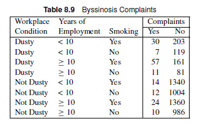
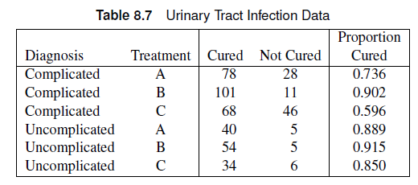
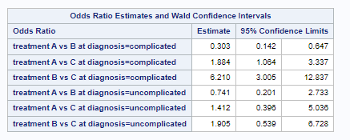
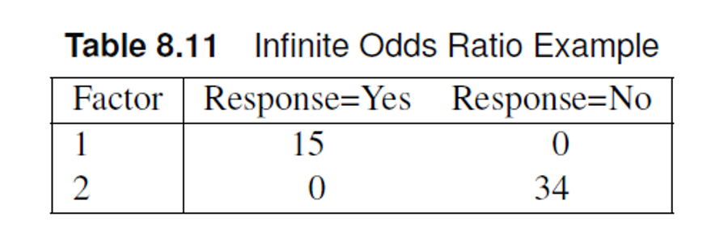

# Chapter 8: Logistic Regression: Dichotomous Response

## Outline

-   Dichotomous Explanatory Variables
-   Qualitative Explanatory Variables
-   Continuous and Ordinal Explanatory Variables
-   Diagnostics
-   Likelihood methods


## Review: Mantel-Haenszel Tests

Mantel-Haenszel statistics investigate association between two variables with adjustment for a stratification variable.
    -   General association
    -   Location shifts for means
    -   Linear/increasing trends 
    
::: callout-note
Mantel-Haenszel Tests do not involve statistical models, and therefore can’t be used for estimation for effect sizes or prediction. Furthermore, these tests cannot accommodate for continuous variables as predictors.
:::

## Logistic Regression

Statistical modeling method that enables us to make inferences, estimate/predict outcome variables, and describe the relationship between a categorical response variable and multiple explanatory variables. Possible applications include epidemiology, medical research, agronomy, and social science research.

::: callout-note
Continuous explanatory variables can be included in the analysis, unlike in Mantel-Haenszel tests. Responses can be dichotomous or polytomous (more than two levels).
:::

# Dichotomous Response

## Logistic Regression: Model

Logistic regression enables us to write a model for the probability of success for each group.

Let $\theta_{mi}$ be the probability of success of the $i^{th}$ group in
the $m^{th}$ strata.The logistic model can be used to describe the
variation among {$\theta_{mi}$}

$$
\theta_{mi} = \frac{1}{1+\exp[-\eta_{mi}]}
$$

## Logistic Regression: Model

Where

$$
\eta_{mi} = \alpha + \sum_{k=1}^t \beta_kx_{mik}
$$ 

and $t$ is the number of explanatory variables.

::: callout-note
$\eta_{mi}$ is referred to as the linear predictor of the model.
:::

## Logistic Regression: Model

Using algebra, we can invert the equation to the following form:

$$
\eta_{mi} = \alpha + \sum_{k=1}^t \beta_kx_{mik} = \log\left[\frac{\theta_{mi}}{1-\theta_{mi}}\right]
$$

::: callout-note
$\log\left[\frac{\theta_{mi}}{1-\theta_{mi}}\right]$ is referred to as
the **logit** transformation of $\theta_{mi}$, which is the logarithm of
the odds.

Other functions that can serve as a link function include the probit model and the complementary log-log model.
:::

## Odds and Odds Ratios

The odds of success for an individual in the $m^{th}$ strata and
$i^{th}$ group can be calculated as

$$
\theta_{mi}/(1-\theta_{mi}) = e^{\eta_{mi}}
$$

The odds ratio between the $i^{th}$ and $j^{th}$ group in the $m^{th}$
strata can easily be calculated.

$$
OR = \frac{odds_{mj}}{odds_{mi}} = e^{\eta_{mj}}/e^{\eta_{mi}} = e^{\eta_{mj}-\eta_{mi}}
$$

## Advantages

-   The logit transformation enables us to monitor the change in log
    odds.
-   Easy to calculate odds ratio.
-   The linear predictor can take on values from $(-\infty,\infty)$, but
    the values of $\theta_{mi}$ will be constrained in \[0,1\].

::: callout-tip
If you used linear regression to model a proportion, it assumes that the
response variable can be negative or above 1.
:::

## Fit Statistics

-   The model performance can be measured using the **deviance** and
    **goodness-of-fit** statistics.

::: callout-note
Both use chi-square statistics to assess model fit.
:::

## Chi-square statistics

::: callout-note
Likelihood ratio chi-square measures the difference between two models
by using the ratio of the two likelihoods as a chi-square statistic.
:::

::: callout-note
Pearson chi-square goodness of fit uses observed and expected values to
test for a goodness of fit.
:::

## Chi-square statistics

-   If the chi-square statistic divided by the degrees of freedom is
    higher than one, then the data has some variation that is
    unaccounted for in the model.
    -   This is called overdispersion
-   The high ratio between the chi-square statistic and degrees of
    freedom can also mean that the data does not follow a binomial
    distribution well.
    -   Heterogeneity
-   Both cases are accounted for using generalized linear mixed
    models/generalized estimating equations.

## Chi-square statistics: Sample Size

Sample size guidelines for the chi-square assumption for these fit
statistics include:

-   Each group should have at least ten subjects.
-   80% of the predicted counts should be at least 5.
-   No 0 counts, remaining 20% of the counts should be above 2.
-   Failure to satisfy these assumptions means exact tests should be
    used.

## Chi-square statistics: Hypothesis Test

The null hypothesis for both deviance and goodness-of-fit tests is that
the departures of the observed data from the predicted values based on
the model are random.

::: callout-note
Failure to reject the null hypothesis means we have no evidence against good agreement between observed and predicted values based on the model.
:::

## Fit Statistics

The Akaike Infomation Criterion (AIC) and the Bayesian Information Criterion (BIC)/Schwarz Criterion (SC) can also be used to assess model fit. Lower values of these criteria indicate better model fit.

::: callout-note
AIC predicts estimation error based on the provided model. BIC also
predicts estimation error but uses a different penalization scheme for
errors.

The AIC (or BIC) for the full model (intercept + covariates) should be lower than the AIC (or BIC) of the intercept-only model if the covariates are associated with the response.

:::


## The Main Effect Model

Recall that the linear predictor can be written as:

$$
\eta_i = \beta_0 + \beta_1x_{i1} + \beta_2x_{i2} + ...
$$ 

::: callout-note 
$\beta_0$ is the intercept of the linear model 
:::

::: callout-note
$\beta_k$ are the coefficients of the explanatory variables. These
coefficients will tell us the effect of predictor $x_{ik}$.
:::

## The Main Effect Model

The current form of the linear predictor assumes the explanatory variables are in quantitative form. When the explanatory variables are categorical, we need to create dichotomous dummy variables to denote each level of the variables.
    
::: callout-note    
The case $x_{ik}=0$ is called the reference level of the variables. When all $x_{ik}=0$ the linear predictor collapses to        the intercept $\beta_0$.
:::

::: callout-note
For dummy dichotomous variables, odds ratios can be calculated as an
effect size of association.
:::

## The Main Effect Model

::: callout-note
The main effect model follows a regression framework, which means we can
use ANOVA to test for effect significance.
:::

## `SAS`: The LOGISTIC Procedure

The LOGISTIC procedure can perform logistic regression in SAS.

-   Can take both categorical and continuous explanatory variable
-   Syntax is slightly different from the FREQ procedure.

## `SAS`: The LOGISTIC Procedure

The LOGISTIC procedure provides estimates for $\beta$ as in regression
analysis.

### Sample Syntax

``` r
proc logistic data=data;
freq count; # <1>
model y(event='Yes') = x1 x2 /scale=none aggregate; # <2>
run;
```

1.  `freq` functions similar to `weight` in the `FREQ` procedure. When
    the data consists of an observation for each row, this statement is
    not needed.
2.  `model` specifies the model for the response `y` using the
    explanatory variables `x1` and `x2`. `event` tells SAS what the
    "success" response level is. The `scale` option produces
    goodness-of-fit statistics. The `aggregate` option requests that SAS
    treat each unique combination of the explanatory variable values as
    a distinct group in computing the goodness-of-fit statistics.


## `R`: `glm()`

The `glm()` function in `R` can fit a logistic regression model in the generalized linear model framework.

::: callout-note
Because there are other distributions that work with `glm()`, we need to specify that we are dealing with a binomial distribution using the `family="binomial"` argument.

```{r}
#| eval: false

mod_glm <- glm(dependent~independent+covariates,
    data=dataset,
    family="binomial")

summary(mod_glm)
```

:::

## `R`: Odds Ratios

We can use `emmeans()` and `contrast()` from the `emmeans` package to estimate the probabilities and odds ratios based on the model provided by the `glm()` function.

```{r}
#| eval: false

library(emmeans)

emm <- emmeans(mod_glm,~independent, type="response",infer=T)
emm
contrast(emm,method="pairwise",type="response",infer=T)
```


## Example

The data shows people who visited a clinic and required a
catheterization. The response is the presence of coronary artery
disease. The explanatory variables are ECG segment depression and sex.
Use logistic regression methods to obtain odds ratio estimates and
create a logistic regression model to estimate the probability of
developing CA disease based on sex and ECG segment depression.

{height="200px"}

### Data Set

``` r
data coronary;
input sex ecg ca count @@;
datalines;
0 0 0 11 0 0 1 4
0 1 0 10 0 1 1 8
1 0 0 9 1 0 1 9
1 1 0 6 1 1 1 21
;
```
or refer to `ECG.csv` uploaded on Canvas. Sex=0 refers to female, while ECG=0 refers to
lower segment depression.

```{r}
library(tidyverse)
ecg <- read.csv("ECG.csv", stringsAsFactors = T)
glimpse(ecg)
```


## Example

The data shows people who visited a clinic and required a
catheterization. The response is the presence of coronary artery
disease. The explanatory variables are ECG segment depression and sex.
Use logistic regression methods to obtain odds ratio estimates and
create a logistic regression model to estimate the probability of
developing CA disease based on sex and ECG segment depression.

::: panel-tabset
### SAS Code

``` r
proc logistic data=coronary ;
freq count;
model ca(event='1')=sex ecg / scale=none aggregate;
run;
```

### R Code

```{r}
library(emmeans)
mod_glm <- glm(Disease~Sex+ECG,
               data=ecg,
               family="binomial")

# intercept only model 
mod1 <- glm(Disease~1,
            data=ecg,
            family="binomial")

# comparing intercept only  model to intercept + variables model

anova(mod1,mod_glm,test = "LRT")
summary(mod1)
summary(mod_glm)

# Calculating probabilities and odds ratios.

emm <- emmeans(mod_glm,~Sex,type="response")
emm
contrast(emm,method="pairwise",type="response",infer=T)
contrast(emm,method="revpairwise",type="response",infer=T)

emm_ecg <- emmeans(mod_glm,~ECG,type="response")
emm_ecg
contrast(emm_ecg,method="pairwise",type="response",infer=T)
contrast(emm_ecg,method="revpairwise",type="response",infer=T)

```

### Answer

From `SAS` output: Both chi-square tests had p-values above 0.05, which meant there was no
evidence that the errors were not random.

The AIC values for the full model are lower than the intercept-only
model, which meant model performance increased after including our
covariates.

Assuming the probability of developing CA is given by $\theta_CA$, the
logistic model was estimated to be:

$$
logit~[\hat{\theta}_{CA}] = -1.17 + 1.28*SEX + 1.05*ECG
$$

There is a significant effect of sex ($\beta = 1.28$, p=0.01) and
segment depression ($\beta = 1.05$, p=0.03) on the probability of
developing CA disease. In terms of odds ratios, the odds that males
develop CA is 3.58 (95% CI: 1.35,9.52) times that of females. Additionally, the odds of
developing CA with higher segment depression is 2.87 (95% CI: 1.08, 7.62) times that of
patients with lower segment depression in their ECG.
:::

## Exercise

A simple random sample of individuals from different age groups were
asked about their caffeine and exercise habits.

::: panel-tabset

### Data

|             |              |              |             |
|-------------|--------------|--------------|-------------|
| Age Group   | Caffeine     | Yes Exercise | No Exercise |
| Young Adult | Yes Caffeine | 121          | 158         |
| Young Adult | No Caffeine  | 36           | 97          |
| Older Adult | Yes Caffeine | 44           | 132         |
| Older Adult | No Caffeine  | 15           | 130         |

It is also uploaded as line-level data as `exercise_caffeine.csv` on Canvas.

```{r}
exercise <- read.csv("exercise_caffeine.csv")
glimpse(exercise)


```

### Questions 

-   Use logistic regression to estimate the logistic model for the data.
    Use Young Adult and No caffeine as the reference levels.
-   Is there a significant age group effect on exercise habits?
-   Is there a significant effect of caffeine intake on exercise habits?
-   Calculate and interpret the appropriate odds ratios for age group
    and caffeine intake.
-   Does the model fit the data well?

:::

## Exercise

A simple random sample of individuals from different age groups were
asked about their caffeine and exercise habits.

:::{.panel-tabset}
### SAS Code

```{.r}
data caf;
input agegrp  caffeine  exercise  count;
datalines;
0 1 1 121
0 1 0 158
0 0 1 36
0 0 0 97
1 1 1 44
1 1 0 132
1 0 1 15
1 0 0 130
;

proc logistic;
freq count;
model exercise(event='1')=agegrp caffeine / scale=none aggregate;
run;
```

### R Code

```{r}
exercise <- read.csv("exercise_caffeine.csv")
glimpse(exercise)


```


```{r}
mod_glm <- glm(Exercise~AgeGrp+Caffeine,
               data=exercise,
               family="binomial")

summary(mod_glm)

library(emmeans)
emm <- emmeans(mod_glm,~Caffeine,type="response",infer=T)
emm

contrast(emm,method='revpairwise', type="response",infer=T)


emm_age <- emmeans(mod_glm,~AgeGrp,type="response",infer=T)
emm_age

contrast(emm_age,method='pairwise', type="response",infer=T)

mod1 <- glm(Exercise~1,
               data=exercise,
               family="binomial")
anova(mod1,mod_glm,test = "LRT")
summary(mod1)
summary(mod_glm)
```


### Answer

Suppose the probability of exercise is given by $\theta$,The estimated logistic regression model is: $logit (\theta) = -1.08 -0.93*AGEGRP + 0.84*CAFFEINE$. The AIC for the full model is lower than that of the intercept only model, indicating better model fit.

There is a significant effect of age in the likelihood of exercising. The odds of an older participant reporting regular exercise is 0.39 (95% CI: 0.28, 0.56; p<0.001) times that of younger participants.

There is a significant effect of caffeine intake on exercise. The odds of a participant reporting regular exercise when they consume caffeine is 2.3 (95% CI: 1.6,3.3; p<0.001) times that of those who do not consume caffeine.

`SAS`: The deviance (p=0.39) and goodness-of-fit chi-square tests (p=0.40) showed no evidence against the randomness of errors, which indicates good model fit. The AIC and SC values also decreased after including covariates, also supporting good fit.

:::


## `SAS`: `CLASS` statement

- The `class` statement can create dummy variable coding automatically through the LOGISTIC procedure.
  - The REF option allows us to set the reference level for each variable.
  
  
```{.r code-line-numbers=2}
proc logistic;
class cat;
model y = x cat/scale=none aggregate;
run;
```

## `SAS`: Model parameterizations

::: callout-note
**Effect parameterization** produces deviation from the _grand mean_. The reference level corresponds to $X=-1$.

- In `R`, this is established using `contr.sum()`
- In `SAS`, this is the default parameterization in the `LOGISTIC` procedure.
:::

::: callout-note
**Reference cell parameterization** produces measurements based on reference level. The reference level corresponds to $X=0$.

- In `R`, this is established using `contr.treatment()` or `contr.SAS()`. This is the default in `R`.
- In `SAS`, this can be specified in the class statement as `param=ref` in the `LOGISTIC` procedure.


:::

## Example

The data is based on a study on prison sentencing for persons convicted of a burglary or larceny. The researchers wanted to test whether the type of crime (nonresidential or other) and prior arrests (some or none) affect whether the offender was sent to prison.

::: panel-tabset

### Data

{height="200px"}

### Questions

-   Perform a logistic regression analysis to estimate the appropriate logistic model for the data. Comment on the significance of the main effects and estimate the odds ratio and the 95% CI.
  -   Using effect parameterization
  -   Using reference cell parameterization

:::

## Example

Recall the age x caffeine x exercise habits exercise. Use the class statement to perform logistic regression using effect and reference cell parameterization. Comment on the significance of the main effects and estimate the odds ratio and the 95% CI.


## Example
Recall the age x caffeine x exercise habits exercise. Use the class statement to perform logistic regression using effect and reference cell parameterization. Comment on the significance of the main effects and estimate the odds ratio and the 95% CI.

:::{.panel-tabset}

### SAS Code
```{.r}
title "effect";
proc logistic data=caf;
freq count;
class agegrp (REF='0') caffeine (REF='0');
model exercise(event='1')=agegrp caffeine / scale=none aggregate;
run;

title "ref cell";
proc logistic data=caf;
freq count;
class agegrp (REF='0') caffeine (REF='0')/param=ref;
model exercise(event='1')=agegrp caffeine / scale=none aggregate;
run;
```

### R Code

```{r}
library(tidyverse)
exercise <- read.csv("exercise_caffeine.csv")
glimpse(exercise)
```

Reference Cell parameterization

```{r}
options(contrasts=c("contr.treatment","contr.poly"))


mod_glm <- glm(Exercise~AgeGrp+Caffeine,
               data=exercise,
               family="binomial")

summary(mod_glm)

library(emmeans)
emm <- emmeans(mod_glm,~Caffeine,type="response",infer=T)
emm

contrast(emm,method='revpairwise', type="response",infer=T)


emm_age <- emmeans(mod_glm,~AgeGrp,type="response",infer=T)
emm_age

contrast(emm_age,method='pairwise', type="response",infer=T)

mod1 <- glm(Exercise~1,
               data=exercise,
               family="binomial")
anova(mod1,mod_glm,test = "LRT")
summary(mod1)
```


::: callout-warning
Effect parameterization can only be implemented in `R` if the predictors are inputted as factors.
:::

```{r}
options(contrasts=c("contr.sum","contr.poly"))

exercise <- exercise |> 
  mutate(AgeGrp=as.factor(AgeGrp),
         Caffeine = as.factor(Caffeine))

mod_glm <- glm(Exercise~AgeGrp+Caffeine,
               data=exercise,
               family="binomial")

summary(mod_glm)

library(emmeans)
emm <- emmeans(mod_glm,~Caffeine,type="response",infer=T)
emm

contrast(emm,method='revpairwise', type="response",infer=T)


emm_age <- emmeans(mod_glm,~AgeGrp,type="response",infer=T)
emm_age

contrast(emm_age,method='pairwise', type="response",infer=T)

mod1 <- glm(Exercise~1,
               data=exercise,
               family="binomial")
anova(mod1,mod_glm,test = "LRT")
summary(mod1)

```


### Answer

Effect parameterization: $logit (\theta_{ij}) = -1.12 - 0.47 * AGEGRP +0.42* CAFFEINE$

Reference Cell parameterization: $logit (\theta_{ij}) = -1.08- 0.93 * AGEGRP +0.84* CAFFEINE$

There is strong evidence of an effect of age (p<0.001). The odds of older adults reporting regular exercise is 0.39 (95% CI: 0.28, 0.56) times that of younger adults.

There is strong evidence of an association with caffeine consumption (p<0.001). The odds of reporting regular exercise for participants who consumed caffeine is 2.32 times that of those who do not consume caffeine.
:::


## Example

The data is based on a study on prison sentencing for persons convicted of a burglary or larceny. The researchers wanted to test whether the type of crime (nonresidential or other) and prior arrests (some or none) affect whether the offender was sent to prison.

-   Perform a logistic regression analysis to estimate the appropriate logistic model for the data. Comment on the significance of the main effects and estimate the odds ratio and the 95% CI.
  -   Using effect parameterization
  -   Using reference cell parameterization
  
:::{.panel-tabset}
### SAS Code

```{.r}
data sentence;
input type $ prior $ sentence $ count @@;
datalines;
nrb some y 42 nrb some n 109
nrb none y 17 nrb none n 75
other some y 33 other some n 175
other none y 53 other none n 359
;

proc logistic data=sentence order=data;
title "effect";
class type(ref="nrb") prior(ref="none") / ; # <1>
freq count;
model sentence(event='y') = type prior / scale=none aggregate;
run;


proc logistic data=sentence order=data;
title "reference";
class type(ref="nrb") prior(ref="none") / param=ref; # <2>
freq count;
model sentence(event='y') = type prior / scale=none aggregate;
run;


```

1. Default: effect parameterization
2. Reference cell parameterization used after `param=ref` is specified.

### R Code

We can also use `glm()` for aggregated counts, but we don't need to create a contingency table.

```{r}
dat <- expand.grid(type = c("nonresidential","other"),
                   prior = c("none","some"))
dat$prison <- c(17,53,42,33)
dat$noprison <- c(75,359,109,175)

dat
```

**Reference Cell Parameterization**

```{r}
options(contrasts=c("contr.treatment","contr.poly"))
mod_glm <- glm(cbind(prison,noprison)~type + prior,data=dat,family="binomial")
summary(mod_glm)

library(emmeans)
emm <- emmeans(mod_glm,~type,type="response",infer=T)
emm
contrast(emm,method="revpairwise",type="response",infer=T)

emm_prior <- emmeans(mod_glm,~prior,type="response",infer=T)
emm_prior
contrast(emm_prior,method="revpairwise",type="response",infer=T)
```
::: callout-tip
Try replacing "contr.treatment" with "contr.SAS". Which parts of the output change? Which parts do not change?
:::

**Effect parameterization**

```{r}
options(contrasts=c("contr.sum","contr.poly"))
mod_glm <- glm(cbind(prison,noprison)~type + prior,data=dat,family="binomial")
summary(mod_glm)

emm <- emmeans(mod_glm,~type,type="response",infer=T)
emm
contrast(emm,method="pairwise",type="response",infer=T)

emm_prior <- emmeans(mod_glm,~prior,type="response",infer=T)
emm_prior
contrast(emm_prior,method="pairwise",type="response",infer=T)
```


### Answer

Effect parameterization: $logit (\theta_{ij}) = -1.48 - 0.30 * TYPE +0.17* PRIOR$

Reference Cell parameterization: $logit (\theta_{ij}) = -1.36- 0.59 * TYPE +0.35* PRIOR$

The odds of sending an offender to prison after committing other crimes is 0.55 times (95% CI: 0.38, 0.81) that when committing non-residential crimes. There is strong evidence against the null hypothesis of no difference.

The odds of sending an offender with some prior arrests are 1.42 times (95% CI: 0.974, 2.06) times more likely to be sent to prison than those who have no prior arrests. There is moderate evidence against the null hypothesis of no difference.

:::


## Saturated models

- Saturated models often include an interaction term $A*B$, which tests the difference of the effect of B in the different levels of $A$.

::: {.callout-note title="Simple Effects"}
The effect of $B$ conditional on the level of $A$ is referred to as _simple effects_.
:::

## Interaction Models

The interaction model in the logistic regression framework can be written as:

$$
logit(\theta) = \alpha + \beta_1 x_1  + \beta_2 x_2 + \beta_{12}x_1x_2
$$

::: callout-tip
Interaction terms should be tested first ($x_1x_2$). If the interaction is not significant, it can be dropped from the model, leaving you with a main effects model.
:::

## Interaction models

::: panel-tabset

### Interaction tests
- Interaction tests are Wald chi-square tests with $(a-1)(b-1)$ degrees of freedom, where $a$ is the number of levels of A and $b$ is the number of levels of B.
- The degrees of freedom is also equal to the number of coefficients that should be allotted to the interactions.
  - Interactions can be visually recognized using interaction plots.
  
### Figure 


:::

## Non-Dichotomous Explanatory Variables

- What if the explanatory variables have more than two levels?
  - Nominal
  - Ordinal
  - Continuous

## Non-Dichotomous Explanatory Variables

If an explanatory variable has $n$ levels, $(n-1)$ dichotomous dummy variables are needed to be produced to include the explanatory variable in the regression model.

::: callout-note
In interaction models, this leads to more interaction terms.
:::

For a variable with $(a-1)$ levels
$$
logit(\theta) = \alpha + \beta_1x_{a1} + \beta_2x_{a2} + ... + \beta_{(a-1)}x_{a,a-1}
$$

The matrix form of the predictor variables is called the **Design Matrix**.

## Non-Dichotomous Explanatory Variables

For a model with two variables/factors: one with $(a-1)$ levels and the other with $(b-1)$ levels, the interaction model can be written as:

$$
logit(\theta) = \alpha + \beta_{a1}x_{a1} + \beta_{a2}x_{a2} + ... + \beta_{a,(a-1)}x_{a,a-1} +  \beta_{b1}x_{b1} + \beta_{b2}x_{b2} + ... + \beta_{b(b-1)}x_{b,b-1} + Interaction
$$

$$
Interaction = \beta_{a1b1}x_{a1}x_{b1} + \beta_{a1b2}x_{a1}x_{b2} + \beta_{a2b1}x_{a2}x_{b1} +... + \beta_{a,a-1;b,b-1}x_{a,a-1}x_{b,b-1}
$$

## Nominal Explanatory Variables

Since there is no order in the levels of explanatory variables, we might be interested in the difference between specific levels

- Example: How did the difference in placebo and test treatments compare between Hospital 1 and Hospital 2?
- Example: How did the placebo and test treatments compare in Hospital 2?

## Contrasts

- Contrasts are used in performing a formal test for estimable effects
- The null hypotheses for these tests are usually the hypothesis of no effect
  - “There is no main effect of Variable/ Factor A”
  - “There is no interaction”
  - “The estimated treatment mean of the first level of Factor A and first level of Factor B is zero”

## Contrasts: Estimable Effects

Suppose we refer to $logit(\theta_{ij})$ as $\eta_{ij}$.

::: {.callout-note title="Estimable Effects"}
Estimable effects are effects that can be expressed as the sum or difference of linear predictors $\eta_{ij}$.
:::

Example: How did the difference in placebo and test treatments compare between Hospital 1 and Hospital 2?

- The null hypothesis can be expressed as $\eta_{t1}-\eta_{p1} -(\eta_{t2}-\eta_{p2}) = 0$. This effect is estimable!
- The expression can be expressed in terms of $\beta_i$ by substituting the linear predictor expressions.

## Contrasts: Joint Tests

Suppose we have an explanatory variable/factor $A$ with three levels, which requires **two** different dummy variables. The regression model can be expressed as:

$$
logit (\theta) = \eta = \alpha + \beta_1 X_{a1} + \beta_2 X_{a2}
$$

To test for a main effect of $A$, we need to test the following null hypotheses simultaneously: $\beta_1=0$ and $\beta_2=0$. These could be done using **joint tests**.

- The joint tests use Wald statistics similar to an ANOVA.

## Contrasts: SAS

We use the `contrast` statement in the `LOGISTIC` procedure to test these contrasts.

:::callout-note
In SAS, we focus on the coefficients of each term defined in the linear predictor. Each linear predictor is broken down into the effect and interaction terms and simplified. The resulting **coefficients** would then make it to the contrast statement.
:::

## Contrasts: `R`

The `contrast()` function in the `emmeans` package enables us to perform contrasts. There are preset contrasts like "pairwise" and "revpairwise" that do not need to specify coefficients. Complex contrasts and joint tests need to have the coefficient inputted in the function.

## Example: `SAS`

Suppose we are interested in modeling the mortality rate of cardiothoracic surgery across 4 hospitals. The resulting logistic regression model would be:


$$
\eta = \alpha + \beta_1X_{h1} + \beta_1X_{h2} + \beta_3X_{h3}
$$

Suppose we want to test for a difference in mortality between hospital 1 and hospital 4.

:::{.panel-tabset}
### Reference Cell
The effect due to Hospital 1 corresponds to the case $(X_{h1},X_{h2},X_{h3} = 1,0,0)$ yields a regression model given by: $\alpha + \beta_1$.
Hospital 4 corresponds to the case $(X_{h1},X_{h2},X_{h3} = 0,0,0)$, which yields a regression model given by: $\alpha$.

Then the difference between Hospital 1 and Hospital 4 can be calculated as 
$$\alpha +\beta_1 - \alpha = \beta_1 $$. T
he corresponding null hypothesis of no difference can the be written as
$$ 1* \beta_1 + 0*\beta_2 + 0*\beta_3 = 0$$

In SAS, we can code this as:

```{.r}
contrast A 1 0 0 ;
```

### Effect
The effect due to Hospital 1 corresponds to the case $(X_{h1},X_{h2},X_{h3} = 1,0,0)$ yields a regression model given by: $\alpha + \beta_1$.
Hospital 4 corresponds to the case $(X_{h1},X_{h2},X_{h3} = -1,-1,-1)$, which yields a regression model given by: $\alpha -\beta_1 - \beta_2 - \beta_3$.

Then the difference between Hospital 1 and Hospital 4 can be calculated as 
$$\alpha +\beta_1 - [\alpha -\beta_1 - \beta_2 - \beta_3] = 2\beta_1 +\beta_2 + \beta_3$$. 

The corresponding null hypothesis of no difference can the be written as:

$$
2\beta_1 +1* \beta_2 + 1*\beta_3 = 0
$$

In SAS, we can code this as:

```{.r}
contrast A 2 1 1 ;
```

In `R`, we can code this as:

```{r}
#| eval: false 
contrast_list <- list(contrast1=c(2,1,1))
contrast(emm,method=contrast_list,type="response")
```

:::

## Example: `R`

Suppose we are interested in modeling the mortality rate of cardiothoracic surgery across 4 hospitals. The resulting logistic regression model would be:


$$
\eta = \alpha + \beta_1X_{h1} + \beta_1X_{h2} + \beta_3X_{h3}
$$

The `contrast()` function uses the coefficients of the **marginal means** to perform the contrast. Suppose we want to test for a difference in mortality between hospital 1 and hospital 4. This means we are testing the hypothesis $H_0: \mu_1-\mu_4=0$, which can be interpreted as:

$$
\mu_1 + 0*\mu_2 + 0*\mu_3 -\mu_4 =0
$$

which yields the coefficients (1,0,0,-1). In `R`, we can code this as:

```{r}
#| eval: false 
emm <- emmeans(mod_glm,~hospital,type="response")

contrast_list <- list(contrast1=c(1,0,0,-1))
contrast(emm,method=contrast_list,type="response")
```

## Exercise: `SAS`

Consider a Factor A with three levels $(A_1,A_2,A_3)$, with $A_3$ as the reference level. Provide the corresponding null hypotheses and formulate the contrast statements for both reference cell and effect parameterization.

  - There is no difference between the first and third levels of A.
  - The mean effect of $A_1$ and $A_2$ is equal to the effect of $A_3$.

## Exercise: `SAS`

Consider a Factor A with three levels $(A_1,A_2,A_3)$, with $A_3$ as the reference level. Provide the corresponding null hypotheses and formulate the SAS contrast statements for both reference cell and effect parameterization.

  - There is no effect difference between the first and third levels of A.
  - The mean effect of $A_1$ and $A_2$ is equal to the effect of $A_3$.

The logit model can be expressed as:

$$
\eta = \alpha + \beta_1 X_1 + \beta_2 X_2
$$


:::{.panel-tabset}
### Item 1

Reference Cell: 
Effect $A_1 = \alpha + \beta_1$
Effect $A_3 = \alpha$

No effect difference between the first and third levels: $A_1-A_3 = 0 \to \beta_1=0$. Therefore, the contrast coefficients are $(\beta_1,\beta_2) = (1,0)$.

```{.r}
contrast A 1 0;
```


Effect parameterization:
Effect $A_1 = \alpha + \beta_1$
Effect $A_3 = \alpha-\beta_1 - \beta_2$

No effect difference between the first and third levels: $A_1-A_3 = 0 \to 2\beta_1 +\beta_2=0$. Therefore, the contrast coefficients are $(\beta_1,\beta_2) = (2,1)$.

```{.r}
contrast A 2 1;
```

### Item 2

Reference Cell: 
Effect $A_1 = \alpha + \beta_1$
Effect $A_2 = \alpha + \beta_2$
Effect $A_3 = \alpha$

No effect difference between the first and third levels: $(A_1+A_2)/2-A_3 = 0 \to 1/2(\beta_1+\beta_2)=0$. Therefore, the contrast coefficients are $(\beta_1,\beta_2) = (0.5,0.5)$.

```{.r}
contrast A 0.5 0.5;
```

Effect parameterization:
Effect $A_1 = \alpha + \beta_1$
Effect $A_2 = \alpha + \beta_2$
Effect $A_3 = \alpha-\beta_1 - \beta_2$

No effect difference between the first and third levels: $(A_1+A_2)/2-A_3 = 0 \to 3/2(\beta_1+\beta_2)=0$. Therefore, the contrast coefficients are $(\beta_1,\beta_2) = (1.5,1.5)$.

```{.r}
contrast A 1.5 1.5;
```
:::


## Exercise: `R`

Consider a Factor A with three levels $(A_1,A_2,A_3)$, with $A_3$ as the reference level. Provide the corresponding null hypotheses and formulate the contrast statements.

::: panel-tabset
### Questions

  - There is no difference between the first and third levels of A.
  - The mean effect of $A_1$ and $A_2$ is equal to the effect of $A_3$.

### Answer
- `contrast1`:  There is no difference between the first and third levels of A. $(\mu_1-\mu_3) = 0$
- `contrast2`:The mean effect of $A_1$ and $A_2$ is equal to the effect of $A_3$. $\frac{\mu_1+\mu_2}{2}-\mu_3=0$.

```{r}
#| eval: false

contrast_list <- list(contrast1 = c(1,0,-1),
                      contrast2 = c(1/2,1/2,-1))
contrast(emm,method=contrast_list)
```

:::  

## Example

Consider a Factor A with three levels $(A_1,A_2,A_3)$ and Factor B with two levels $(B_1,B_2)$, with $A_3$ and $B_2$ as the reference level. Suppose $\theta$ is a probability of observing success for a dichotomous response variable $y$.

  - Please write the saturated/interaction logistic model for $\theta$  

Provide the corresponding null hypothesis and formulate the contrast statements for both reference cell and effect parameterizations.

  - "There is no interaction between A and B".


## Example: `SAS`

Consider a Factor A with three levels $(A_1,A_2,A_3)$ and Factor B with two levels $(B_1,B_2)$, with $A_3$ and $B_2$ as the reference level. Suppose $\theta$ is a probability of observing success for a dichotomous response variable $y$.

  - Write the saturated/interaction logistic model for $\theta$  

$$
\eta = \alpha + \beta_{A1}x_{A1} + \beta_{A2}x_{A2} +\\
\beta_{B1}x_{B1}+ \beta_{A1B1}x_{A1}x_{B1} + \beta_{A2B1}x_{A2}x_{B1}
$$

Provide the corresponding null hypotheses and formulate the SAS contrast statements for both reference cell and effect parameterizations.

  - "There is no interaction between A and B".
    - The joint tests of the following hypotheses should be tested: $\beta_{A1B1} = 0$ and $\beta_{A2B1}=0$, which corresponds to the following coefficients for A*B: (1,0) and (0,1).
    
```{.r}
contrast A*B 1 0,
              0 1;
```

## Example: `R`


## Implementing Qualitative Explanatory Variables in SAS

- Use the `class` statement in `LOGISTIC` procedure to identify qualitative variables.
- Interaction between Factors A and B are included in the model as $A*B$
  - To include the saturated model of Factors A and B, you can write (response variable)=`A|B`.
  - You can add more than two factors in these statements.
  - Three-way interaction: `A*B*C`
  - Saturated model for a three-factor model: `A|B|C`
- If you wish to only include up to two-way interactions in a three-factor model: `A|B|C@2`
- You can introduce contrasts in the `contrast` statement.
- `effectplot` can be used to create interaction plots.
- `oddsratio` calculates odds ratios and graphs of confidence limits for odds ratios.

## Implementing Qualitative Explanatory Variables in `R`.

It would be ideal to change all character variables into factors using the `mutate()` function in the `dplyr`/`tidyverse` package in `R` before using it in the `glm()` function in `R`.

::: callout-note
Interactions are written as `A:B`. This can be extended to higher order interactions: `A:B:C`.

Writing `A*B` means we are including the following terms: `A + B + A:B`.
:::

::: callout-note
Marginal and conditional means can still be calculated using the `emmeans()` package. To create an interaction plot, we just use the `plot()` function.

Contrasts can be used to calculate odds ratios and confidence limits.
:::

::: callout-note
Type III tests of fixed effects should be used to test for interactions. This can be done by using the `Anova()` function in `R`.
:::

## Example

The data set is from a cross-sectional prevalence study conducted to investigate textile worker complaints about respiratory symptoms experienced while working in the mills. Investigators were interested in whether occupational environment was related to prevalence of respiratory ailments associated with the disease byssinosis.

- Use logistic regression to model the probability of complaining based on workplace condition, years of employment, and smoking history. Include only up to two-way interaction effects.
- Is there evidence of any two-way interactions at a significance level of 0.10?
- Generate an interaction plot for these cases.
- Generate the main effects using contrast statements.

:::{.panel-tabset}
### Table



### SAS Data Set
```{.r}
data byss;
input work $ years $ smoke $ status $ count @@;
datalines ;
dusty <10 yes yes 30 dusty <10 yes no 203
dusty <10 no yes 7 dusty <10 no no 119
dusty >=10 yes yes 57 dusty >=10 yes no 161
dusty >=10 no yes 11 dusty >=10 no no 81
not <10 yes yes 14 not <10 yes no 1340
not <10 no yes 12 not <10 no no 1004
not >=10 yes yes 24 not >=10 yes no 1360
not >=10 no yes 10 not >=10 no no 986
;
```

### R Data Set

```{r}
dat <- expand.grid(Smoking = c("No","Yes"),
                   Years = c("Less10","Greater10"),
                   Work= c("Not Dusty","Dusty"))

dat$yes <- c(12,14,10,24,7,30,11,57)
dat$no <- c(1004,1340,986,1360,119,203,81,161)
dat
```


:::

##  Example

The data set is from a cross-sectional prevalence study conducted to investigate textile worker complaints about respiratory symptoms experienced while working in the mills. Investigators were interested in whether occupational environment was related to prevalence of respiratory ailments associated with the disease byssinosis.

:::{.panel-tabset}

### Questions

- Use logistic regression to model the probability of complaining based on workplace condition, years of employment, and smoking history. Include only up to two-way interaction effects.
- Is there evidence of any two-way interactions at a significance level of 0.10?
- Generate an interaction plot for these cases.
- Generate the main effects using contrast statements.

### R Code

```{r}
options(contrasts=c("contr.treatment","contr.poly"))
library(car)
mod_glm <- glm(cbind(yes,no)~Work*Years + Work*Smoking + Years*Smoking,
               data=dat,family="binomial")
summary(mod_glm)
Anova(mod_glm,test.statistic = "Wald")
```

- Main Effects

```{r}
library(emmeans)
emm_work <- emmeans(mod_glm,~Work,type="response",infer=T)
emm_work

# main effect
contrast_list <- list(main.effect = c(-1,1))
contrast(emm_work,method=contrast_list,infer=T)

emm_years <- emmeans(mod_glm,~Years,type="response",infer=T)
emm_years

# main effect
contrast_list <- list(main.effect = c(-1,1))
contrast(emm_years,method=contrast_list,infer=T)

emm_smoking <- emmeans(mod_glm,~Smoking,type="response",infer=T)
emm_smoking

# main effect
contrast_list <- list(main.effect = c(-1,1))
contrast(emm_smoking,method=contrast_list,infer=T)
```

- Interaction

The `Anova()` function already has the Wald test. Let's see if we can re-create one of the interactions using the `contrast()` and `test()` functions. Note that the interaction null hypothesis can be interpreted as 

$$
H_0: \mu_{Dusty,No}-\mu_{NDusty,No} - (\mu_{Dusty,Yes}-\mu_{NDusty,Yes}) = 0
$$

```{r}
emm_interaction <- emmeans(mod_glm,~Work*Smoking,type="response")
emm_interaction
plot(emm_interaction)
contrast_list <- list(interaction = c(-1,1,1,-1))
contrast(emm_interaction,method=contrast_list,infer=T,type="response") |> test(joint=T)

```


### SAS Code

```{.r}
proc logistic data=byss;
freq count;
class work years(ref=first) smoke(ref=first) /param=ref;
model status(event=last) = work|years|smoke@2 /scale=none aggregate;
effectplot interaction (x=work) / at(smoke=all years=all) link noobs;
oddsratios work;
contrast 'work' work 1;
contrast 'years' years 1;
contrast 'smoke' smoke 1;
run;
```


### Answer

We have evidence of an interaction between work conditions and smoking status ($Work*Smoke$) ($\chi^2_1$=3.22,p = 0.07) at the 0.10 level of significance, which means we need to be careful in interpreting the main effect of work conditions and smoking status.

We can interpret the main effect of the years of employment. Those who work more than 10 years have odds of complaining about byssinosis disease that are 1.6 times that of those who worked less than 10 years.
:::

## Exercise

The following data come from a study on urinary tract infections. Investigators applied three treatments to patients who had either a complicated or uncomplicated diagnosis of urinary tract infection. Since complicated cases of urinary tract infections are difficult to cure, investigators were interested in whether the pattern of treatment differences is the same across diagnoses.

- Are we interested in main effects or interaction?
- Is there a significant interaction effect?
- Calculate the odds ratio between the diagnoses of UTI for different treatments.
- Generate plots for the interaction and odds ratios.


::: {.panel-tabset}
### Table



### SAS Data Set

```{.r}
data uti;
input diagnosis : $13. treatment $ response $ count @@;
datalines;
complicated A cured 78 complicated A not 28
complicated B cured 101 complicated B not 11
complicated C cured 68 complicated C not 46
uncomplicated A cured 40 uncomplicated A not 5
uncomplicated B cured 54 uncomplicated B not 5
uncomplicated C cured 34 uncomplicated C not 6
;
```

### R Data Set

```{r}
uti <- expand.grid(Treatment=c("A","B","C"),
            Diagnosis=c("Complicated","Uncomplicated"))

uti$yes=c(78,101,68,40,54,34)
uti$no = c(28,11,46,5,5,6)

uti
```

:::

## Exercise

The following data come from a study on urinary tract infections. Investigators applied three treatments to patients who had either a complicated or uncomplicated diagnosis of urinary tract infection. Since complicated cases of urinary tract infections are difficult to cure, investigators were interested in whether the pattern of treatment differences is the same across diagnoses.

- Are we interested in main effects or interaction?
- Is there a significant interaction effect?
- Calculate the odds ratio between the diagnoses of UTI for different treatments.
- Generate plots for the interaction and odds ratios.


::: {.panel-tabset}
### SAS Code

```{.r}
data uti;
input diagnosis : $13. treatment $ response $ count @@;
datalines;
complicated A cured 78 complicated A not 28
complicated B cured 101 complicated B not 11
complicated C cured 68 complicated C not 46
uncomplicated A cured 40 uncomplicated A not 5
uncomplicated B cured 54 uncomplicated B not 5
uncomplicated C cured 34 uncomplicated C not 6
;

proc logistic data=uti order=data;
freq count;
class diagnosis treatment /param=ref;
model response(event='cured') = diagnosis|treatment /scale=none aggregate;
effectplot interaction (x=treatment) / at(treatment=all) link noobs;
oddsratios diagnosis;
run;
```

### R Code

```{r}
mod_glm <- glm(cbind(yes,no)~Diagnosis*Treatment,
               data=uti,
               family="binomial")
summary(mod_glm)
Anova(mod_glm)
```
To calculate the conditional odds ratios, we can manually add contrast statements:

```{r}
emm_interaction <- emmeans(mod_glm,~Diagnosis*Treatment,type="response",infer=T)
emm_interaction

contrast_list <- list(OR.at.A = c(1,-1,0,0,0,0),
                      OR.at.B=c(0,0,1,-1,0,0),
                      OR.at.C = c(0,0,0,0,1,-1))

contrast(emm_interaction,method=contrast_list,infer=T,type="response")
```


### Answer

We are more interested in the interaction effect.

There is no significant interaction effect between diagnosis and treatment ($\chi^2_2$=0.28, p=0.28).


:::

## Continuous and Ordinal Explanatory Variables

Sometimes, continuous explanatory variables are unique in the data set. The sample size requirements for the goodness-of-fit tests will not be satisfied.
  - Income
  - Age
  - Years in University

::: callout-note
There should be at least 5 observations for the rarer outcome per parameter in the full model. If there are 50 observations of the rarer outcome, then the maximum number of parameters supported is 10.
:::

:::callout-note
In `SAS`, continuous variables should **NOT** be included in the class statement.
:::

## `SAS` Model Selection: Logistic Regression 

- We can use the residual score statistic $Q_{RS}$ to determine up to what extent does the residuals from the model are linearly associated with other potential explanatory variables.
  - DF: difference in number of parameters between models
  

- The `SELECTION=FORWARD` option should be included in the `MODEL` statement. The `LOGISTIC` procedure will then start from an intercept model and build it up to the most parsimonious model.
  - The `INCLUDE` option tells SAS how many of the variables listed should always be included in the model.

## `SAS Model Selection: Logistic Regression

- SAS also provides the Hosmer and Lemeshow Goodness-of-Fit test that tests the adequacy for these data by including the `lackfit` option.
  - Null hypothesis: The model is adequate, i.e., the residuals are explained by the model.
- The UNITS option specifies at what increment of the continuous variable will SAS calculate the odds ratios.

## `R` Model Selection

The function `step()` can perform forward selection, i.e. adding more predictors and interaction terms to the model until we reach the full model, in `R`. The model selection will be based on the Akaike Information Criteria (AIC), by default.

```{r}
#| eval: false

base_model <- glm(dependent~independent1,data=sampledata,family="binomial")
full_model <- glm(dependent~independent1+independent2 + covariates,data=sampledata,family="binomial")

step(base_model,full_model, direction="forward")
anova(base_model,full_model)
```

## `R`: Hosmer and Lemeshow test

The Hosmer and Lemeshow goodness-of-fit test tests the adequacy of the model for the provided data. 

::: callout-note
The null hypothesis of the Hosmer and Lemeshow test is that the model is adequate, i.e. the residuals are explained by the current model.
:::

The Hosmer and Lemeshow test can be performed using the `performance_hosmer()` function in the `performance` package in `R`.


## Example

The data set CORONARY is from the same study on coronary artery disease as previously analyzed; in addition, the continuous variable AGE is an explanatory variable. The variable ECG is now treated as an ordinal variable, with values 0, 1, and 2. ECG is coded 0 if the ST segment depression is less than 0.1, 1 if it equals 0.1 or higher but less than 0.2, and 2 if the ST segment depression is greater than or equal to 0.2. The variable AGE is age in years.

  - What is the resulting logistic model?
  - Calculate the odds ratio for patients that differ in age by 10 years.

### SAS Data Set

```{.r}

data coronary;
input sex ecg age ca @@ ;
datalines;
0 0 28 0 1 0 42 1 0 1 46 0 1 1 45 0
0 0 34 0 1 0 44 1 0 1 48 1 1 1 45 1
0 0 38 0 1 0 45 0 0 1 49 0 1 1 45 1
0 0 41 1 1 0 46 0 0 1 49 0 1 1 46 1
0 0 44 0 1 0 48 0 0 1 52 0 1 1 48 1
0 0 45 1 1 0 50 0 0 1 53 1 1 1 57 1
0 0 46 0 1 0 52 1 0 1 54 1 1 1 57 1
0 0 47 0 1 0 52 1 0 1 55 0 1 1 59 1
0 0 50 0 1 0 54 0 0 1 57 1 1 1 60 1
0 0 51 0 1 0 55 0 0 2 46 1 1 1 63 1
0 0 51 0 1 0 59 1 0 2 48 0 1 2 35 0
0 0 53 0 1 0 59 1 0 2 57 1 1 2 37 1
0 0 55 1 1 1 32 0 0 2 60 1 1 2 43 1
0 0 59 0 1 1 37 0 1 0 30 0 1 2 47 1
0 0 60 1 1 1 38 1 1 0 34 0 1 2 48 1
0 1 32 1 1 1 38 1 1 0 36 1 1 2 49 0
0 1 33 0 1 1 42 1 1 0 38 1 1 2 58 1
0 1 35 0 1 1 43 0 1 0 39 0 1 2 59 1
0 1 39 0 1 1 43 1 1 0 42 0 1 2 60 1
0 1 40 0 1 1 44 1
;
```

### R Data Set

```{r}
library(tidyverse)
ecg <- read.csv("ECG_withage.csv")
glimpse(ecg)
```


## Example

The data set CORONARY is from the same study on coronary artery disease as previously analyzed; in addition, the continuous variable AGE is an explanatory variable. The variable ECG is now treated as an ordinal variable, with values 0, 1, and 2. ECG is coded 0 if the ST segment depression is less than 0.1, 1 if it equals 0.1 or higher but less than 0.2, and 2 if the ST segment depression is greater than or equal to 0.2. The variable AGE is age in years.

:::{.panel-tabset}
### SAS Code

```{.r}
proc logistic descending;
model ca=sex ecg age ecg*ecg age*age
sex*ecg sex*age ecg*age /selection=forward include=3 details lackfit; # <1>
units age=10; # <2>
run;
```

1. `include=3` indicates we are including the first three variables in the model. In this case, it's sex, ecg, and age.
2. Looks at the odds ratio due to a 10-point difference in age.

### R Code

```{r}
mod_glm <- glm(CA~Sex+ECG+Age,data=ecg,family="binomial")
mod_full <- glm(CA~Sex+ECG+Age + ECG:ECG + Age:Age + Sex:ECG + Sex:Age + ECG:Age,data=ecg,family="binomial")
step(mod_glm,mod_full,direction="forward")
anova(mod_glm,mod_full)
summary(mod_glm)


library(performance)
performance_hosmer(mod_glm)
```
```{r}
library(emmeans)
emm_sex <- emmeans(mod_glm,~Age,type="response",at=list(Age=c(50,60)),infer=T)
emm_sex

contrast(emm_sex,method="revpairwise",infer=T)
```


### Answer

The logistic model is as follows:

$$
logit(\hat{\theta}) = -5.64 + 1.35*Sex + 0.873*ECG +0.09*Age
$$
The odds of developing a coronary artery disease in patients older than 10 years increases by 2.53 (95% CI: 1.27-5.03) times.
:::

## Exercise

Chapter8-Corn.csv includes the data of 82 plants from a randomized controlled trial that tests the effect of a new formulation of pesticide as well as the effect of using cover crops in planting corn. The farmers are also interested if the yield (measured in kg) is associated to the plant discoloration. 

- Use the forward selection approach to determine if an interaction term between cover crop and pesticide needs to be included in the model.
- What is the resulting logistic model?
- Calculate the odds ratio for corn plants that have a yield difference of 2 kg.

## Exercise

Chapter8-Corn.csv includes the data of 82 plants from a randomized controlled trial that tests the effect of a new formulation of pesticide as well as the effect of using cover crops in planting corn. The farmers are also interested if the yield (measured in kg) is associated to the plant discoloration. 

:::{.panel-tabset}
### SAS Code

```{.r}
proc logistic data=corn;
class pesticide (ref="No") covercrop (ref="No");
model Discolored(event="Yes") = pesticide covercrop yield pesticide*covercrop/selection=forward include=3 details lackfit;
run;
```

### R Code

```{r}
corn <- read.csv("Chapter8-Corn.csv",stringsAsFactors = TRUE)
glimpse(corn)
```

```{r}
mod_glm <- glm(Discolored~Pesticide + CoverCrop + Yield, data=corn, family="binomial")
mod_interaction <- glm(Discolored~Pesticide + CoverCrop + Yield + Pesticide:CoverCrop, data=corn, family="binomial") 

step(mod_glm,mod_interaction,direction="forward")
anova(mod_glm,mod_interaction)
performance_hosmer(mod_glm)
```


### Answer

There was no evidence to indicate that a pesticide*covercrop interaction needed to be included ($Q_{RS} = 0.08, p=0.78$). The Hosmer-Lemeshow goodness-of-fit test also provides no evidence against model adequacy ($\chi^2 = 6.9, p=0.55$). 

The resulting logistic model is:

$$
logit(\theta) = 0.38 - 0.68*Pesticide - 1.10 * CoverCrop - 0.27*Yield
$$
The odds of discoloration decreases by 0.42 (1-0.58) times when the yield increases by 2 kg.
:::

# Model Diagnostics

## Diagnostics

- We are interested in how a model fits our data and the lack of fit.

  - Lack of fit: Should we still consider other variables to include in the model?

- Model fit: Pearson chi-square and deviance chi-square tests (`SAS`)
- Lack of fit: Pearson *residuals* and deviance *residuals*


::: {.callout-note}
- Pearson residuals look at the difference between the observed and expected occurrences in a group. A value of 2 is usually indicative of a lack of fit.
- Deviance residuals are the components that make up the deviance statistic
- Likelihood residuals: weighted average of standardized Pearson and Deviance residuals
:::

## Diagnostics

- These residuals can be viewed in graphical form.

:::callout-tip
In SAS, we can view the residual plots by specifying `PLOTS=INFLUENCE` in the `PROC LOGISTIC` statement. `stdres` specifies plots for standardized residuals

```{.r}
proc logistic plots(label)=influence(unpack stdres);
```
:::

::: callout-tip
In `R`, we can use the `check_model` function in the `performance` package.

```{r}
#| eval: false

library(performance)
check_model(mod_glm,
            check=c("pp_check", "binned_residuals","vif","outliers"))
```

:::
## Example

Consider a modified version of the UTI data set. Generate the standardized residual plot, likelihood residual plot, and the Pearson chi-square residual plot.

```{.r}
data uti2;
input diagnosis : $13. treatment $ response trials;
datalines;
complicated A 78 106
complicated B 101 112
complicated C 68 114
uncomplicated A 40 45
uncomplicated B 54 59
uncomplicated C 34 40
;
```

::: callout-note
In `R`, the previous `uti` data set can still be used.
:::

## Example

Consider a modified version of the UTI data set. Generate the standardized residual plot, likelihood residual plot, and the Pearson chi-square residual plot.

:::{.panel-tabset}
### SAS Code

```{.r }
proc logistic data=uti2 
plots(label)=influence(unpack stdres); #<1>
class diagnosis treatment / param=ref;
model response/trials = diagnosis treatment; # <2>
run;
```

1. `plots=influence` yield all residual plots. `stdres` generates the standardized residual plot.
2. The model can also be expressed in terms of # of success/sample size;

### R Code

```{r}
mod_glm <- glm(cbind(yes,no)~Treatment+Diagnosis, 
               data=uti,
               family="binomial")
library(performance)
check_model(mod_glm)
```


### Answer

The plots indicate good fit and lack of multicollinearity.
:::

## Alternative Estimation Methods

- We have been using maximum likelihood (ML) estimation to estimate values of $\beta$, which leads to odds ratio estimates.
  - What if there are no successes or failures in your data? (Complete separation)
  - What if there is a small number of successes in the data?
  - What if the sample size is small?
- These conditions might yield non-converging solutions
  - Infinite odds ratios
  - Nonsensical odds ratio estimates

## Complete Separation



::: callout-note
If nearly all the observations have a probability of 1 of being allocated to the correct response
group, then the data configuration may be one of **quasi-complete separation**.
:::

## Dealing with non-convergence

- Exact tests
  - Non-convergence due to small cell counts
  - Quasi-complete separation

::: callout-tip
The `EXACT` statement calculates the exact p-values for each variable/factor. Adding a `joint` option performs joint tests for the variables included. We use the results of the joint _probability_ tests as its results are analogous to the Fisher's exact test.
:::

::: callout-warning
The output of the exact statement typically yields a one-sided p-value for median unbiased estimates and one-sided confidence intervals. To get a two-sided 95% confidence interval, we can use a one-sided 97.5% confidence interval by specifying `alpha = 0.025`.
:::

- Firth’s penalized likelihood
  - Complete separation/quasi-complete separation when there are continuous explanatory variables 
  - Applies a penalty in the likelihood function.


::: callout-tip
Adding the `FIRTH` option to the model statement tells SAS to use the Firth penalized likelihood.
`CLPARM=PL` uses the likelihood profile consistent with the Firth penalized likelihood method.
:::

## Example

Consider the following data set:

  - Does this display complete separation, quasi-complete separation, or neither?
  - Calculate exact p-values for the effect of treatments A and B as well as the joint tests.
  - Calculate exact estimates for the odds ratio.

```{.r}
data preclinical;
input treatA $ treatB $ response $ count @@;
datalines;
no no yes 0 no no no 0
yes no yes 8 yes no no 0
no yes yes 0 no yes no 2
yes yes yes 21 yes yes no 6
;
```

## Example

Consider the following data set:

  - Does this display complete separation, quasi-complete separation, or neither?
  - Calculate exact p-values for the effect of treatments A and B as well as the joint tests.
  - Calculate exact estimates for the odds ratio.


:::{.panel-tabset}
### SAS Code

```{.r}
proc logistic data=preclinical;
freq count;
class treatA (ref="no") treatB (ref="no") /param=ref ;
model response (event="yes") = treatA treatB ;
exact treatA treatB /joint estimate=both alpha=0.025;
run;
```

### Answer

The data shows quasi-complete separation. 

The odds of a successful response is for those who received Treatment A is 7.06 (CI: 0.52, $\infty$) times that of those who did not receive Treatment A. The exact p-value is 0.07.

The odds of a successful response is for those who received Treatment B is 0.35 (CI: 0, 2.85) times that of those who did not receive Treatment B.The exact p-value is 0.18.
:::


## Example: Complete Separation

Consider the following data set:

  - Does this display complete separation, quasi-complete separation, or neither?
  - Calculate exact p-values for the effect of treatments A and B as well as the joint tests.
  - Calculate estimates for the odds ratio from the Firth penalized likelihood approach.

```{.r}
data complete;
input gender region count response @@;
datalines;
0 0 0 1 0 0 5 0
0 1 1 1 0 1 0 0
1 0 0 1 1 0 175 0
1 1 53 1 1 1 0 0
;
```


## Example: Complete Separation

Consider the following data set:

  - Does this display complete separation, quasi-complete separation, or neither?
  - Calculate exact p-values for the effect of treatments A and B as well as the joint tests.
  - Calculate estimates for the odds ratio from the Firth penalized likelihood approach.

::: {.panel-tabset}

### SAS Code
```{.r}
proc logistic data=complete;
freq count;
model response = gender region / firth clparm=pl;
exact gender region/estimate=both;
run;
```

### Answer

Based on the exact tests, there appears to be no effect of gender (p=0.5). However, there is an effect of region.

There is complete separation in region. We can use the penalized likelihood approach to calculate odds ratio estimates. The estimated odds ratio between region=1 and region = 0 is 10.5 (95% CI: 7.55, 16.26).

:::

# The `GENMOD` procedure

## The `GENMOD` procedure

- The `GENMOD` procedure uses generalized estimating equations in performing logistic regression when the responses are correlated.
  - Similar syntax as the `LOGISTIC` procedure.

- Reference levels are included in the estimates, but are automatically zeroed out by the `GENMOD` procedure.
  - You can set the reference levels by applying the `ref` option to each variable in the class statement.

### Sample Code

```{.r}
proc genmod;
freq count;
class A B;
model response = A B A*B/link=logit dist=binomial type3 aggregate; # <1>
estimate '[NAME OF CONTRAST]' A 1 -1/exp cl; # <2>
run;
```

1. We need to specify the link function and the distribution as `GENMOD` can be used to model other distributions like Poisson. `type3` invokes the Type III tests of fixed effects, which looks at partial testing of each effect.
2. `GENMOD` does not output odds ratio by default. Hence, we use the `estimate` statement. The `estimate` statement follows the `contrast` statement, but since it calculates effect sizes, fractions cannot be eliminated by multiplying a factor unlike contrast statements.


## Example

Consider the UTI example. Perform a logistic regression analysis using PROC GENMOD.

## Example 

Consider the UTI example. Perform a logistic regression analysis using PROC GENMOD.

### SAS Code

```{.r}
proc genmod data=uti;
freq count;
class diagnosis treatment;
model response = diagnosis treatment /link=logit dist=binomial type3 aggregate;
contrast 'treatment' treatment 1 0 -1 ,
					 treatment 0 1 -1; # <1>
contrast 'A-B' treatment 1 -1 0;
contrast 'A-C' treatment 1 0 -1;
estimate 'odds ratio of diagnosis' diagnosis 1 -1/exp;
run;
```

1. This contrast should yield the same values as that of the Type 3 test for treatment.

## Exercise

Consider the Byssinosis example. Perform a logistic regression analysis by applying an interaction model that includes up to two-way interactions in PROC GENMOD.

- Test for the main effect of workplace condition using contrasts. Compare the chi-square and p-values obtained through the Type 3 tests.
- Test for the interaction of years of employment and smoking for dusty workplace conditions.
- Calculate the odds ratio of developing byssinosis between the two work conditions.

### SAS Data Set
```{.r}
data byss;
input work $ years $ smoke $ status $ count @@;
datalines ;
dusty <10 yes yes 30 dusty <10 yes no 203
dusty <10 no yes 7 dusty <10 no no 119
dusty >=10 yes yes 57 dusty >=10 yes no 161
dusty >=10 no yes 11 dusty >=10 no no 81
not <10 yes yes 14 not <10 yes no 1340
not <10 no yes 12 not <10 no no 1004
not >=10 yes yes 24 not >=10 yes no 1360
not >=10 no yes 10 not >=10 no no 986
;
```

## Exercise

Consider the Byssinosis example. Perform a logistic regression analysis by applying an interaction model that includes up to two-way interactions in PROC GENMOD.

:::{.panel-tabset}
### SAS Code
```{.r}
proc genmod data=byss;
freq count;
class work years smoke;
model status(event='yes') = work years smoke work*years work*smoke years*smoke /link=logit dist=binomial type3 aggregate;
contrast 'work' work 1 -1; * same as the Type 3 Tests;
contrast 'interaction' work*years 1 -1 -1 1;
estimate 'OR for work' work 1 -1/e exp;
run; 
```

### Answer

The workplace effect has a $\chi^2$ = 114.10, p<.0001. There is sufficient evidence of a workplace main effect.

The interaction term between years of work and smoking yielded a $\chi^2= 0.91$, p=0.34. There is insufficient evidence of a workplace main effect.

The estimated odds of developing byssinosis for dusty work places is 11.6 (95% CI: 7.96, 17.03) times that of non-dusty places 


:::

