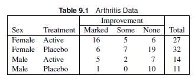
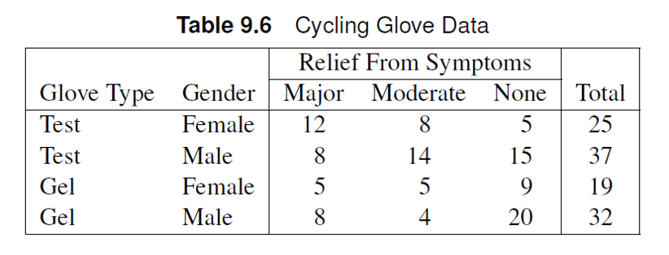

# Logistic Regression - Polytomous Response

## Outline

- Ordinal Response
  - Proportional Odds Model
  - Multiple Qualitative Explanatory Variables
  - Partial Proportional Odds Model
- Nominal Response
  - Generalized Logits Model
  - Exact Methods: Generalized Logits Model
  

# Ordinal Response Variable

## Polytomous Variables?

Recall Chapter 8: dichotomous response variables can be analyzed using logistic regression.


::: callout-note
What if the response variable has more than two levels?
:::

## Polytomous variables

- Polytomous variables are usually described by the [multinomial distribution](https://online.stat.psu.edu/stat504/book/export/html/667)

::: callout-tip
Unlike the binomial distribution where we only need one probability of success, more than one probability of success is needed to be defined in multinomial distributions.
:::

## Cumulative probabilities

Consider $\pi_{hij}$ as the probability of success of the $h^{th}$ strata and $i^{th}$ explanatory variables and the $j^{th}$ level of the response variable. We can define $\theta_{hij}$ such that:

$$
\theta_{hiJ} = \sum_{j=1}^{J} \pi_{hij}
$$

::: callout-note
If $J=1$, then $\theta_{hi1} = \pi_{hi1}$. If $J=2$, then $\theta_{hi2} = \pi_{hi1} + \pi_{hi2}$. $\theta_{hiJ}$ is the _cumulative probability_ of the response levels from $j=1$ to $j=J$.
:::

::: callout-note
If there are $J+1$ levels, then $\pi_{J+1}$ = 1-\theta_{hiJ}$.
:::

## Cumulative logits

Cumulative logits can be defined based on the cumulative probabilities $\theta_{hij}$. For a specific level $k$ out of $K$ levels,

$$
logit(\theta_{hik}) = \log\left(\frac{\theta_{hik}}{1-\theta_{hik}}\right) = \log\left(\frac{\sum_{j=1}^k\pi_{hij}}{1-\sum_{j=1}^k\pi_{hij}}\right) = \log\left(\frac{\sum_{j=1}^k\pi_{hij}}{\sum_{j=k+1}^K\pi_{hij}}\right)
$$

## Cumulative logits

Suppose we define a linear predictor $\eta_{hij}$ such that

$$
\eta_{hij} = logit(\theta_{hij}) = \alpha_j + \mathbf{x'_{hi}\beta_k}
$$

where $x'_{hi}\beta_k$ represents the matrix product of the explanatory/strata variables $x_{hi}$ and the coefficients for each response level $\beta_k$.

## Proportional Odds Assumption

::: callout-note 
## Proportional Odds

The proportional odds assumption applies the following condition for a response variable with $K$ total variable levels:

$$
\mathbf{\beta_1} = \mathbf{\beta_2} = \mathbf{\beta_3} = ... = \mathbf{\beta_{K}} = \mathbf{\beta}
$$
:::

Key assumption: the effect of the explanatory variables should not be disproportionate across all levels.

## Proportional Odds

A consequence of the proportional odds assumption is that the difference between the levels of the explanatory variables are the same across different response levels.

::: callout-note
## Example

Consider comparing the $m^{th}$ and $n^{th}$ level of the explanatory variable in the $h^{th}$ strata for the first and second level of the response variable.

$$
\eta_{hm1}-\eta_{hn1} = (\mathbf{x'_{hm} - x'_{hn}})\mathbf{\beta_1} = (\mathbf{x'_{hm} - x'_{hn}})\mathbf{\beta} 
$$

$$
\eta_{hm2}-\eta_{hn2} = (\mathbf{x'_{hm} - x'_{hn}})\mathbf{\beta_2} = (\mathbf{x'_{hm} - x'_{hn}})\mathbf{\beta} 
$$
These are the same across all levels of the response variable. The difference between $\eta$ correspond to the log odds, hence the odds ratios between explanatory variables are the same across all response levels.
:::


## Proportional Odds

Another consequence of the proportional odds assumption is that the difference between the response levels does not depend on the strata or explanatory variables.

::: callout-note
## Example

Consider comparing the first and second level of the response variable.

$$
\eta_{hm1}-\eta_{hm2} = \alpha _ 1 - \alpha _2 +  (\mathbf{x'_{hm}\beta - x'_{hm}}\beta) = \alpha_1-\alpha_2
$$

:::

## Solving for Individual Probabilities

Individual probabilities can be calculated by taking the differences between cumulative logits.

$$
\pi_1 = \theta_1; \pi_2 = \theta_2-\theta_1; \pi_{k} = \theta_{k}-\theta_{k-1}
$$

## Proportional Odds Model in SAS

- We can use the `LOGISTIC`, `GENMOD`, and `GLIMMIX` procedures to fit the proportional odds model.
- Dealing with ordinal variables means we need to specify order of the data.
- We can use the ESTIMATE and CONTRAST statements to determine and test the odds ratios between response levels, explanatory variable levels, and strata.
  - `ESTIMATE: EXP` option to get the estimated odds ratio, `ILINK` option to get the estimated cumulative probability $\theta$.
  - CL option is used to get the confidence limits for odds ratio or estimated probabilities.

## Example

Male and female subjects received an active or placebo treatment for their arthritis pain, and the subsequent extent of improvement was recorded as marked, some, or none.

::: panel-tabset

### Questions
- Write the correct form of the linear predictor.
- Use the proportional odds model to determine whether there is an effect of sex and treatment.
- List the odds ratio estimates, 95% confidence intervals, and corresponding interpretations. 
- Estimate the probability of marked improvement for females in the active group.

### Data
{width=200%}
:::


## Example 

Male and female subjects received an active or placebo treatment for their arthritis pain, and the subsequent extent of improvement was recorded as marked, some, or none.

::: {.panel-tabset}
### Data Set


```{.r}
data arthritis;
input sex $ treatment $ improve $ count @@;
datalines;
female active marked 16 female active some 5 female active none 6
female placebo marked 6 female placebo some 7 female placebo none 19
male active marked 5 male active some 2 male active none 7
male placebo marked 1 male placebo some 0 male placebo none 10
;
```

### SAS Code

```{.r}
proc logistic data=arthritis order=data plots=effect(polybar x=treatment*sex); # <1> 
freq count;
class treatment sex / param=ref; 
model improve = sex treatment sex*treatment/ selection=forward include=2 scale=none aggregate; #<2>
estimate "odds between marked vs. some+no improvement for female in placebo group" intercept 1 sex 1 /exp cl category='marked';
estimate "odds between marked+some vs. no improvement for female in placebo group" intercept 1 sex 1 /exp cl category='some';
estimate "probability of marked improvement for female in the placebo group" intercept 1 sex 1/ilink cl category='marked'; # <3>
estimate "probability of marked improvement for female in the active trt group" intercept 1 sex 1 treatment 1/ilink cl category='marked';
run;
```

1. The polybar plot creates stacked bar plots showing probability and cumulative probability plots for each level dictated by x.
2. `selection=forward include=2` tests whether the interaction is needed to be included in the model.
3. The `ilink` option calculates the cumulative probability, while `exp` calculates odds ratios. The reason it returns the probability for marked is that the marked level was inputted as the lowest level.

### Answer

The linear predictor can be written as

$$
\eta_k = \alpha_k + \beta_{f}x_{f} + \beta_{a}x_{a}
$$
where $x_f = 1$ when the participant identifies as female, $x_a=1$ when the participant is in the active treatment group. Using the residual chi-square test, the interaction term is not significant $(\chi^2=0.28, p=0.60)$.

Using the proportional odds model, we determine that there is a significant effect of sex ($\chi^2=6.2, p=0.01$) and treatment ($\chi^2=14.4, p=0.001$). 

Females have 3.74 (95% CI: 1.33, 10.55) times higher odds of marked improvement compared to males.

The odds of improvement after undergoing active treatment is 6.03 (95% CI: 2.39, 15.2) times higher compared to the placebo group.
:::

## Exercise

Researchers collected information on subjects’ exposure to general air pollution, exposure to pollution in their jobs, and whether they smoked. The response measured was chronic respiratory disease status. Subjects were assigned to one of four possible categories.

:::{.panel-tabset}
### Questions

- Use the proportional odds main effects model to test the effect of air pollution, job exposure, and smoking status in the response.
- Estimate the odds ratio between Response I+II+III vs. IV for  current vs. ex-smokers. 
- Estimate the probability of developing a response level III for an ex-smoker in a high air pollution environment with job exposure.


### Data Set

```{.r}
data respire;
input air $ exposure $ smoking $ level $ count @@;
datalines;
low no non 1 158 low no non 2 9
low no ex 1 167 low no ex 2 19
low no cur 1 307 low no cur 2 102
low yes non 1 26 low yes non 2 5
low yes ex 1 38 low yes ex 2 12
low yes cur 1 94 low yes cur 2 48
high no non 1 94 high no non 2 7
high no ex 1 67 high no ex 2 8
high no cur 1 184 high no cur 2 65
high yes non 1 32 high yes non 2 3
high yes ex 1 39 high yes ex 2 11
high yes cur 1 77 high yes cur 2 48
low no non 3 5 low no non 4 0
low no ex 3 5 low no ex 4 3
low no cur 3 83 low no cur 4 68
low yes non 3 5 low yes non 4 1
low yes ex 3 4 low yes ex 4 4
low yes cur 3 46 low yes cur 4 60
high no non 3 5 high no non 4 1
high no ex 3 4 high no ex 4 3
high no cur 3 33 high no cur 4 36
high yes non 3 6 high yes non 4 1
high yes ex 3 4 high yes ex 4 2
high yes cur 3 39 high yes cur 4 51
;
```
:::

## Exercise

Researchers collected information on subjects’ exposure to general air pollution, exposure to pollution in their jobs, and whether they smoked. The response measured was chronic respiratory disease status. Subjects were assigned to one of four possible categories.

:::{.panel-tabset}
### SAS Code

```{.r}
proc logistic data=respire order=data plots=effect(polybar x=air*exposure*smoking);; 
freq count;
class air exposure smoking / param=reference;
model level = air exposure smoking air*exposure exposure*smoking air*smoking air*exposure*smoking/ selection=forward include=3 scale=none aggregate;
estimate "odds between I+II+III vs. IV for current vs. ex smokers" smoking 1 -1 /exp cl category="3";
estimate "probability of at most III level for ex smoker, high air pollution, job exposure" intercept 1 air 1 smoking 0 1/ilink cl category='3';
estimate "probability of at most II level for ex smoker, high air pollution, job exposure" intercept 1 air 1 smoking 0 1/ilink cl category='2'; 
run;

```

### Answer

There is no evidence of an air pollution effect ($\chi^2 = 0.18, p=0.68$). Exposure ($\chi^2 = 82.1, p=<0.001$) and smoking history ($\chi^2 = 209.9, p<0.001$) are significant.

The odds of being assigned to Response Level III and lower for current smokers is 0.23 times the odds for ex-smokers.

The probability of receiving a response level III and below for an ex smoker, high air pollution, and with job exposure is 0.9351. The probability of receiving a response level II and below for an ex smoker, high air pollution, and with job exposure is 0.8512. Hence, the estimated probability of receiving a response level III is `r 0.9351-0.8512` .

:::

## Partial Proportional Odds Model

Sometimes, the $\beta_k=\beta$ assumption does not hold for all explanatory variables, especially if some levels disproportionately affect the odds of success.

::: callout-tip
This assumption can be tested using the score test for the proportional odds assumption provided by the `LOGISTIC` procedure.
:::

To address this, we specify unequal slopes for the explanatory variables that violate the proportional odds assumption.

$$
logit(\theta_{hik}) = \alpha_k + x'_{hi}\beta_k + x'_{h'i'} \gamma
$$

where $x'_{hi}$ includes the explanatory variables with unequal slopes $\beta_k$ and $x'_{h'i'}$ includes the explanatory variables with equal slopes $\gamma$. This model is called the **partial proportional odds model**.

## Partial Proportional Odds Model in SAS

- If the score test for the proportional odds assumption is significant at the 0.10 level, we might need to use a partial proportional odds model.
- We can specify the model to have unequal slopes using the `UNEQUALSLOPES` option in the MODEL statement.
`UNEQUALSLOPES=X` specifies that only the explanatory variable X has unequal slopes
- Testing for unequal slopes can be done using the `TEST` statement
  - `LABEL`: TEST statements effectively labels the test.
  - If the test yields a significant result, there is sufficient evidence for unequal slopes for that explanatory variable.
  - If the test is not significant, we can assume the proportional odds model holds.

## Example

The table contains data from a study by a bicycling clothing manufacturer who wanted to assess their test glove. It was designed to combat the hand problems experienced by cyclists dealing with carpal tunnel syndrome. Cyclists wore either the company’s standard gel glove or the new test glove for a week’s worth of their standard rides. Then they reported whether they experienced major, moderate, or no relief from their usual symptoms (numbness and nerve pain) on the bike.

::: panel-tabset

### Questions
- Assume an unequal slopes, main effect model and test for the equality of slopes for glove and gender.
- Perform logistic regression and interpret the results.

### Data
{width=200%}
:::

## Example

The table contains data from a study by a bicycling clothing manufacturer who wanted to assess their test glove. It was designed to combat the hand problems experienced by cyclists dealing with carpal tunnel syndrome. Cyclists wore either the company’s standard gel glove or the new test glove for a week’s worth of their standard rides. Then they reported whether they experienced major, moderate, or no relief from their usual symptoms (numbness and nerve pain) on the bike.

::: {.panel-tabset}
### SAS Code

```{.r}
proc logistic order=data data=wrist;
freq count;
class glove gender / param=reference order=data;
model relief= glove gender / scale=none aggregate unequalslopes; # <1>
pogender: test genderfemale_major=genderfemale_moderate; # <2>
poglove: test glovetest_major=glovetest_moderate;# <3>
run;

proc logistic order=data data=wrist;
freq count;
class glove gender / param=reference order=data;
model relief= glove gender / scale=none aggregate unequalslopes=glove; # <4>
run;
```

1. `unequal slopes` tells SAS to provide unequal slopes for each explanatory level at all response levels.
2. `pogender` is the label for testing whether the slopes should be the same for different response levels for the gender explanatory variable
3. `poglove` is the label for testing whether the slopes should be the same for different response levels for the glove explanatory variable
4. Only assumes unequal slopes for glove, but proportional odds assumption holds for gender.

### Answer

Using a partial proportional odds model, there is a significant effect of the type of glove and gender. the odds of experiencing major relief for females is 2.27 (95% CI: 1.10, 4.66) times that of males. The odds of major relief when using the test glove is 1.4 (0.60, 3.21) times that of gel. Additionally, the odds of moderate relief when using the test glove is 2.91 (1.33, 6.36) times that of gel.
:::


## Exercise

Consider the arthritis example discussed earlier. Test the hypothesis of equal slopes for both sex and treatment.

## Exercise

Consider the arthritis example discussed earlier. Test the hypothesis of equal slopes for both sex and treatment.

:::{.panel-tabset}

### SAS Code
```{.r}
proc logistic data=arthritis order=data plots=effect(polybar x=treatment*sex);; 
freq count;
class treatment sex / param=reference;
model improve = sex treatment / unequalslopes scale=none aggregate;
equal_sex: test sexfemale_marked=sexfemale_some;
equal_treatment: test treatmentactive_marked=treatmentactive_some;
run;
```

### Answer

We suppose the slopes are unequal, then test whether there is evidence against the null hypothesis of equal slopes using `test`.

There is insufficient evidence to claim that the $\beta$ for sex ($\chi^2 = 1.35, p=0.25$) and treatment ($\chi^2 = 0.03, p=0.86$).

:::


# Nominal Response Variables

## Generalized Logits Model

When the response variables are nominal, the concept of cumulative probabilities is less applicable. The **generalized logits model** is used for nominal polytomous response variables.

::: callout-note
## Generalized Logit Model

The logit function is the logarithm of the ratio of the probability of the level of interest, $\pi_j$ and the _reference_ category $\pi_r$.

$$
logit \theta_j = \log \left(\frac{\pi_j}{\pi_r}\right) = \alpha_j + \sum_g \beta_{jg} x_g
$$
where $g$ comprises of ALL explanatory variables
:::

::: callout-warning
## Reference level

For the reference level, $\alpha_r = 0, \beta_{rg}=0$.
:::

## Generalized Logits Model 

The resulting expression for $\pi_j$ can be written as:

$$
\pi_j = \frac{\exp[\alpha_j + \sum_g \beta_{jg}x_g]}{\sum_{k=1}^r \exp[\alpha_k + \sum_g \beta_{kg}x_g]}
$$

with the constraint $\alpha_r=0, \beta_{rg} = 0$.


## Generalized Logits Model: SAS 

::: callout-note
## Implementing generalized logit models in SAS

The `LOGISTIC` procedure will model the logit models for all levels simultaneously. If there are $r$ levels of the response variable, there will be $(r-1)$ degrees of freedom for a single logit model.
:::

::: callout-tip
## Link function

SAS does not know whether your response variable is ordinal or nominal. The generalized logits model can be specified using `link=glogit` in the `model` statement.


:::
::: callout-tip
## Syntax
  - Unless specified, the last variable level based on the specified order in the `class` statement is set as the reference level.
  - Syntax is the same as the PO model, but the assumptions are different.
:::

## Example

Schoolchildren in experimental learning settings were surveyed to determine which learning style they preferred. Investigators were interested in whether response was associated with school and their program, which was either a standard school day or also included after-hours care. 


::: panel-tabset

### Question

Use logistic regression to test for program and school effects and calculate the relevant odds ratios.

### SAS Data Set

```{.r}
data school;
input school program $ style $ count @@;
datalines;
1 regular self 10 1 regular team 17 1 regular class 26
1 after self 5 1 after team 12 1 after class 50
2 regular self 21 2 regular team 17 2 regular class 26
2 after self 16 2 after team 12 2 after class 36
3 regular self 15 3 regular team 15 3 regular class 16
3 after self 12 3 after team 12 3 after class 20
;

proc freq data=school order=data;
weight count;
tables school*program*style/ nocol norow nopct;
run;
```
:::

## Example

Schoolchildren in experimental learning settings were surveyed to determine which learning style they preferred. Investigators were interested in whether response was associated with school and their program, which was either a standard school day or also included after-hours care. Use logistic regression to test for program and school effects and calculate the relevant odds ratios.

:::{.panel-tabset}
### SAS Code

```{.r}
proc logistic data=school order=data;
freq count;
class school (ref=first) program (ref=last) / param=ref;
model style= program school school*program / link=glogit selection=forward include=2 scale=none aggregate;
run;
```


### Answer

There is sufficient evidence of a program ($\chi^2 = 10.9, p=0.004$) and school ($\chi^2=14.8, p=0.005$).

The odds of preferring self-directed learning for those assigned to after-hours care is 0.47 (0.27-0.82) times that of those who assigned to regular class hours. The odds of students from school 2 preferring self-directed learning is 2.95 (1.48-5.91) times that of students from school 1. Similarly, the odds of students from school 3 preferring self-directed learning is 3.72 (1.76-7.90) times that of students from school 1.  

The odds of preferring team-based learning for those assigned to after-hours care is 0.48 (0.27-0.82) times that of those who assigned to regular class hours. The odds of students from school 2 preferring self-directed learning is 1.20 (0.64-2.23) times that of students from school 1. Similarly, the odds of students from school 3 preferring self-directed learning is 1.93 (0.99-3.75) times that of students from school 1.  

:::


## Exercise

The data set “firecracker” shows data of injuries due to firecrackers from three community health centers in rural Philippines. The age groups were coded as A: <25 years of age, B: ≥25 years of age. Use a generalized logit main effect model to determine whether there is a significant effect of age and clinic in the occurrence of face and finger injury compared to other parts of the body.

::: panel-tabset

### Question
Use the estimate statement to test and estimate the odds ratio between clinics 1 and 2 for fingers vs. other injury and face vs. other injury.

### Data
```{.r}
data firecracker;
input clinic $ agegroup $ injury $ count;
datalines;
1 A Fingers 25
1 A Face 18
1 A	Other 5
1 B	Fingers 13
1 B	Face 5
1 B	Other 3
2 A	Fingers 42
2 A	Face 7
2 A	Other 12
2 B	Fingers 23
2 B	Face 5
2 B	Other 5
3 A	Fingers 10
3 A	Face 4
3 A	Other 4
3 B	Fingers 9
3 B	Face 7
3 B	Other 5
;
run;

```
:::

## Exercise

The data set “firecracker” shows data of injuries due to firecrackers from three community health centers in rural Philippines. The age groups were coded as A: <25 years of age, B: ≥25 years of age. Use a generalized logit main effect model to determine whether there is a significant effect of age and clinic in the occurrence of face and finger injury compared to other parts of the body.

:::{.panel-tabset}
### SAS Code

```{.r}
proc logistic data=firecracker order=data;
freq count;
class clinic agegroup;
model injury= clinic agegroup clinic*agegroup/link=glogit selection=forward include=2 scale=none aggregate;
estimate "clinic 1 vs clinic 2 - face" clinic 1 -1/ exp cl category="Face";
estimate "clinic 1 vs clinic 2 - fingers" clinic 1 -1/ exp cl category="Fingers";
run;
```

### Answer

There is a significant effect of clinic ($\chi^2 = 11.9, p=0.02$), but no evidence of an age effect ($\chi^2 = 0.02, p=0.99$).

The odds of receiving patients with face injuries in clinic 1 is 4.08 (1.37-12.2) times that of clinic 2. Meanwhile, the odds of receiving patients with finger injuries in clinic 1 is 1.25 (0.49-3.16) times that of clinic 2.

:::

## Exact Generalized Logits Test

- Exact methods are more appropriate for tables with small or zero counts.

::: callout-warning
## Exact Method Warning
Generalized logits tests have more parameters and exact methods are typically more computationally expensive.
When using exact methods, try to keep the model small for relatively small data sets.
:::

::: callout-tip
## Exact Method in SAS

The `exact` statement can perform joint tests as well as calculate exact confidence intervals for odds ratios. Use the "Exact" p-value column in the "Probability" row in the exact conditional tests.
:::

## Example

The following data come from a study in which a physical therapy practice experimented with different treatment modalities in a strengthening program. The therapists rotated patients through three programs for maintenance after basic strength had been attained. The strengthening programs included free weights, resistance bands, and weight machines. The therapists are interested in whether gender and age affect choice of strengthening programs.

### Data Set

```{.r}
data pt;
format therapy $11.;
input gender $ age $ therapy $ count @@;
datalines;
males adult machines 2 males senior machines 10
males adult freeweights 13 males senior freeweights 9
males adult bands 3 males senior bands 3
females adult machines 3 females senior machines 8
females adult freeweights 9 females senior freeweights 0
females adult bands 1 females senior bands 1
;
```


## Example

The following data come from a study in which a physical therapy practice experimented with different treatment modalities in a strengthening program. The therapists rotated patients through three programs for maintenance after basic strength had been attained. The strengthening programs included free weights, resistance bands, and weight machines. The therapists are interested in whether gender and age affect choice of strengthening programs.

::: callout-warning
Small cell counts means we need to use exact methods.
:::

:::{.panel-tabset}

### SAS Code
```{.r}
proc logistic data=pt;
title "asymptotic";
freq count;
class gender(ref='females') age(ref='senior') / param=ref;
model therapy(ref='machines') = gender age / link=glogit scale=none aggregate;
run;

proc logistic data=pt;
title "exact";
freq count;
class gender(ref='females') age(ref='senior') / param=ref;
model therapy(ref='machines') = gender age / link=glogit scale=none aggregate;
exact gender age/joint estimate=both;
run;
```

### Answer

There is a marginal effect of gender ($ p=0.099$), but there is a significant effect of age ($\chi^2 = 12.2, p=0.003$).

The odds of males preferring bands is 4.1 (0.49-59.55) times than that of females. Additionally, the odds of males preferring freeweights is 4.49 (0.93-30.2) times than that of females.

The odds of an adult preferring bands is 5.08 (0.60-53.2) times that of seniors. However, the odds of an adult preferring freeweights is 12.47 (2.7-84.0) times that of seniors.

:::
