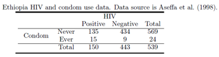

# Problem 1 

A batch of 250 pills is tested by randomly sampling 10 pills for quality control. If all 10 pills pass, the batch is approved for distribution. Suppose there are 25 pills that were not acceptable in this batch, what is the probability that the batch passes? Identify the appropriate distribution to calculate these probabilities.

::: callout-note
### Solution

The most appropriate distribution to calculate these probabilities is the *hypergeometric distribution*. We are interested in P(X=0) when there are $N=250$ pills, $m=25$ unacceptable pills, and a sample of $k=10$ pills.

```{r}
N <- 250
m <- 25
k <- 10

dhyper(x=0,m=m,n=N-m,k=k)

```

:::

# Problem 2

Aseffa et al. (1998) examined the prevalence of HIV among women visiting health care clinics in northwest Ethiopia. Along with testing individuals for HIV, additional information was collected on each woman such as condom use.



## 2a

Calculate the following 95% confidence intervals for the difference in probabilities of being HIV positive based on condom use. (Corrected Wald, Agresti-Caffo, Miettinen-Nurminen).

::: callout-note
### Solution

```{r}
library(DescTools)

BinomDiffCI(x1=135,n1=569,
            x2=15,n2=24,
            method=c('waldcc','ac','mn'))
```
:::

## 2b

At a significance level of 0.05, do we have any evidence of association between condom use and HIV prevalence?

::: callout-note
### Solution

There are two possible ways to answer this question: using the confidence intervals in (2a) or using the Mantel-Haenszel test of association.

Because the confidence intervals in (2a) did not include 0, we have strong evidence of an association between condom use and HIV prevalence.

The Mantel-Haenszel tests can be performed as shown:

```{r}
dat <- expand.grid(Condom=c("Never","Ever"),
                   HIV = c("+","-"))

dat$Count <- c(135,15,434,9)

dat_cc <- xtabs(Count~Condom+HIV, data=dat)

library(vcdExtra)
CMHtest(dat_cc)
```

The MH test yielded $\chi^2_1 = 18.3,p<0.0001$. At the 0.05 significance level, we reject the null hypothesis. We have sufficient evidence to support the claim that there is an association between condom use and HIV prevalence.
:::

## 2c


Estimate the odds ratio and its corresponding 95% confidence interval. Interpret the odds ratio in the context of the problem.

```{r}
library(epitools)

oddsratio(dat_cc,rev="columns")
```

Those who reported condom use were estimated to have odds of having HIV that is 5.30 (95% CI: 2.29-13.02) times that of those who did not report condom use.

# Problem 3


Calculate the sensitivity and the specificity of the test and their 95% confidence intervals.

```{r}
dat <- expand.grid(Test = c("Positive","Negative"),
                   Disorder = c("Positive","Negative"))

dat$Count <- c(123,34,27,189)

dat_cc <- xtabs(Count~Test+Disorder,data=dat)
dat_cc
```
::: callout-note
### Solution

```{r}
library(epiR)

epi.tests(dat_cc)
```
Sensitivity: 0.78 (0.71-0.85)

Specificity: 0.88 (0.82-0.92)

:::

# Problem 4

In a study by Shaked et al. (2003), researchers studied 26 children with blunt pancreatic injuries. These injuries occurred from a direct blow to the abdomen, bicycle handlebars, fall from height, or car accident. Nineteen of the patients were classified as having minor injuries, and seven were classified as having major injuries. Pseudocyst formation was suspected when signs of clinical deterioration developed, such as increased abdominal pain, epigastric fullness, fever, and increased pancreatic enzyme levels. In the major injury group, six of the seven children developed pseudocysts while in the minor injury group, three of the 19 children developed pseudocysts.


## 4a

Construct the relevant 2x2 table for this problem.

```{r}
dat <- expand.grid(Injury=c("Major","Minor"),
                   Pseudocyst =c("Positive","Negative"))

dat$Count <- c(6,3,1,16)
dat_cc <- xtabs(Count~Injury+Pseudocyst,data=dat)

dat_cc
```

## 4b 

Would it be advisable to use the asymptotic confidence interval when reporting the odds ratio for this problem? Why or why not? If it is not advisable, what confidence interval should we use?

::: callout-note
### Solution

```{r}
chisq.test(dat_cc)
```

Because the chi-squared approximation may be incorrect due to low expected values, it would be better to report the exact confidence intervals.


:::

## 4c

Is there sufficient evidence to allow us to conclude that there is an association between pseudocyst development and degree of injuries? Use a significance level of 0.10.

::: callout-note
### Solution

It is recommended to use the Fisher's Exact test because of the low expected counts.

```{r}
fisher.test(dat_cc)
```
The resulting p-value is 0.002. We reject the null hypothesis at 0.05 level of significance. There is sufficient evidence to conclude that there is an association between pseudocyst development and degree of injuries.
:::

# Problem 5

The table below shows data obtained from the 2006 administration of the General Social Survey (GSS).

```{r}
dat <- expand.grid(Work = c("Full","Part"),
                   SelfEmployment = c("No","Yes"),
                   Gender= c("Males","Females"))

dat$Count <- c(1051,108,199,38,978,238,87,60) 

dat_cc <- xtabs(Count~Work+SelfEmployment+Gender,data=dat)
dat_cc
```

## 5a

At $\alpha=0.05$, is there evidence of marginal association between work schedule (full-time/part-time) and self-employment?

::: callout-note
### Solution 

Marginal association means we are summing over gender.

```{r}
dat_marginal <- xtabs(Count~Work+SelfEmployment,data=dat)
CMHtest(dat_marginal)
```

At 0.05 level of significance, we reject the null hypothesis ($\chi^2_1=29.4,p<0.0001). We have sufficient evidence of marginal association between work and self-employment.
:::

## 5b

At $\alpha=0.05$, is there evidence of conditional association between work schedule (full-time/part-time) and self-employment after controlling for gender?

::: callout-note
### Solution 

Conditional association means we have association between work schedule and self-employment at any strata (Gender).

```{r}
CMHtest(dat_cc,overall=T)$ALL
```

At 0.05 level of significance, we reject the null hypothesis ($\chi^2_1=41.29,p<0.0001). We have sufficient evidence of conditional association between work and self-employment after controlling for gender.
:::

## 5c

Does the assumption of the homogeneity of the odds ratios hold?

::: callout-note
### Solution

We perform the Breslow-Day test to confirm homogeneity of the odds ratios.

```{r}
breslow_day_test(dat_cc)
```

The resulting test statistic is $\chi^2_1=2.38,p=0.12$. At 0.05 level of significance, we fail to reject the null hypothesis. We have no evidence against the homogeneity of odds ratios. Hence, we can interpret the common odds ratio.
:::

## 5d.

Based on your answer in part (5c), report the relevant odds ratios and the asymptotic 95% confidence intervals.

::: callout-note
### Solution 

We can interpret the common odds ratio reported by the `mantelhaen.test()` function. 

```{r}
mantelhaen.test(dat_cc,correct=F)
```

The common odds ratio estimate suggests that the odds of not being self-employed for those who work full time is 2.34 (1.80-3.05) times that of those who work part-time.
:::

